# The Computer Vision

## The definition of Computer Vision

What is *Computer Vision*?

Computer Vision is the science of **getting the machines see**. Another definition could be such that 

> \sffamily{
 Computer vision is concerned with the automatic extraction, analysis and understanding of useful information from a single image or a sequence of images. It involves the development of a theoretical and algorithmic basis to achieve automatic visual understanding.
}

Other definitions are the following ones,

- computing properties of the 3-D world from one or more digital images;
- to make useful decisions about real physical objects and scenes based on sensed images;
- the construction of explicit, meaningful description of physical objects from images;
- extracting descriptions of the world from pictures or sequences of pictures.

Computer vision is strictly related to various sciences, for instance, *optics*, *machine learning*, *neuroscience*, *mathematics*, *cognitive sciences*, *image processing* and *computer science* in general.

Computers usually see through bidimensional images; all the necessary three--dimensional information should be extracted directly from the image. In particular, one is interested into:

- *semantic information*, the "what";
- *three--dimensional metric information*, the "where".

By combining the previous two kind of informations, one is able to deeply understand an image, its content, and ultimately its meaning. One of the goals of computer vision is to bridge the gap between the pixel representation of an image and its *meaning*, so that a machine can perform specific tasks.

Object in images are subjected to many kinds of variations:

- objects are subjected to different **illuminations**; they can be dark, bright, over--exposed or under--exposed;
- to different **occlusion**; they can be partially hidden, not having all their shape exposed to the viewer;
- to **deformation**; their shape can be deformed for perspective reasons or because of their own movement;
- they could blend with the **background**; object textures could be very similar to those of the background, resulting in difficult detection;
- there could be many instances, with different classes (**intraclass variation**).
  
All these variations pose serious challenges to identifying what is present in an image.

Regarding the "where", the problem of locating objects in two--dimensional images is said to be **ill-posed** in contrast to **well-posed** problems. An example of a well-posed problem is the forward problem of building an image from three--dimensional information.

The ill-posed nature of the problem lies to resides in the fact that
many explanations exist for a single image.


## Classes of problems in CV

> The first great revelation was that the problems are difficult. Of course, these days this fact is a commonplace. But in the 1960s almost no one realized that machine vision was difficult. The field had to go through the same experience as the machine translation field did in its fiascoes of the 1950s before it was at least realized that here were some problems that had to be taken seriously.

Two classes of computer vision problem exist. The first class is the **recognition** class. Recognition task involves different tasks,

- *object detection*, find all the regions in an image belonging to a certain object, or that are likely to belong to a certain object);
- *instance recognition*, determine an instance of an already known object, potentially being viewed from another point of view;
- *category--level recognition*, where object in images or complete images should be put in categories.

The second class of tasks is the **reconstruction**. Reconstruction tasks involve
building from scratch the three--dimensional structure of an object in a scene,
given a sufficient amount of images of the scene.

Another taxonomy for computer vision tasks is the following one,

- **reconstruction**: given two or more two--dimensional images of a scene, compute a three--dimensional model for the object and the scene;
- **detection**: is there one or more instance of $x$ in this image?
- **localization**: where are the instances of $x$?
- **segment**: where are the *boundaries* of each instance located in the picture?
- **tracking**: is the instance moving from one image to the next in the sequence of images?
- **classification**, **recognition**: what is this object?

## Notable Milestones

Two notable milestones were the *uncalibrated reconstruction* (Agarwal et
al., 2011) and the *image categorization* (Krizhevsky et al., 2012).

The first milestone employed $496$ processors, $1984$ GB of total memory, $62$
terabytes of disk space, $460000$ Flickr pictures of Rome, Venice and Dubrovnik,
and more than $100$ hours of computation to produce a three--dimensional model
of some monuments. In particular, three crucial computer vision problems:
*correspondance*, *structure from motion* and *multiview stereo*.

The second milestone was **AlexNet**, the first *Convolutional Neural Network*
that was able to win the ImageNet challenge, by a large margin, bringing down
the state-of-the-art top-5 error rate from $26.1\%$ to $15.3\%$.

# Image Formation

## The pinhole camera model

At the very basis of image formation understanding there's the *camera obscura* (dark room) principle.

> Camera obscura is a darkened room with a small hole or lens at one side through which an image is projected onto a wall or table opposite the hole.

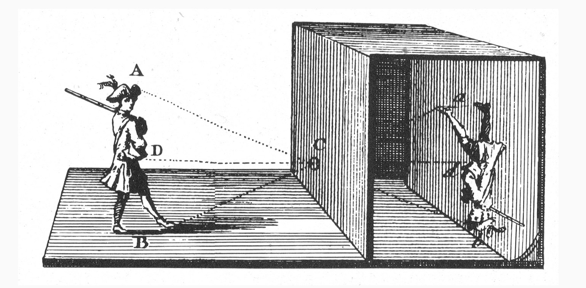

In such mechanism, only some selected ray lights are allowed inside the dark room - light rays reach the end of the room and form a *reverted image* in the wall.

The camera obscura principle was first depcited by *Leonardo da Vinci* (1452-1519), and after developed by *Johann Zahn* (1641-1707) to build the first portable camera. Subsequent development led to took the first photo by *Joseph Nicépore Niépce* in 1826.

Camera obscura can be further summarized in the *pinhole camera* model.

Basically, we need it because it's the only way we have to effectively collect raylights from a figure, projecting them to a plane that can capture them.


### Geometrical description of the pinhole model

Pinhole camera principles are the following:

-   put a film in front of a scene;
-   rays departing from the same point of the scene reach the film in different places;
-   conversely, rays departing from different points of the scene, reach the film in the same place;
-   ideally, a single light ray from the scene should reach the image plane in a given point;
-   put in between a barrier with a hole - **the pinhole**:

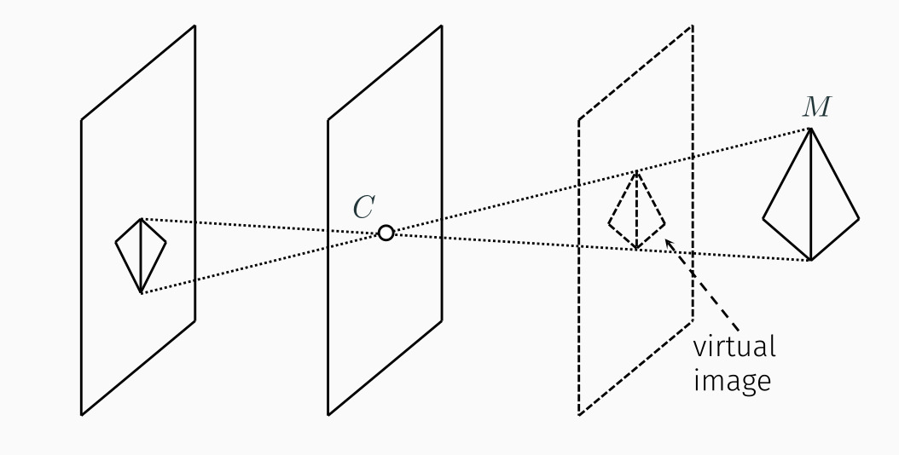

-   The image is then reversed upside-down and left-right
-   A virtual image is formed in front of the camera.

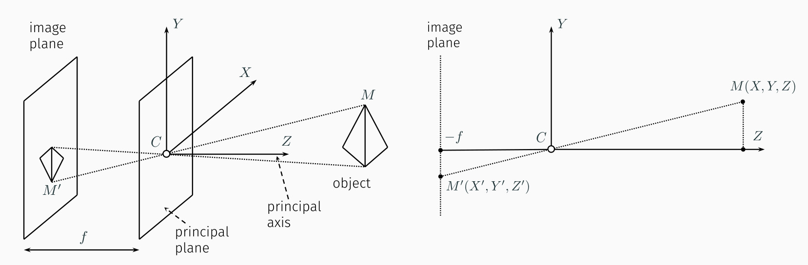

Design of pinhole camera is better described in the Figure, where we have an object $M$ at a distance $Z$ from the pinhole, and the plane where the pinhole lives is called *principal plane*, from which it is defined an orthogonal *principal axis* starting from the pinhole spatial location. Pinhole $C$ is called *optical center*; it allows some rays from the object to trepass the principal plane and to reach the *image plane*, in which we will put a sensor element. Both image and principal planes are perpendicular together. Distance between such planes is called *focal length* $f$.

Following the camera obscura principle, point $M(X,Y,Z)$ is mapped into $M'(X',Y',Z')$ in the image plane. The object appears to be *reversed*.


### Perspective

At right, we have a perspective projection of the same scheme. By similarity of triangles construction, we will have that

$$ [X', Y', Z']^T =  [-\frac{f}{Z}X, -\frac{f}{Z}Y, -f]^T,$$

because of the similarity relationship of $$\frac{M}{f} = \frac{M'}{Z}$$ hence the ratio $$\frac{M'}{M} = \frac{f}{Z} \equiv p.$$ The latter is called *perspective scale factor*, and it describes the effect for which farther away objects appear smaller. The far the object moves, the smaller the shrinking due to perspective scale factor is.

In particular, for objects very far from the camera - so that they're thin (with maximum length $\Delta Z$) with respect to their distance $Z_0$ from the camera - perspective scale factor is roughly constant. Namely,

$$ psf = \frac{f}{Z_0 + \Delta Z} \approx \frac{f}{Z_0} $$ due to the
fact that $Z_0 >> \Delta Z$.

Hence, we can approximate perspective projection such as

$$ X' = -\frac{f}{Z_0}X;$$ $$ Y' = -\frac{f}{Z_0}Y.$$

Leonardo da Vinci developed a rule of thumb to understand when the previous condition holds - that is when $$\frac{\Delta Z}{Z_0} < 0.10.$$ This rule helps us determine when perspective becomes *weak perspective* in the sense that it doesn't count much anymore.


### Aperture and blur

Pinhole cameras are - by definition - constructed with *very* small holes. But, when we leave the mathematics realm and become aware of the real-world problems, we find out that the pinhole cannot be smaller than a certain radius.

In particular, too small holes will not allow much light inside, and thus dark rooms will unsurprisingly be - very dark. What if we increase pinhole size?

The trouble here is that we are letting more rays inside our dark room - in particular, *rays from different directions of the same point in the object will enter the dark room*. Result will be a **blurred** image, caused by directions averaging. Instead, if we reduce the pinhole size too much we will obtain a similar results: when the pinhole size is comparable to wavelength, diffraction phenomena will start to blur the image, again.

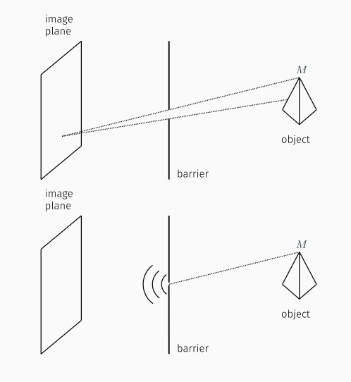

So, a too small pinhole won't allow much light in it (also there will be some diffraction blurring effects) and a too big pinhole will inevitably blur the image due to ray directions averaging. Apparently, there's no solution without pinhole. Many example pictures of both blurring and diffraction can be found online.

## Lenses


Lenses are the solution to the brightness problem. Lenses allow collection of a larger portion of the ray light, directing it inside the pinhole. Therefore, a larger amount of light will be let in the dark room. In particular, we will use the *thin lenses* model, for which perspective projection criteria still hold true.

A thin lens is composed by a piece of glass (very thin) which has some particular properties:

1.  rays reaching the centre of the lens will be left untouched;
2.  rays coming horizontally will be all directed towards a single point $F$, called *focal point*;
3.  rays departing from the same point will follow other directions, but always reach the focal point.

With these properties we can build our pinhole system with a thin lens.


### The geometry of a lens system

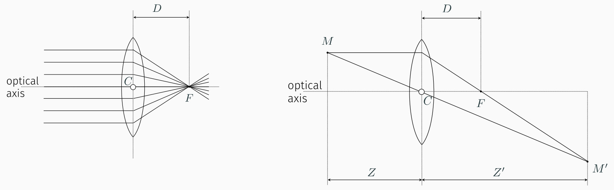

Image above describes the thin lens in detail. Aside from the previously described focal point $F$, we define $D$ *focal length* the distance between the center $C$ of the lens and the focal point $F$, and $Z$, $Z'$ that are, respectively, distances between the lens and the real object and between the lens and the image plane. An axis orthogonal to the lens departs from $C$ - the *optical axis*.

The point $M'$ on the image plane is reached by two, distinct, rays; the first one being the one crossing the centre $C$ of the lens (which won't change direction due to thin lens properties) and the second one crossing the focal point $F$, since each horizontally incident ray will be directed towards $F$. The image $M'$ can be obtained by intersecting $2$ rays.

Point $M$ is projected, when in focus, into the same position of a pinhole model having its center $C$ located in the focal point $F$. That is, we can get the same results with more rays entering the dark room (hence, our image will be bright enough to be captured). In fact, there's a straight line from point $M$ to point $M'$, *plus* there are many rays from such point of the object, collected by the lens and reaching focal point.


### The thin lens equation

By triangles similarities, we can find the following relationships,

$$ \frac{Y'}{Y} = \frac{Z'}{Z} $$ and $$ \frac{Y'}{Y} = \frac{Z' - D}{D}, $$

where we had a look at the two similar triangles at the right of the lens. Merging the previous equations, we obtain the *thin lens equation* $$ \frac{1}{Z} + \frac{1}{Z'} = \frac{1}{D}, $$ a remarkable formula which puts $Z$, $Z'$ and $D$ in relationship.


### Focusing

Thin lens equation explains the *focusing* of a lens with respect to the distances between the lens and the object or the image plane.

In particular, given distances $Z$ and $Z'$, focal length $D$ will be determined by the left member of the equation.

-   when $Z \longrightarrow \infty$ we are focusing the infinite. This means that the term with $Z$ vanishes, and the thin lens equation yields $$ \frac{1}{Z'} = \frac{1}{D},$$ and ultimately $Z'=D$;
-   when $Z$ = $Z'$, the only possible solution is $Z = Z' = 2D$. In such situation the focal point will be in the middle between the distance between lens and objects. Since objects distance with respect to the lens is the same, this is called *1:1 imaging*;
-   when $2D < Z < \infty$, equation implies $D < Z' < 2D$;
-   when $D < Z < 2D$, equation yields the viceversa $2D < Z' < \infty$;
-   when $Z = D$ focus is impossible, for rays are spread horizontally towards the image plane.

Basically, we can't focus objects closer than $2D$, otherwise our sensor would have to go back - possibly very much - to keep focus.


### Field of view

We can define the *field of view* of a camera system as the portion of the scene space that projects onto the sensor.

Field of view $f.o.v = 2\varphi$ depends largely on the focusing distance and the sensor width $w$, and it is conventionally defined by focusing at infinity; for instance,

$$ f.o.v. \equiv 2\varphi = 2\arctan{\frac{w}{2D}}.$$

Field of view can be understood as the maximum angle $2\varphi$ for which a ray crossing the lens could reach any portion of the sensor of width $w$.

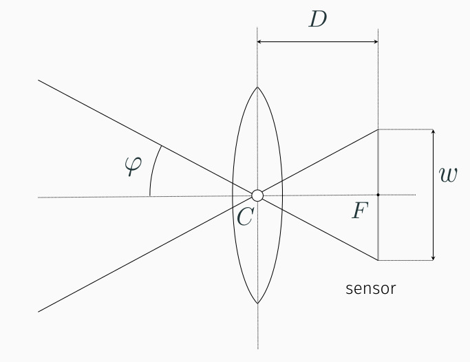


### The circle of confusion (blur circle)

Image is perfectly on focus when all rays from point $M$ are projected into $M'$. Such condition holds when the image plane is congruent with the *focus plane*.

A phenomena happening when the image plane is not on the focus plane, but at a distance $\Delta Z'$ from it, is the so-called *blurring circle*, also called *circle of confusion*. The blurring circle is caused by the misalignment of the image plane from the focus plane: rays projected from point $M$ of the object will reach the image plane in different locations instead of a single point $M'$. This causes a blurring of the image in the circle where the rays are incident.

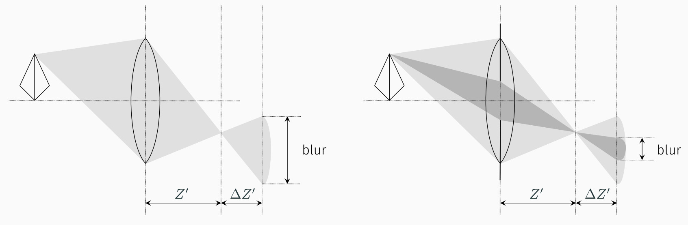

A blur circle diameter is given by the formula

$$d_{blur} = d\frac{|\Delta Z'|}{Z'},$$

where $d$ is the lens diameter and the expression is obtained using triangles similarities. In fact, we have $$ \frac{d_{blur}}{d} = \frac{\Delta Z'}{Z'}$$.

Blurring prevents getting sharp and detailed images: therefore, we must avoid getting blur effects on our images.

To partially solve our problem, we could reduce the aperture, since reducing the diameter of the lens will cause less rays to enter the dark room and eventually less of them will reach the sensor, resulting in a minor blurring effect.

This is shown in figure above, where the right picture visually explains such solution, and this can be assumed to be true since reducing $d$ in the formula directly causes a decreasing of the term $d_{blur}$.

This phenomena is far more complex than the above explanation. For instance, suppose we have a moving image plane which will change its location according to the distance of the object to keep in focus. If we keep a huge aperture, we are basically making more room for blurring effects of objects out of focus. This will result in a proper focusing of an object, while quickly blurring objects with a different distance from the camera with respect to the object. Instead, if we take a smaller aperture, our lens will allow less blurring of objects out of focus. This means that objects out of focus will not exhibit blurring even if they're at a different distance from the camera. Sadly, closing the lens will complicate image acquiring, since the lens would let less light in the dark room.

In the end, it all depends on the kind of effect we want to obtain, and the exposure of the object, since aperture is a trade-off between focusing capabilities and brightness of the object whose image is captured.

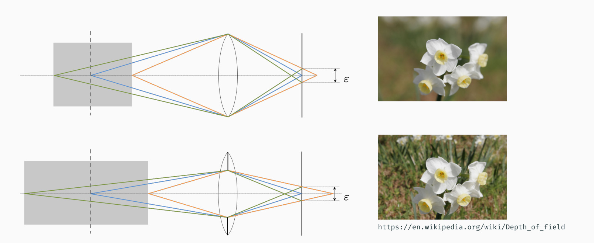


### Telecentric optics

A particular kind of optics is the *telecentric optics*. Telecentric cameras are special ones that capture an orthogonal projection of the image.

To achieve that, we put a pinhole exactly in the focal point $F$. By doing so, our camera will capture only rays which are travelling parallel to the lens axis, so that objects at different distances will appear at the same distance in space.

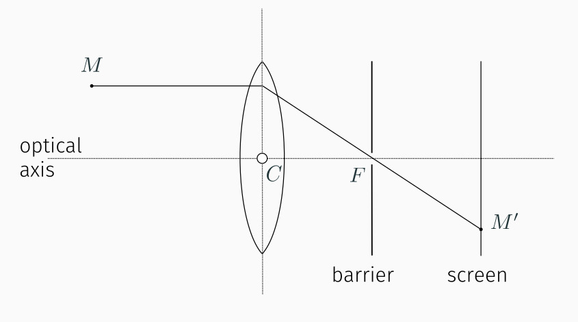


### Thick lenses

When we abandon the thin lens hypothesis, we get the so called *thick lens*. Thick lenses have different portions of the lens with different focal points. Distortion acts *radially*, so we can mathematically compensate it. Thick lenses suffer from side effects such as *radial distorsion* (straight lines become curve), *pincushion distorsion* (increasing magnification) and *barrel distorsion* (decreasing magnification).

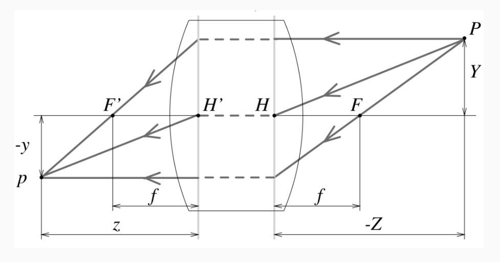

Real lenses also suffer from a lot of other side effects, such as *vignetting*, *chromatic aberration* and so on.

Different wavelengths travel with different paths in the lens, resulting in a wave decomposition by color - this phenomena will appear in a similar fashion of a blur, with color artifacts.

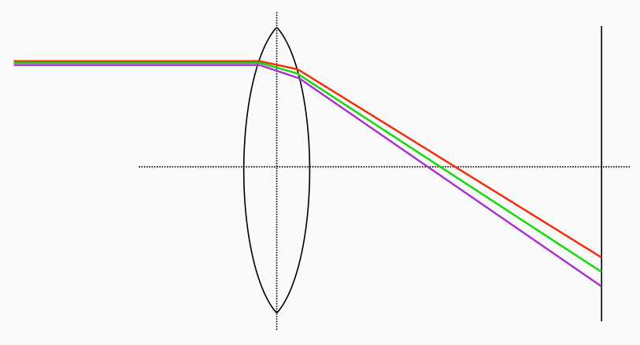

To solve this, a second *compound lens* can be added. However, adding a second lens will result in a further side effect, such as *vignetting*. Vignetting happens when a portion of the light doesn't reach the second lens, resulting in the outer portion of the image to be darker.

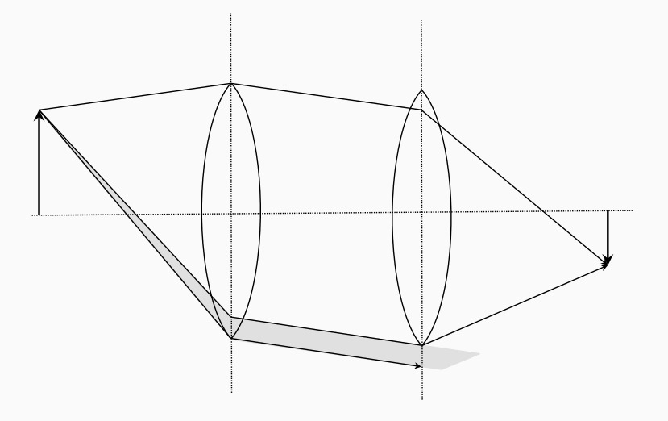


## Ray capturing


### Sensing

Sensing happens through *pixels*. Ray lights reach the lens first, and then photosensitive elements can capture them. A single sensor apparatus is called a pixel. When light reaches a photosensitive element, an electric current is generated proportional to the amount of light received. More light a sensor receives, the more current will flow in the circuit. Current charges a capacitor, which is periodically discharged to measure the amount of charge in it. Such period of time is called *shutter time*, and corresponds to the framerate of the camera.

We capture color through the *three sensors method*. There's a sensor sensitive to each channel: red, green and blue. A set of glass prisons will split wave to 3 different colors, sending them to the three different sensors. Location of sensors is determined by the *Bayer Mosaic*, as in the figure.

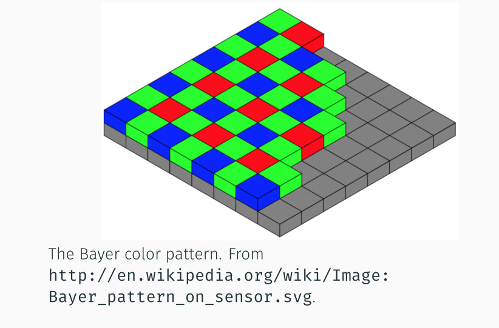

In the square of pixels, green is *overrepresented*: this is okay with the fact that human eyes see much better the green color than red or blue.

### The diagram of light capturing

A simple sensor model is composed by

-   an *integrator*, for instance a capacitance element;
-   a *sampler*, used to sample the amount of charge from the capacitor;
-   a *quantizer*, necessary to convert such information to a number.

Noise will enter this process. In particular, we have noise entering the capacitor, and entering the quantizer. Noise will largely depend on input brightness, camera settings and camera gain.


# Basics of Image Processing


## Linear filters


### The description of an image

An image can be described by the function $$f: \mathbb{R}^2 \longrightarrow \mathbb{R},$$ where $f(x, y)$ yields *intensity* of a feature (brightness) at location $(x, y)$. The domain is usually a rectangle, and intensity is bounded, so the function will be defined as $$f:[a, b] \times [c, d] \longrightarrow [I^-, I^+].$$

We can split intensity in color intensity with a vector function. For
instance, each element of the vector will contain intensity of,
respectively, red, green and blue:

$$f(x, y) = \begin{bmatrix} r(x, y)\\ g(x, y)\\ b(x, y) \end{bmatrix}, $$

each one with its own upper and lower bound. Color intensities are named
*channels*. Overall intensity is obtained with a linear combination of
red, green and blue channels with experimentally obtained coefficients.

Digital images are obtained by first *sampling* the 2D space on a
regular grid, and then *quantizing* the value:

$$ f(i, j) = \mbox{ Quantize }(f(\Delta i, \Delta j)).$$

An image can thus be represented as a matrix with indexes $i$ and
$j$: each channel is actually a matrix of values, that are the results
of previous samples and quantization. The higher the value in the matrix
field, the greater the intensity will be for that specific pixel.

Each channel is typically represented as a $8$ bits value, ranging
from $0$ to $255$.


### Linear filters

A *operator* is a function $h(\cdot)$ that takes an image as input and
outputs another image $g$ such as

$$ g(i, j) = (h \circ f) = h(f(i, j)).$$

An operator is said to be *local* if a given value of a pixel depends on
a collection of pixel values in the neighborhood. For instance, a local
operator could be one that makes the average of a pixel value with all
its surrounding neighbors. Such operator would work on a *window* of $2W + 1$ pixels.


### The averaging filter

An *averaging* filter can be mathematically defined as

$$ g(i, j) = \frac{1}{(2W + 1)^2} \sum_{k = -W}^{k=W} \sum_{l = -W}^{k=W} f(i + k, j + l).$$
If $W=1$, the above formula will perform the average of all pixels with its directly surrounding neighbors, for instance:

$$ g(i, j) = \frac{1}{9} \sum_{k = -1}^{k=1} \sum_{l = -1}^{k=1} f(i + k, j + l).$$

The average local operator in a $3 \times 3$ square can be understood as
the sum of all 9 cells values, with each one with a weight of $1/9$. By putting $W=1$ we obtained a $3 \times 3$ square, a *mask* of
pixels. Such mask determined by the operator is called *kernel* of the
filter.

In above example, we had a kernel filter with size $3 \times 3$, and
with $\frac{1}{9}$ as value for all its cells. Much more complex
filters can be achieved, for instance we can define a generic *weighted
sum* filter as

$$ g(i, j) = \sum_{k = -W}^{k = W} \sum_{l = -W}^{l = W} f(i + k, j + l) h(k, l)$$

with $h$ kernel of the filter having possibly different values for
each location $(k, l)$ of the mask.


### Correlation filter

A special local filter is the *Correlation* filter:

$$ g(i, j) = f \otimes h (i, j) = \sum_{k, l} f(i + k, j + l) h(k, l)$$

Correlation can be described as an averaging filter, but with a mask having
different coefficients instead of fixes ones. It is basically the
weighted sum filter we briefly discussed above.


### Convolution filter

A remarkable filter is the *Convolution* filter,

$$ g(i, j) = f * h = \sum_{k, l} f(i - k, j - l) h(k, l) = \sum_{k, l} f(k, l) h(i - k, j - l).$$
Convolution works in a different fashion than correlation, in particular convolution performs weighted sum of pixels which are *at the opposite location of the corresponding kernel filter location*. For instance, suppose we have a $3 \times 3$ mask, enumerating all pixels from top to bottom, left to right, $1$ to $9$. We will perform a convolution with pixel at location $5$ as center. Pixels in image that are at location $1$ and $2$, will be, respectively, filtered with values of the kernel that are in the opposite location, $9$ and $8$.

Properties of convolution and correlation together are the following:

-   they are *shift-invariant*: the output depends on pattern of
    neighborhood pixels rather than position of current neighborhood
    $$g(i, j) = f(i + k, j + l) \Leftrightarrow (h \circ g)(i, j) = (h \circ f)(i + k, j + l);$$ -   they are *linear*: for them holds the superposition principle
    $$h \circ (\alpha f + \beta g) = \alpha(h \circ f) + \beta(h \circ g), \mbox { with } \alpha, \beta \in \mathbb{R}.$$
Properties of convolution alone are the following:

-   is *commutative*;
-   is *associative*;
-   its fourier transform has the remarkable property that
    $$ f * g \longleftrightarrow F\cdot G,$$ with the
    $\longleftrightarrow$ symbol denoting a fourier transform (and
    viceversa) of an entire equation. This is very important: **a convolution can be computed as a simple product in the Fourier transform space**, thus allowing for far quicker calculations.


### Kernel of a filter

The *kernel* is the *mask* of the filter, a fixed-size matrix which will correspond to the local filter window employed when filtering.

Since convolving a function $h$ with the *Dirac's delta impulse*
  $\delta$ yields the same function again $\delta * h = h$, we will say
  that the kernel of the convolution is the *impulse response function*,
  or *unity impulse*.


### Border effects

A problem with such filter happens when we are averaging the border
pixels. Such pixels will need to be treated differently, for instance we
could ignore them, remove them, or simply perform the average with a
different algorithm and ignoring some out-of-the-image locations.

A common operation is to use a *padding* technique to extend the
original image. To do so, we will set aside pixels with constant value
(this is called *clamping*), or repeating the same value in the border.
More complex solutions involve wrapping the image as a toroid or a
sphere, or mirroring the pattern by reflecting pixels.

These operations are shown in the Figure.

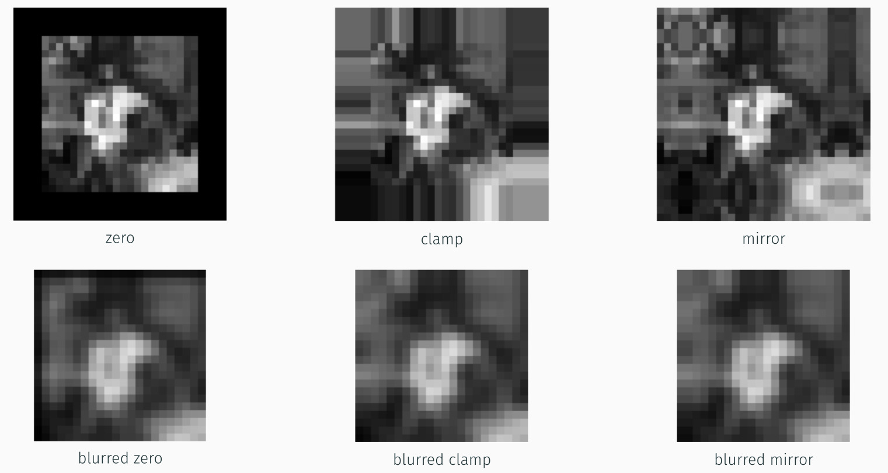


### Remarkable linear filters

Some remarkable linear filters are the *box filter*, the *Gaussian filter*, the *bilinear filter*, the *Sobel filter* and the *corner filter*. Box, Gaussian and bilinear filter are *low-pass* filters, while Sobel and corner filter are *band-pass* filters. Low-pass filters will remove much of the high-frequency content of the images, while band-pass will remove both very-low and very-high frequency content. All filters are *not oriented*; the Sobel filter only is said to be *oriented*.

The box filter averages the pixel values in a square window. Its shape is of
the form 

$$ h = \frac{1}{9} \begin{bmatrix} 1 & 1 & 1 \\ 1 & 1 & 1 \\ 1 & 1 & 1 \end{bmatrix}. $$

Basically, each element would have a value of $\frac{1}{9}$, and the end result will be the average of the pixels around the filtered one.

The Gaussian filter does the same, but in a better fashion. For instance,

$$ G(x, y; \sigma) = \frac{1}{2 \pi \sigma^2} \exp{\left(-\frac{x^2 + y^2}{2\sigma^2}\right)}.$$

Such formula is the formula of a gaussian with *variance* $\sigma^2$ ($\sigma$
is its standard deviation).

The quantity $\sigma$ is associated to the *width* of the filter, for it controls the size of the neighborhood that actually affects the center pixel when evaluating the filter and producing the filtered image. Even though there's a fixed window, the exponential would still be close to zero after a certain distance, that depends on the $\sigma$: the smaller it is, the smaller that distance will be. As a result, smaller $\sigma$s will basically leave the image unaffected, as the Gaussian filter with $\sigma$ going to $0$ will resemble more and more the impulse filter (which, as we know, is the kernel of the convolution, so that doing such filtering would leave the image unaffected $f * \delta = f$). On contrary, increasing $\sigma$ value will yield images which will see their details lost. This particular effect is due to the low-pass filtering nature of the Gaussian filter, which is suited to remove details in the image.

A kernel for the Gaussian can be obtained by constructing a proper $(2W + 1)^2$
array, such that 

$$h(i,j) = \frac{1}{2\pi \sigma^2} \exp{\left(-\frac{(i - W - 1)^2 + (j - W - 1)^2}{2\sigma^2}\right)}.$$

{ width=80% }

The bilinear filter has a kernel that is the product of two, piecewise linear,
*tent* functions,

$$\frac{1}{16} \begin{bmatrix} 1 & 2 & 1\\ 2 & 4 & 2\\ 1 & 2 & 1 \end{bmatrix} = \frac{1}{4}\begin{bmatrix} 1 \\ 2 \\ 1 \end{bmatrix} \frac{1}{4} \begin{bmatrix} 1 & 2 & 1 \end{bmatrix} $$

The Sobel filter, which instead is an oriented band-pass filter, has a
different shape,

$$ \frac{1}{8} \begin{bmatrix} -1 & 0 & 1 \\ -2 & 0 & 2 \\ -1 & 0 & 1 \end{bmatrix} = \frac{1}{4} \begin{bmatrix} 1 \\ 2 \\ 1 \end{bmatrix} \frac{1}{2} \begin{bmatrix} -1 & 0 & 1 \end{bmatrix} $$

The last filter, the corner filter, is a non-oriented band-pass filter,

$$ \frac{1}{4} \begin{bmatrix} 1 & -2 & 1\\ -2 & 4 & -2\\ 1 & -2 & 1\\ \end{bmatrix} = \frac{1}{2} \begin{bmatrix} 1 \\ -2 \\ 1 \end{bmatrix} \frac{1}{2} \begin{bmatrix} 1 & -2 & 1 \end{bmatrix}. $$


## Band-pass filters


Band-pass filters are any filter that passes frequencies in a certain range,
and attenuates frequencies that are outside that range.

### Laplacian of Gaussian

A more sophisticated filter can be created by means of two passages,

1. we first smooth the image with a Gaussian filter in order to remove high
   frequency content;
2. we take the first or the second derivative of that image.

The trick here is that we *take both steps by convolving the image with a
single function*, the **Laplacian of Gaussian**. Let's start with the
*Laplacian*. Laplacian of a function is the quantity

$$\nabla^2 f(x, y) = \frac{\partial^2 f}{\partial x^2} + \frac{\partial^2 f}{\partial y^2},$$ and corresponds to a "second derivative" of a function $f$
of two variables (our image).

Basically, the idea of a LoG filter is to simply convolve $f$ with the
Laplacian of the Gaussian filter, which is the quantity

$$\nabla^2 G(x, y; \sigma) = \left(\frac{x^2 + y^2}{\sigma^4} - \frac{2}{\sigma^2}\right) G(x, y; \sigma),$$

which is the Gaussian function multiplied by a function which depends on both
$x^2$ and $y^2$.

{ width=350px }

As one can see in the figure, LoG filter is *not oriented* and has a
*center-surround* response.

### Derivative of Gaussian

DoG stands for **Derivative of Gaussian**, and is a different kind of filter which is very similar to the LoG. The idea here is to just take the *gradient* (the directional derivative) of the Gaussian. In particular, let's take $\nabla f = (\frac{\partial f}{\partial x}, \frac{\partial f}{\partial y})$ the gradient of $f$: its *directional derivative* along a direction $d = (u, v) = (\cos\theta, \sin\theta)$ is the dot product between a vector $d$ and the gradient of $f$, that is 

$$\nabla_d f = d \cdot \nabla f.$$ Such quantity is of a crucial importance. Suppose that we want to compute a band-pass filter, employing first-order directional derivatives. One has to do 

$$\nabla_d (G * f) = (\nabla_d G) * f = (d \cdot \nabla G) * f,$$ but the quantity $$d \cdot \nabla G = u\frac{\partial G}{\partial x} + v\frac{\partial G}{\partial y}.$$ Resulting filter is called **steerable filter**, due to the fact that it can be fine-tuned by choosing the value of $u = \cos\theta$ and $v=\sin\theta$, directions in the image plane, accordingly to our needs. Basically, this kind of filter has a *direction* which can be set up by taking proper values of $u$ and $v$: we can assign a direction to such filter, thus we call it *steerable*.


### Steerable filters

We have the quantity $$d \cdot \nabla G = u\frac{\partial G}{\partial x} +
v\frac{\partial G}{\partial y}.$$ Such filter is called **steerable filter**,
due to the fact that it can be fine-tuned by choosing the value of $u =
\cos\theta$ and $v=\sin\theta$, directions in the image plane, accordingly to
our needs. Basically, this kind of filter has a *direction* which can be set up
by taking proper values of $u$ and $v$: we can assign a direction to such
filter, thus we call it *steerable*.

Steerable filters are crucial for efficiency: the core idea is that we can
compute the basis filter (the Gaussian) *once*, and then simply take the dot
product with the direction $d$ we want to set to the filter.

A basis filter is the filter having the default direction (direction is along
axis). In formula,

$$d \cdot \nabla G = u\frac{\partial G}{\partial x} + v\frac{\partial G}{\partial y} = u G_x + v G_y,$$ basis filters are $G_x$ and $G_y$. It is sufficient to compute each one of them once by convoluting $f$ with the basis filters, and then apply the dot product to get a new filter of the same shape along the direction $d$ we imposed.


### The idea of basis filters

DoG only requires two filters, as shown above. Such filters are those over
direction $x$ and $y$. Computing the gradient of the Gaussian and then
convolving it with the image is, then, sufficient.

LoG requires at least three basis filters. In particular, given the second
order derivative of the Gaussian, with respect to $x$,

$$G_{xx} = (4x^2 - 2)\exp{\left(-\frac{x^2 + y^2}{2\sigma^2}\right)},$$ having $u_i = (\cos\theta_i, \sin\theta_i)$, it has been proposed that $$G_{uu} = \sum_{i=1}^3 k_i(\theta)G_{u_i, u_i},$$

where $G_{u_i, u_i}$ is the second derivative of Gaussian with respect to a direction $u_i$, $k_i$ is a term such that $$k_i(\theta) = \frac{1}{3}[1 + 2\cos(2(\theta - \theta_i))],$$ and the angle $\theta_i$ has values $\theta_1 = 0$, $\theta_2 = \frac{\pi}{3}$ and $\theta_3 = \frac{2\pi}{3}$. 

Basically, one has to just compute $G_{u_i, u_i}$, and to compute the generic
filter in direction $u$ one makes the sum with three terms multiplied by
$k_i(\theta)$, where $\theta$ is the angle upon which the direction $u$
depends.

### High pass filtering

A high-pass filter can be built by *subtracting* a low-pass filtering result
from the image (basically, by "removing" low frequencies by subtraction).
Adding such high-pass filtered result to the image by a fraction of its value,
can yield a sharper image whose details are augmented.

Basically, a sharper image can be obtained in such way,

$$f_{sharp} = f + \gamma(f - f * h_{blur}),$$ where $h_{blur}$ is, for example, a Gaussian filter. By doing some math, $$f_{sharp} = f + \gamma(f - f * h_{blur}) = f + \gamma f - \gamma (f * h_{blur}) = (\gamma + 1) f - \gamma (f * h_{blur}) = f * [(\gamma + 1) \delta - \gamma h_{blur}],$$ 

where we used the property $f * \delta = f$.


## Filtering Performance

### Improving performance when convolving large images

Performing a convolution requires $W^2$ operations, with $W$ size of the
window. Basically, the bigger the filter, the computationally harder the task
will be. However, some improvements can be taken, up to the point we manage to
compute $2W$ operations only, which is a lot better. Such drastic improvement
can be achieved when dealing with **separable filters**.

Separable filters are a class of filters whose kernel can be *decomposed* to a
product between two vectors and (eventually) some coefficients. In particular,
we obtain a kernel of the form 

$$K = v\sigma u^\top,$$ with $\sigma$ being a coefficient and $v$ and $u^\top$ are said to be the *vertical* and *horizontal kernels*. In order to convolve the image with a separable kernel it is sufficient to perform a vertical convolution with $v$ and a horizontal convolution with $u^\top$, resulting in a much faster computation than taking the whole window and perform a 2-D convolution.

An example could be the aforementioned bilinear filter, whose decomposition is 

$$ \begin{bmatrix} 1 & 2 & 1\\ 2 & 4 & 2\\ 1 & 2 & 1 \end{bmatrix} = \begin{bmatrix} 1 \\ 2 \\ 1 \end{bmatrix} \begin{bmatrix} 1 & 2 & 1 \end{bmatrix}, $$

where, in this case, we didn't consider any coefficient other than $1$.


### Singular Value Decomposition

*Singular value decomposition* is the factorization method for which we can separate a separable kernel.

Suppose we have the general case of a matrix $M$ whose rank is $r$. We would end up with the *singular value decomposition*

$$M = U \Sigma V^\top,$$ where $U$ is the matrix whose columns are said to be *left-singular vectors*, while $V^\top$ rows are *right-singular vectors*. $\Sigma$ is a diagonal matrix, which contains in descending order, coefficients $\sigma_1, \sigma_2, \dots, \sigma_r$ that are said to be *singular values*. The number of non-zero singular values is equal to the rank of matrix $M$ (in this case, equal to $r$).

In below example from Wikipedia, it is shown the effect of each matrix. In particular, $U$ and $V^\top$ matrices are rotation matrices, while $\Sigma$ only applies a rescaling (in this case, $M$ matrix has rank equal to $2$ since there are only $2$ singular values, $\sigma_1$ and $\sigma_2$).

{ width=80% }

Our goal is to obtain $$K = v\sigma u^\top.$$ Since we only want a single $\sigma$ and the number of non-zero singular values is equal to the rank of the matrix we would like to separate, **a separable kernel is a kernel whose rank is equal to $1$.** In particular, we would obtain

$$K = \sigma_1 u_1 v_1^\top.$$

If $K$ is not of rank $1$, we end up with the general case of a matrix with rank $r \neq 1$. For this reason, we would obtain

$$ K \approx \sum_{i=1}^r \sigma_i u_i v_i^\top = \sigma_1 u_1 v_1^\top + \sigma_2 u_2 v_2^\top + \dots + \sigma_r u_r v_r^\top,$$ having to perform $2r$ convolutions, two for each generated pair of $u_i$ and $v_i^\top$. 

Why is this convenient? It makes compoutation cheaper, since instead of dealing with $W^2$ operations, now it will be sufficient to precompute the gradient with $u_r$ and $v_r^\top$ only, and those vectors have size $W$. Thus, only $2W$ operations will be needed. However, keep in mind that if $r \neq 1$, one has to perform $2r$ convolutions with filters having $W$ size, and sum up everything altogether. Despite that, the end result will be much better than performing $W^2$ operations.


For filters described by a function it is quite the same. Given a filter $f(x, y)$ it is said to be separable if 

$$f(x, y) = g(x)h(y).$$

An example of a separable filter is the Gaussian filter, 

$$ G(x,y;\sigma) = \frac{1}{2\pi \sigma^2}\exp{\left(-\frac{x^2 + y^2}{2 \sigma^2}\right)} = \frac{1}{\sqrt{2\pi} \sigma} \exp{\left(-\frac{x^2}{2\sigma^2}\right)}\frac{1}{\sqrt{2\pi} \sigma} \exp{\left(-\frac{y^2}{2\sigma^2}\right)} = g(x)h(y).$$


## Non-linear operators and other neighborhood operators


### The median filter

A *median filter* is a filter that substitutes each pixel value with the
**median** of the distribution in the neighborhood. In particular, it takes all
pixels in neighborhood of a given pixel, takes the median of all those values,
and store it in the central pixel. Resulting image would hopefully see much of
its noise being removed by the median filter (in particular, *shot noise*).
Median filter is a non-linear filter.

The median filter is able to address *shot noise*, it's a kind of noise that
strongly affects random, single points in an image.

### The $\alpha$-trimmed mean filter

An example is the *$\alpha$-trimmed mean* filter. Such filter is designed to
remove the *fraction* $\alpha$ of values in the neighborhood that are the
smallest and the largest. 

### Weighted median filter

Too large neighborhood will likely make the filter consider points that are far
from the one in the middle. Basically, we want those points to count *less*
than closer ones, and this is not guaranteed in the classic median filter
(points far from the center of the window are equally considered). **Weighted
median** filter solves this issue by applying corresponding weights to pixels.
In particular, it corresponds to solving such optimization problem (for the
weighted median $p = 1$)

$$ \min_{g(i, j)} \sum_{k, l} w(k, l)|f(i + k, j + l) - g(i, j)|^p,$$ with
$w(k, l)$ being the weight associated to the corresponding $(k, l)$ position in
the filter window. $k$ and $l$ will range from value $-W$ to value $W$, and $p$
is equal to $1$. This problem means *finding the $g(i, j)$ that results in the
minimum distance with weights between a point in neighborhood of $f$ and the
point $g(i, j)$*.

By setting $p=2$ one obtains the *weighted mean* filter (which does the mean,
but weighted by function $w$).


## Morphology (non-linear)

Morphology is basically the set of operations that allows to manipulate *shapes*
in figures.

A shape can be described by an image containing only $0$ and $1$, that's called
a **binary image**. Binary images are actually images having only two values,
and are usually adopted to describe some kind of shape. A shape could be, for
instance, a feature or a set of points that are detected in an image; those
points are then "mapped" to another image (the binary image) which is related
to the original image by containing collected informations on shapes.
Basically, a binary image can describe a shape by identifying it with `1` and
`0` values.

A binary image is obtained by a non-binary image by applying a *thresholding
operation* $\theta$ which is non-linear,

$$\theta(f, t) = \left\{\begin{array}{ll} 1 & \mbox{ if } f \geq t\\ 0 & \mbox{
otherwise } \end{array}\right.$$

{ width=80% }


Morphological operations consists in two steps,

1. convolve the image with a *binary structuring element* (e.g. a box filter);
2. select a binary output, based on the thresholded result of previous
   operation.


### Operations when convolving with shapes

There are many possible operations. 

Let $c = f \otimes s$ being the count of the number of $1$s falling inside both
figures, the $f$ image and the $s$ moving filter (actually, $c$ is the count of
$1$s falling in both $f$ and $s$ because, at each convolution step when
calculating each point of the convolved image $c$, the pixel value in $c$ will
be the count of $1$s belonging to both functions; this is a peculiar
characteristic of the correlation, since we are dealing with functions whose
values are either $0$ or $1$). Let's also call $S$ the total number of $1$s in
the $s$ shape. Some operations are

* **dilation**, $\mbox{dilate}(f, s) = \theta(c, 1)$. In this case, a pixel
  becomes $1$ if *at least one $1$ falls inside both $f$ and $s$, that is when
  $f$ and $s$ intersect* at least a bit. This happens because the threshold is
  only $1$;
* **erosion**, $\mbox{erode}(f, s) = \theta(c, S)$. In this other case, a pixel
  becomes $1$ if *$f$ and $s$ are fully-intersected, or when the entire $s$
  falls inside $f$*. This happens because the threshold is the same of the
  total numbers of point in shape $s$, which is $S$; **majority**,
  $\mbox{maj}(f, s) = \theta(c, S/2)$. This operation assigns $1$ to the center
  of the filtering window $s$ if *the majority of $s$ falls inside $f$*.
  Basically, picking a threshold of $\frac{S}{2}$ means that the result will be
  $1$ if the intersection has *at least* half of the points in shape $s$;

Combining those operations leads to new operations, for instance 

* **opening**, $\mbox{dilate}(\mbox{erode}(f, s), s)$;
* **closing**, $\mbox{erode}(\mbox{dilate}(f, s), s)$,

are operations that, respectively, allow opening and closing of holes in a
binary image.

{ width=80% }


### Distance transform

*Distance transform* $D(i, j)$ of a given binary image $b(i, j)$ and given a
metric $d$, is a transform such that 

$$D(i, j) = \min_{k, l: b(k, l) = 0} d(i-k, j-l).$$ Basically, a pixel value is
given by its distance with metric $d$ from the closest point whose value is $0$
(that point is indeed $b(k, l)$, and it is indicated by the constraint $k, l:
b(k, l) = 0$).

Commonly adopted metrics are:

- 1-norm, which is the *city-block* distance $$d(i, j) = |i| + |j|.$$
- 2-norm, which is the *Euclidean* distance $$d(i, j) = \sqrt{i^2 + j^2}.$$

Hence, for example in above example when we are in the case of the city-block
distance, one has to minimize the quantity $$d(i-k, j-l) = |i - k| + |j - l|.$$

{ width=80% }

## Connected Components

Connected components of an image are the regions of the image with adjacent
pixels having the same value. Connected components can be either *labeled* or
not, depending on the kind of task we want to perform.

{ width=80% }

Connected components can be described by some quantities. In particular, we
could be interested in:

1. *area* of the connected components, which is the number of pixels belonging
   to a connected component;
2. *perimeter* of the connected components, which is the number of pixels
   belonging to the *boundary* of the connected component;
3. *centroid* which has formula $$(\overline x, \overline y) = \left(\frac{\sum
   x^{(i)}}{N},\frac{\sum y^{(i)}}{N}\right);$$
4. *matrix of the second moments*, which is $$I = \begin{bmatrix} I_{xx} &
   I_{xy} \\ I_{yx} & I_{yy} \end{bmatrix} = \sum_{i=1}^N \begin{bmatrix}
   x^{(i)} - \overline{x} \\ y^{(i)} - \overline{y} \end{bmatrix}
   \begin{bmatrix} x^{(i)} - \overline{x} & y^{(i)} - \overline{y}
   \end{bmatrix};$$
5. *Hu moment invariants*.


## Image warping

*Image warping* is the idea to modify an image by applying some
kind of transformation. 

{ width=80% }

The above transformations will change the *domain* of the image, are *global*
and *parametric*. Another example of a parametric transformation is the
*rotation*. There are two kinds of warping: the *forward warping* and the
*inverse warping*.

### Forward warping

> Forward warping transforms an image $f(x)$ into an image $g(x')$ by means of
> the transform $x' = h(x)$:

```
procedure ForwardWarp(f, h) out g
    for each pixel x in f(x) do
        compute the destination x'
        copy pixel f(x) to g(x')
end procedure
```

This works by calculating point in the output image by applying transform of
input pixels. Looks like this works well, but in practice it will not: by
computing destination location $x'$, one has a non-integer value as a result.
It is not clear how to deal with such values. Basically, what's wrong here is
that we apply a transformation without having guaranteed that the output
location will be an integer (and thus, we cannot locate the resulting
transformed pixel reliably).

### Inverse warping

> Inverse warping transforms an image $f(x)$ into an image $g(x')$ by means of
> the transform $x = h^{-1}(x') = \hat{h}(x)$, with $x' = h(x)$:

```
procedure InverseWarp(f, h) out g
    for each pixel x' in g(x') do
        compute the source location x = h^{-1}(x')
        resample image f at location x in order to get f(x) value
        copy pixel f(x) to g(x')
end procedure
```

This works well, because our output is *guaranteed to be an integer*, at the
cost of resampling the *input* in order to find the value of the pixel before
the transformation, and then applying the transform at the correct location.
Resampling requires a well-crafted interpolation filter, because generally a
sampling rate $r$ is not defined for $g(x')$ output image.


### Non-parametric transforms


Non-parametric transforms are all those that are non global. Basically,
non-parametric transforms allow to define local transformations whose amount of
transformation is different from place to place. 

A common approach to achieve this is to first define a *sparse* set of
corresponding points, then interpolate to a dense displacement field via
triangulation followed by the application of an affine motion.


## Multi-resolution representations

### Upsampling and downsampling

*Upsampling* and *downsampling* are, respectively, increasing and decreasing
the size of an image. Usually, upsampling is useful when the image needs to
match the size of a pre-trained algorithm or the size of a printer, while
downsampling is also required when applying *coarse-to-fine matching* (starting
from a small sized picture, finding a pattern, and then fine-tuning the match
as we increase in image size) and *fine-to-coarse feature tracking* (find
features at fine scales, but rejecting them if they do not have parents in
coarser scales). Downsampling is also useful when we wish to find a pattern in
an image with a fixed-size template.

### The upsampling process

Upsampling is basically a correlation between the image and an *interpolation
function* $h(i, j)$ (interpolation):

$$g(i, j)= \sum_{k, l} f(i, j) h(i - rk, j - rl).$$

{ width=80% }

We say that $f$ is the original image, $h$ is the *interpolation kernel*, and
$r$ is the *upsampling rate* (the new sampling rate of the image).

Common interpolation kernels are:

* *bilinear*;
* *bicubic*, the product of two bicubic
  [splines](https://en.wikipedia.org/wiki/Spline_\(mathematics\)), that is 

$$h(x) = 
\left\{
\begin{array}{ll}
1 - (a + 3)x^2 + (a + 2)|x|^3 & \mbox{ if } |x| < 1\\
a(|x| - 1)(|x| - 2)^2 & \mbox{ if } 1 \leq |x| < 2\\
0 & \mbox{ otherwise }
\end{array}
\right.
$$

with usually $a = -1$. $a$ is the derivative at $x = 1$; setting it equal to
$-1$ makes our bicubic resemble the [sinc
function](https://en.wikipedia.org/wiki/Sinc_function) much more.

### Aliasing

*Aliasing* is the phenomenon for which, when sampling a signal, choosing a
too-low sample rate (below the double of the max frequency of the signal -
Nyquist-Shannon theorem) results in an image that is indistinguishable from
sampling to an even lower frequency.

{ width=80% }

When dealing with signals where sampling at enough frequency is impossible, the
only thing left is to low-pass filter: as a consequence, max frequency of
signal would drop and required double of max sampling frequency will be much
lower.

### The downsampling process

Downsampling is a two-step procedure. 

First, in order to avoid aliasing a convolution with a low-pass filter is
performed. Second, we simply take one sample every $r$-th: 

$$g(i, j) = \sum_{k, l} f(k, l)h(ri - k, rj - l).$$

{ width=80% }

### Multi-resolution representation

The basic idea of multi-resolution representation is that by having many
various-scale representations of a same image at our disposal, each one of them
having more and more coarser details as we are downsampling the image, we can
detect features at many levels of representations with the same templates. Each
level will offer peculiar features at a certain scale, by investigating each
one of them we are able to match and finally track all features, no matter
their scale.

### Image pyramids

*Image pyramids* are conceptual pyramids obtained by subsequent downsampling of
an original image. 

A common pyramid structure is the *octave pyramid*, for which every image is
downsampled at $r = 2$ rate. Similarly, the *half-octave pyramid* sees every
image downsampled at $r = \sqrt{2}$.

{ width=80% }

When downsampling, a smoothing filter should be applied in order to prevent
aliasing. When such filter is a Gaussian, the pyramid is called **Gaussian
pyramid**. 


# Feature Detection

## Key-point detection and matching

### Tracking and matching

Correspondences between two images can be obtained by *feature detection*, and
then by *finding two features which are very similar across images*. Such
features are, usually:

- *keypoints*: texture patches surrounding the point location;
- *edges*; *geometric primitives* such as lines, curves, and so on.

When it comes to finding features and matching them across images, there are
two approaches.

The first approach is the so-called **detect-and-track**. By doing
detect-and-track, we are finding features *in a single image* that can be
tracked *by performing a local search*. This is particularly good when we are
dealing with images been taken from nearby viewpoints, or for video sequences
where usually features will "move" slowly across frames.

The second approach is named **detect-and-match**. In this approach, we are
finding features *in all images*, then matching such features *based on their
local appearance*. This approach is very good when there's a lot of motion
involved, and the two images are taken from a very different point of view.

### The feature and matching pipeline

Basically, it all boils down to 3 steps:

1. *feature detection*: some features are extracted from each image, such
   features are likely to match well in other images;
2. *feature description*: each extracted feature will be assigned to a
   *descriptor*, which is required to be *invariant* to rotation and
   illumination;
3. either *feature matching* (searching the same feature in other images) or
   *feature tracking* (where the search is restricted to a small neighborhood
   of the considered feature).

## Harris Corner Detector

The core idea of the **Harris Corner Detector** is that to detect corners, a
necessary condition for a feature is to **exhibit intensity changes
(gradient)** in at least *two different orientations*. This is due to the fact
that, if change occurs in a single direction, ambiguity occurs.

{ width=80% }

Basically, we are going to pick a region of the figure where the gradient
varies in *at least* two directions, and then go track it across the other
images.

**Harris Corner Detector** works by computing the gradient between two
different (translated) versions of the same window $W$. Window $W$ is centered
in pixel $(x, y)$ of image $I$, and its translated version is shifted by the
quantity $(\Delta x, \Delta y)$. The method computes the *sum of square
differences* by means of the calculus

$$E(x, y, \Delta x, \Delta y) = \sum_{d_x, d_y \in W} [I(x + d_x, y + d_y) -
I(x + \Delta x + d_x, y + \Delta y + d_y)]^2,$$

where the $d_x$ and $d_y$ denote the indexes of the sum.

Basically, the goal here is to get the gradient. In order to do so, we employ
the Taylor series expansion, truncating it at the first order. Hence,

$$I(x + \Delta x + d_x, y + \Delta y + d_y) \approx I(x + d_x, y + d_y) +
\nabla I(x + d_x, y + d_y)^\top \begin{bmatrix} \Delta x \\ \Delta y
\end{bmatrix}.$$

By substituting this term into $E$, one gets 

$$E(x, y, \Delta x, \Delta y) = \sum_{d_x, d_y \in W} \begin{bmatrix} \Delta x
& \Delta y \end{bmatrix} \nabla I(x + d_x, y + d_y) \nabla I(x + d_x, y +
d_y)^\top \begin{bmatrix} \Delta x \\ \Delta y \end{bmatrix},$$

where the general relationship $$(v^\top u)^2 = u^\top v v^\top u$$ holds, and 

$$ \nabla I(x + d_x, y + d_y) \nabla I(x + d_x, y + d_y)^\top = \begin{bmatrix}
I^2_x & I_x I_y \\ I_x I_y & I^2_y \end{bmatrix}.$$

Rearranging the equation,

$$E(x, y, \Delta x, \Delta y) = \begin{bmatrix} \Delta x & \Delta y
\end{bmatrix} \begin{bmatrix} \sum_{d_x, d_y \in W} I^2_x & \sum_{d_x, d_y \in
W} I_x I_y \\ \sum_{d_x, d_y \in W} I_x I_y & \sum_{d_x, d_y \in W} I^2_y
\end{bmatrix} \begin{bmatrix} \Delta x \\ \Delta y \end{bmatrix} =
\begin{bmatrix} \Delta x & \Delta y \end{bmatrix} C \begin{bmatrix} \Delta x \\
\Delta y \end{bmatrix},$$

where $C$ is *positive semidefinite* by construction.

In order to better obtain a rotationally invariant operator, and to get a
smoother operator it is better to use a Gaussian weighting window for each term
of the $C$ matrix. Hence, by applying weights 

$$w(d_x, d_y) = \frac{1}{2 \pi \sigma^2}\exp{\left(-\frac{d_x^2 +
d_y^2}{2\sigma^2}\right)},$$ one finally gets 

$$E(x, y, \Delta x, \Delta y) = \begin{bmatrix} \Delta x & \Delta y
\end{bmatrix} \begin{bmatrix} \sum_{d_x, d_y \in W} w(d_x, d_y) I^2_x &
\sum_{d_x, d_y \in W} w(d_x, d_y) I_x I_y \\ \sum_{d_x, d_y \in W} w(d_x, d_y)
I_x I_y & \sum_{d_x, d_y \in W} w(d_x, d_y) I^2_y \end{bmatrix} \begin{bmatrix}
\Delta x \\ \Delta y \end{bmatrix} = \begin{bmatrix} \Delta x & \Delta y
\end{bmatrix} \hat{C} \begin{bmatrix} \Delta x \\ \Delta y \end{bmatrix}.$$

The rationale is that the farther away from the centre of the window (the
center of the feature we are going to detect), the lesser the effect it should
have on the $E$ computation. With this we specify we want our corner in the
middle of the feature, and not anywhere else.

### Second moment matrix

$\hat{C}$ is called **second moment matrix**. It is a *symmetric* and *positive
semidefinite* matrix. Since it has such properties, it can be decomposed into a
product between three matrices, the middle one being the diagonal eigenvalues
matrix $\Lambda$, such as 

$$\hat{C} = T \Lambda T^\top = T \begin{bmatrix} \lambda_1 & 0 \\ 0 &
\lambda_2\end{bmatrix} T^\top,$$ where the ordering of eigenvalues is such that
$\lambda_2 > \lambda_1 > 0.$ An interesting property is that for unitary
displacements the sum of squared errors value is constrained by the
eigenvalues, for instance $\lambda_1 \leq E(x, y) \leq \lambda_2$. Basically,
eigenvalues describe the direction and the intensity of the gradient in a given
window.

There are $3$ possible cases:

1. $\lambda_1, \lambda_2 >> 0$: the feature is a *corner*;
2. $\lambda_2 >> 0$, but $\lambda_1 \approx 0$: the feature is an *edge*;
3. $\lambda_1 \approx \lambda_2 \approx 0$: there is *no particular structure*.

In order to measure how likely a feature is a corner, we may employ different
measures: 

- the *minimum eigenvalue* $\lambda_1$:
- the quantity $\mbox{det}(\hat{C}) - k \mbox{tr}^2(\hat{C})$;
- the ratio $\frac{\mbox{det}(\hat{C})}{\mbox{tr}(\hat{C})}$, which is called
  *harmonic mean*.

### General algorithm for Harris corner detector

The *Harris corner detector general algorithm* is an algorithm which takes an
*image* as input, and outputs a *position of keypoints*.

Its steps are:

1. compute $I_x$ and $I_y$ by a convolution with derivatives of Gaussian
   filter;
2. compute the $3$ images of the $C$ matrix, that are $I^2_x, I^2_y$ and $I_x
   I_y$;
3. convolve each image with a larger Gaussian;
4. compute a scalar index using one of the $3$ possible measures;
5. throw away noise by finding a local maxima above a certain threshold.

## Hessian detector

The **Hessian detector** has generally the same goals of the Harris corner
detector, with the difference that it employs second derivatives (the Hessian
matrix) in order to do so, and the perks that it is more responsive on regions
with strong texture variation. Basically, the Hessian matrix is the matrix 

$$H(x, y) = \begin{bmatrix} I_{xx} & I_{xy} \\ I_{yx} & I_{yy}\end{bmatrix}.$$

The idea is to detect locations that exhibit *high curvature in two,
orthogonal, directions*.

Hessian detector works by detecting local maxima of $|\mbox{det}(H)|$ that are
above a certain threshold $\theta$, by detecting locations that exhibit *high
curvature in two, orthogonal, directions*.

### Details of Second Moment Matrix

With computations like the Harris detector case, one gets

$$E(x, y, \Delta x, \Delta y) = \begin{bmatrix} \Delta x & \Delta y
\end{bmatrix} \hat{C} \begin{bmatrix} \Delta x \\ \Delta y \end{bmatrix},$$ so
that $E$ is as large as possible in all directions of vector $\begin{bmatrix}
\Delta x \\ \Delta y \end{bmatrix}$. $\hat{C}$ is now defined as the *weighted
sum of matrices*

$$\hat{C} = \sum w(d_x, d_y) \begin{bmatrix} I^2_x & I_x I_y \\ I_x I_y & I^2_y
\end{bmatrix}.$$

Each matrix in the sum are positive semidefinite and symmetric and will satisfy
property $$\mbox{tr}(\hat C) \geq 0 \Rightarrow \lambda_1 + \lambda_2 \geq 0,$$
and property $$\mbox{det}(\hat C) = 0 \Rightarrow \lambda_1 \lambda_2 = 0;$$
hence, one eigenvalue is $0$, the other one can be either $0$ or greater than
$0$.

{ width=80% }

### Second moment matrix to obtain eigenvalues

Lete's consider the property for which the second moment matrix is orthogonally
similar to a diagonal matrix (can be diagonalized by applying rotation $T$),

$$\hat{C} = T\begin{bmatrix}\lambda_{max} & 0 \\ 0 &
\lambda_{min}\end{bmatrix}T^\top = \begin{bmatrix} t_{max} &
t_{min}\end{bmatrix}\begin{bmatrix}\lambda_{max} & 0 \\ 0 &
\lambda_{min}\end{bmatrix}\begin{bmatrix} t_{max}^\top \\ t_{min}^\top
\end{bmatrix},$$

where we substituted $T = \begin{bmatrix} t_{max} & t_{min}\end{bmatrix}.$ For
unitary displacements, one gets $t = \begin{bmatrix} \Delta x & \Delta y
\end{bmatrix}^\top$, with norm $||t||_ 2 = 1$.

The column $t_{max}$ of matrix $T$ represents *the direction along with $E$ is
maximal, and equal to $\lambda_{max}$*. So, in order to compute the max
eigenvalue one could multiply $\hat{C}$ by the quantity 

$$t_{max}^\top \hat{C} t_{max} = \begin{bmatrix}t_{max}^\top t_{max} &
t_{max}^\top t_{min}\end{bmatrix} \begin{bmatrix} \lambda_{max} & 0 \\ 0 &
\lambda_{min}\end{bmatrix}\begin{bmatrix} t_{max}^\top t_{max} \\ t_{max}^\top
t_{min}\end{bmatrix} = \begin{bmatrix}1 & 0\end{bmatrix} \begin{bmatrix}
\lambda_{max} & 0 \\ 0 & \lambda_{min}\end{bmatrix}\begin{bmatrix} 1 \\
0\end{bmatrix} = \lambda_{max}.$$

$\lambda_{min}$ can be obtained by multiplying by $t_{min}$.

### Invariance and covariance to a transform

The concepts of **invariance** and **covariance** are quite similar, despite
being different in some core aspects. 

> Keypoint locations should be *invariant* to photometric transformations and
> *covariant* to geometric transformations.

- **invariance**: the image is transformed and keypoint locations *do not
  change*;
- **covariance**: the image is transformed, and keypoint locations *are
  transformed accordingly*. Basically, *the regions detected after having
  applied a transformation should remain the same as the transformed versions
  of the regions which are detected in the original image*. This means that a
  transformation should "transform" region detection as well.

Harris corner detector already provides covariance to rotation, since both
trace and determinant are invariant to rotation (more generally, one has to
design detectors which are rotationally invariant, so that they equally respond
to same features in both original image and rotated version.

## Scale-space representation

Some features that appear in a scale may not appear in other scales. For
instance, a corner could be detected in a large-enough scale, but not being
detected at a smaller scale. This happens because we are using the same
strategy of detecting feature at both scales, and features may not be fit for
detection at any scale.

When no a priori knowledge is exploitable, the best idea is to deal with
different scales at the same time. The idea is to provide our algorithms *many*
rescaled versions of the same image, in order to multiply the chance of finding
a given feature at a proper scale.

In order to do so, there are 2 distinct approaches, the straightforward one
being building a pyramid of an image and then looking at a feature at all
scales. However, a better approach is to look for features that are stable and
strong in **both location and scale**. This leads to a convenient
'three-dimensional' representation of an image, the **scale-space
representation**.

### The scale-space representation

In **scale-space representation** the goal is to offer the same 'interface' to
both location in an image and scale of an image. This is built by constructing
a 3D 'cube' of images, where two dimensions are represented by the two axis
that determine the location of a point in an image, and the third dimension is
**the scale of the image, with an ordering**. Basically, we achieve this by
subsequently convolving the image with a Gaussian filter with width $t =
\sigma^2$: each time we apply the filter, a new smoothed image is born, and we
stack it on top of our scale-space cube. In the end, we will obtain a cube with
three dimensions, $x, y$ and *scale parameter* $t$: each point $(x, y, t)$
represents a triplet in the scale-space.

In practice, each element of the scale-space representation (a 'level'), has
formula 

$$L(x, y, t) = G(x, y; \sqrt{t}) * f(x, y).$$ Adopted Gaussian filters are
built so that $$G(x, y; \sqrt{t}) = \frac{1}{2\pi t}\exp{\left(-\frac{x^2 +
y^2}{2t}\right)}.$$ If we build a scale-space this way, we will end up with a
'cube' of images, where going 'up the cube' will correspond to getting more and
more blurred images.

The *principle of scale selection* is the idea that, if we assume that we are
able to detect features at a given scale as spatial local maxima of
derivatives, such features **may be detected in the same location at different
scales too, with the same combination of derivatives**. With this approach we
basically detect features in both location in image and scale-space.

Before applying this method, we must **normalize** derivatives, since
performing those at various scales will yield derivatives with different
strength, possibly rendering our search of a maxima without normalization
meaningless.

### Derivative normalization

Derivative normalization should take in account that features that have
intrinsic scales should offer a local maxima of the combination of derivatives
at a given scale.

{ width=80% }

Normalization generally depends on the kind of feature that has to be detected.
For instance, let's normalize plain sinusoidal functions, such as $$ g(x) =
\sin{\omega_0 x}.$$ In our example, convolving a sin with a Gaussian one
obtains 

$$L(x, t) = e^{-\frac{\omega_0^2 t}{2}}\sin{\omega_0 x}$$ due to a convolution
property. Since there is a decreasing exponential term, $L$ will decrease
exponentially as we get to a higher scale $t$. If we maximize with respect to
$x$, at each scale we get $$L_{max}^x (t) = e^{\frac{\omega_0^2 t}{2}},$$ which
depends on scale only. The same happens when we apply a $m$-th order
derivative, which is 

$$L^m(x, t) = e^{-\frac{\omega_0^2 t}{2}}\frac{d^m \sin{\omega_0 x}}{dx^m},$$
which yields a maximum of 
$$L^{x^m}_ {max}(t) = \omega_0^m e^{-\frac{\omega_0^2 t}{2}}.$$

Take a look on the result: none of the $m$-th derivatives have a local maximum,
since each of them is composed by an exponential that is constantly decreasing
with no maxima.

The trick is in the normalization, that should be good enough to transform such
expressions in expressions that have a local maximum, preferably in
$\frac{2\pi}{\omega_0}$ (the characteristic length of the sine wave).

In order to get maxima, we employ the **$\gamma$-normalized derivative
operator** $t^\gamma \partial x,$ which is perfectly suited for normalizing
derivatives in scale-space representation. Such operator corresponds to a
change of variable $\xi = \frac{x}{t^{\gamma/2}}.$ The result will be the
non-monotonic behavior we are looking for, 

$$ L^{\xi^m}_ {max} (t) = t^{m\gamma/2}\omega_0^m e^{-\frac{\omega^2_0
t}{2}}.$$ Introduction of this change of variable had the result of getting a
unique maximum at $$t_{max} = \frac{\gamma m}{\omega_0^2},$$ whose location
across scales is a function of $\omega_0$ (changing it will modify the
characteristic length of the sine wave, hence the location of maximum).

{ width=80% }

The parameter of our normalization is $\gamma$. Its value will basically have
to be selected depending on the feature that should be detected.

### Blob detection

Blobs are particular 'circular' configurations that can be commonly detected by
a LoG (Laplacian of Gaussian) filter, which is not oriented, band-pass,
scale-specific (dark blobs of scale $\sqrt{2}\sigma$ have strong response)
filter with center-surround response.

Recall the formula

$$\nabla^2 G(x, y; \sigma) = \left(\frac{x^2 + y^2}{\sigma^4} -
\frac{2}{\sigma^2}\right) G(x, y; \sigma).$$

The LoG can also (erroneously) detect ridges that by chance have the proper
size that may result in a strong response.

The corresponding multi-scale approach to blob detection can be achieved in $2$
steps:

1. compute the scale-space normalized LoG of the image by means of 

   $$ \nabla^2_{\mbox{norm}} L(x, y, t) = t\nabla^2 G(x, y; \sqrt{t}) * f(x,
   y),$$ which corresponds to a $\gamma$-normalized derivative operator having
   $\gamma=1$ and $m=2$;
2. find the local extrema in the scale-space (by searching for it in **both
   space and scale**).

Since both scale and space are discrete, one usually has to perform a search in
a local neighborhood window of a given size (for example, a cubic window of
size $3 \times 3 \times 3$). A local extrema will occur in a given scale: that
scale is called *characteristic scale*.

This approach both guarantees **scale covariance** and **rotational
covariance** since the LoG filter has rotational covariance and in the
scale-space representation it can be shown that scale covariance holds.

## The SIFT detector

**SIFT** takes its name from the acronym *Scale Invariant Feature Transform*.
SIFT has some interesting characteristics, for instance 

- it uses **Differences of Gaussians** (we will call them DioG in these notes)
  to approximate LoG operator;
- it uses a **pyramid** with sub-octave resolution as scales, with
  undersampling at each octave; it detects local extrema at **sub-pixel** and
  **sub-scale** level, by fitting a quadratic function of $\Delta x, \Delta y$
  and $\Delta \sigma$ to a raw scale-space location, and setting its gradient
  to zero; it **removes potential edges and ridges** by means of the Hessian
  matrix of DoG.

### SIFT operations

SIFT works by calculating Differences of Gaussians, which approximate Laplacian
of Gaussians at different scales. This is easily done because 

$$\frac{\partial G}{\partial \sigma}(x, y, \sigma) = \sigma \nabla^2 G(x, y,
\sigma)$$

and therefore by substituting the derivative with the difference quotient one
gets 

$$\frac{G(x, y; \sigma + \Delta \sigma) - G(x, y; \sigma)}{\Delta \sigma}
\approx \sigma \nabla^2 G(x, y, \sigma)$$

which basically means that a Laplacian of a Gaussian, multiplied by a $\sigma$,
is well-approximated by a difference of two Gaussians, one taken at scale
$\sigma$ and the other one at scale $\sigma + \Delta \sigma$ (and then dividing
by $\Delta \sigma$).

If we rename $k\sigma := \sigma + \Delta \sigma$ we get that $\Delta \sigma =
(k - 1)\sigma$, therefore one obtains

$$G(x, y; k\sigma) - G(x, y; \sigma) \approx (k-1)\sigma^2 \nabla^2 G(x,
y;\sigma) = (k-1)\nabla^2_{\mbox{norm}}G(x, y;\sigma).$$

It practically means that by taking DoG (differences of Gaussians) instead of
Laplacian of Gaussians one has a decent approximation of LoG while
*incorporating normalization* (the closer $k$ gets to $1$, the better the
approximation is). In a multi-scale framework, a convenient choice is
$k=\sqrt[n]{2}$ in order to get $n$ levels per octave. SIFT employs $n = 4$ to
get $4$ levels per octave.

{ width=80% }

Another important characteristic of the SIFT detector is the **pyramid** it
employs. 

Scales are chosen at sub-octave resolution, with undersampling that occurs at
each octave. For each octave of the scale space, the initial image is
repeatedly convolved with Gaussians in order to produce the set of scale space
images shown on the left in Figure. Adjacent Gaussian images are subtracted to
produce the Difference of Gaussians on the right. Basically, in order to get
the images convolved with DiffOfGaussians one has to pick two images of
adjacent scales ($\sigma$ and $k\sigma = \sigma + \Delta \sigma$) and perform
the difference. This way we get DioG which is an approximation of LoG. After
each octave, a downsampling by factor of $2$ occurs: the process is then
repeated.

In order to search the extrema in $n$ levels per octave one needs $n+2$ DioG
images, thereby $n+2+1=n+3$ Gaussian filtered images are needed.

{ width=90% }

### Sub-pixel precision

Sub-pixel precision and sub-scale precision are one of the characteristic
features of the SIFT detector. Since at-pixel and at-scale precision are not
enough, one has to perform an *interpolation* in order to avoid discretization
and detect extrema at sub-pixel and sub-scale level. 

The reason why this works is that, by chance, an extrema may not be *exactly*
on a given scale or a given pixel. Reasonably, an extrema will fall *between*
pixels and *between* scales. In order to catch them, sub-pixel and sub-scale
precision is required.

SIFT detects local extrema at sub-pixel and sub-scale level by *fitting a
quadratic function* of $x, y,$ and $\sigma$ to the standard 'raw' scale-space
and setting its gradient to $0$ (this way, an extrema can detected *between*
pixels and scales).

Let $D(x, y, \sigma)$ denote the **DioG approximation** of the normalized
Laplacian at scale $\sigma$ (a convenient notation for DioG), in the
neighborhood of a pixel-level local extremum. By means of the Taylor expansion
at such location,

$$D(x + \Delta x, y + \Delta y, \sigma + \Delta \sigma) \approx D(x, y, \sigma)
+ [\nabla D(x, y, \sigma)]^\top \Delta + \frac{1}{2}\Delta^\top H(x, y, \sigma)
  \Delta,$$ where $\Delta = \begin{bmatrix}\Delta x & \Delta y & \Delta \sigma
  \end{bmatrix}^\top$.

The above representation is a **quadratic function of $\Delta$** (our
interpolation function).

This means that the gradient of $D$ and the Hessian matrix can be approximated
by differences of neighboring sample points. By setting the sum at zero, one
can obtain extrema at sub-scale and sub-pixel level,

$$ \nabla D (x, y, \sigma) + H(x, y, \sigma)\Delta = 0,$$ and one gets as
solution

$$\Delta = -H^{-1}(x, y, \sigma) \nabla D(x, y, \sigma).$$

### SIFT to detect edges and ridges

Poorly defined peaks can happen when using DioG. In particular, ridges and
edges can result in unwanted strong responses. In order to avoid this behavior,
SIFT employs Hessian matrix of DioG computed in correspondence of the location
$(x, y, \sigma)$ of the keypoint. Basically, a rejection criterion $r =
\frac{\alpha}{\beta} > \overline{r}$ between maximum and minimum eigenvalue
(respectively, $\alpha$ and $\beta$) is adopted. Since $$\frac{\mbox{det}
H}{\mbox{tr}^2 H} = \frac{\alpha \beta}{(\alpha + \beta)^2} = \frac{\beta^2
r}{\beta^2(r + 1)^2} = \frac{r}{(r + 1)^2}$$ is monotonic with respect to $r$,
the peak is rejected when $$\frac{\mbox{det} H}{\mbox{tr}^2 H} \geq
\frac{\overline{r}}{(\overline{r} + 1)^2}.$$

### SIFT descriptor

A **SIFT descriptor** associated to a keypoint is a **histogram of the gradient
orientation** in the neighborhood of the keypoint.

Given (for instance) a total of $8$ directions for the gradient, the histogram
will contain the gradient value computed in all those $8$ directions in a given
pixel. The number of pixels in a given histogram must be chosen.

Orientation of keypoints can be computed by means of the SIFT descriptor (a
histogram containing information on gradient for each pixel belonging to the
keypoint).

To achieve scale invariance, SIFT considers a fixed window of $16 \times 16$ in
the pyramid level in which the keypoint has been detected.

To achieve rotation invariance, a **dominant orientation** should be computed:

1. the gradient is computed for each pixel of the window;
2. a histogram of $36$ angular bins is built, where the contribution to each
   bin is weighted by the gradient magnitude and a Gaussian centered in the
   window (in order to make far pixels less important);
3. the dominant orientation is the mode of the histogram;
4. in order to increase the angular resolution, the mode is estimated by
   quadratic interpolation with the two neighboring bins;
5. the histogram is *multi-modal* only when there are local maxima of the
   histogram within the $80%$ of the mode (local maxima should be high enough
   to have a peak that is $\frac{4}{5}$ the value of the mode). A descriptor is
   then generated for each dominant orientation.

Given the dominant orientation, a *descriptor* can be constructed as follows:

1. a $16 \times 16$ window, rotated according to the dominant orientation is
   considered at the same level of detection;
2. a Gaussian-weighted gradient is computed for each pixel;
3. the window is then divided into $16$ subwindows, each having size $4\times
   4$;
4. a $8$ bin histogram of orientation is constructed. The weighting of each bin
   is performed by gradient magnitude.

This process finally leads to a $128$ non-negative values that should be
collected into a vector. The vector is then normalized to unit length (in order
to achieve *contrast invariance*). Finally, values below a certain threshold
(SIFT employs a threshold of $0.2$) are trimmed to zero, and the vector is,
again, normalized.

The result of this entire process is the **SIFT descriptor** for a given
keypoint.

{ width=80% }

### Steerable filters as compact descriptors

The **steerable filters** can be adopted as a compact descriptor in the sense
that instead of describing a keypoint with all filters, one could use steerable
filters in order to lower the number of filters.

- The descriptor is *compact* because it is composed of the filter responses
  which correspond to filters centered in the keypoint. Hence, $n$ filters will
  result in a descriptor of size $n$;
- in order to compute derivatives up to the $4$-th order, $16$ filters are
  required - however, only $14$ are necessary, since two couples of filters are
  the same with different orientation; they are suitable for representing even
  (ridge-type) features; they are the most effective among the short length
  descriptors.

### Feature matching

In *feature matching* step, features are matched across pair of images. To
prevent false positive matches, one has to implement some tricks based on
**distancing**.

### Distance in matching strategies

To prevent too many false positives matches across images we assume that
correctly matching features should be very close each other. In particular, we
employ a **distance between descriptors**, such as

$$d(D_A, D_B) = \sqrt{(D_A, D_B)^\top W (D_A, D_B)}, $$ where $W$ is a
semidefinite positive matrix that acts as a weight (weighted distance). In some
cases, one simply removes $W$, obtaining an Euclidean distance between
descriptors. In some other cases, especially when descriptors are histograms,
one could employ a much more complex distance known as **Earth Mover's
Distance** (EMD).

Simply calculating distance value means nothing. One has to put down a rule in
order to decide if two features are to be matched. In particular, let $D_A$
being the feature to match, there are three different approaches:

1. **fixed threshold**: simply putting, if $d(D_A, D_B) > \theta$ those
   features are not matched (matching occurs when $d(D_A, D_B) \leq \theta$);
2. **nearest neighbor**: simply match the nearest neighbor in the feature
   space. Some features may not have matches, so a threshold is still adopted
   to reduce the number of wrong matches;
3. **Nearest Neighbor Distance Ratio (NNDR)**: let $D_B$ and $D_C$,
   respectively, the closest and the second closes neighbors of $D_A$. By
   heuristic $$NNDR = \frac{d(D_A, D_B)}{d(D_A, D_C)}$$ one obtains an index
   that measures the ratio between the two closest neighbors of a given
   feature, in order to correctly match. A threshold is then applied to reject
   ratios above a certain threshold.


### Issues in matching phase

Matching can bring false positives. Moreover, matching may be not efficient.
Consider the case where we decide to compare all features against all other
features, in each pair of potentially matching images. This is quadratic in the
number of extracted features, so it is impractical in most applications. One
should adopt more efficient data structures and algorithms.

### SIFT overall algorithm

The overall algorithm is as follows,

```
Input: image
Output: position, scale and orientation of keypoints

1. compute the Gaussian pyramid
2. compute DioG by subtracting nearby levels of the same octave
3. find scale-space extrema at pixel level
4. adopt interpolation to refine location in scale-space 
   (sub-pixel and sub-scale precision)
5. reject extrema with absolte valute below a certain threshold
6. reject extrema corresponding with edges, based on the ratio 
   between maximum and minimum eigenvalues of the Hessian matrix
7. compute dominant orientation of the keypoints, by histogram of gradients
```

## Edge detection

Edges are spatially rapid changes in pixel intensity. Overall goal of edge
detection is to find **discontinuities** in an image. They carry a lot of
semantic informations, because they usually lie at the border of a figure,
representing the boundary of an object. Ideally, their analysis should provide
results which are similar in the way we draw - however, humans make decisions
based on object-level informations while in the picture edges may be subtle,
therefore our algorithm may not be able to clearly define edges where they
should be (and it has no clue of the shape an object has).

Edges may be detected due to many different kinds of discontinuity:

1. *surface normal* discontinuity: a surface clearly ends or there are two
   different surfaces;
2. *surface color* discontinuity: a surface has a sudden change in color;
3. *depth* discontinuity: a surface has a sudden change in depth, therefore a
   color change happens;
4. *illumination* discontinuity: a surface is subject of different
   illuminations, and may suddenly show different degrees of brightness that
   may cause a discontinuity.

Edges may be found by employing derivatives of the first and second order and
studying their behavior.

### Detecting edges

There are 2 approaches, historically,

1. find zero-crossings of the 2D analogue of the second derivative (not
   employed anymore);
2. find locations where magnitude of gradient is maximum (actually the best
   approach).

Edges have a sudden descending profile or a sudden ascending profile. By
computing derivatives (discrete derivatives) of such behaviors, it follows
that:

1. first order derivatives see **peaks** in correspondance of the edges
   location;
2. second order derivatives have **multiple peaks** for which the edge is
   located in correspondance of the zero-crossing of the second derivative.


However, since derivatives are high-pass filters they basically *amplify the
noise*, resulting in an unreliable indication of where an edge actually is:

1. regarding second order derivatives, they are too unreliable since there are
   too many zero-crossings to clearly locate the edge to be detected;
2. luckily, first order derivatives still may be able to show peaks, in the
   sense that by applying a threshold one could detect real edges and don't
   consider noise.


An easy solution could still be applying low-pass filtering (e.g. Gaussian
filtering) to the image. This way, noise can be reduced.

Moreover, in place of computing derivative of a Gaussian filtered image, one
could simply convolve image $f$ with a derivative of a Gaussian kernel. Let's
show it in the case of a single-dimension signal.

Filtering a signal means computing $f * g$ with $f$ image and $g$ proper
Gaussian filter. By computing derivative, one has that, by linearity of
convolution, $$\frac{d}{dx}\left(f * g\right) = \frac{d}{dx}\left(g * f\right)
= \left(\frac{d}{dx}g\right) * f = g_ x * f,$$ which basically means we are
convolving the image directly with a derivative of the kernel $g$, which is $g_
x$.

### Good characteristics of an edge detector

Good edge detectors should be able to provide **good detection**, **good
localization** and **single response**. Good detection means that the detector
should *minimize the probability of false positives* (detecting not real edges
because of noise) *and false negatives* (missing true edges). With good
localization we want our detector to be able to well localize an edge in the
image, as close as possible to the true edge. Single response means our
detector should return only one point for each true edge point: not any more,
not any less.

{ width=80% }

### Laplacian of Gaussians to detect edges

The LoG approach to edge detection makes use of the Laplacian operator (a
rotationally-invariant operator analogous to the second order derivatives -
also called *undirected second order derivative*). Laplacian has formula
$$\nabla^2 f = \frac{\partial^2 f}{\partial x^2} + \frac{\partial^2 f}{\partial
y^2}.$$

Laplacian of Gaussian has formula $$\nabla^2 G (x, y;\sigma) = \left(\frac{x^2
+ y^2}{\sigma^4} - \frac{2}{\sigma^2}\right)G(x, y; \sigma),$$ which basically
  is a Gaussian filter with a coefficient depending on squares of $x$, $y$ and
  different powers of $\sigma$.

Since it is indirected, LoG filter has a center-surround response (not
oriented).

{ width=80% }

{ width=80% }


### The general approach for Gradient-based edge detection.

Differently from before, this approach simply uses gradient instead of
Laplacian to edge detection. Canny edge detector is probably the most widely
adopted edge detector in real applications.

The core idea is to measure gradient magnitude in order to estimate edge
locations. Maximum magnitude is typically sought along the orthogonal direction
to the edge, in order to get a single response (one of the characteristics of a
good detector).

The algorithm is as follows,

```
input: image
output: edge points location
1. Form an estimate of the gradient of the image
2. Obtain the magnitude of the gradient off the estimation
3. Identify image points where the value of the gradient magnitude 
   is maximal in the direction perpendicular to the edge, and also large:
   these are edge points. In order to find points, 
   employ non-maximum soppression and thresholding to remove noise
```

### The Canny edge detector

The **Canny edge detector**, an edge detector widely used on the field, adopts
the idea that an *edge is modeled as step-edges corrupted by (additive)
Gaussian noise*. Basically, an edge is like a "perfect" edge in the sense that
it is a step, but it is corrupted by additive Gaussian noise, and that's why it
does not have the perfect shape of a step. With this core idea, Canny has shown
that Derivatives of Gaussian filters closely approximate the operator that
optimizes both problems of detection and localization.

The Canny edge detector, in fact, optimizes two quantities, the **output
signal-to-noise ratio** (SNR) and the **localization measure** (LM), $$SNR =
\frac{\mbox{response to an edge}}{\mbox{response to noise}},$$ $$LM =
\frac{1}{\mbox{distance between detected edge and true one}}.$$

Derivatives of Gaussian has $\sigma$ as parameter. The value of $\sigma$ acts
as a bandwidth parameter: the largest it is, the largest the band of the edge
to detect. Basically, fine-tuning $\sigma$ corresponds to setting proper
*scale* of the edges we would like to detect.

{ width=80% }


{ width=80% }

{ width=80% }

{ width=80% }

### Non-maximum suppression

{ width=80% }

**Non-maximum suppression** allows finding out whether a given pixel $q$ is actually a point in which the gradient is maximum. In order to discover that (such point could be a *fake* maximum, in the sense that it is maximum with respect to the other pixels, but it is not a true maximum) we interpolate the picture with a function and then we check nearby points with wub-pixel precision, and get the actual maximum position. Procedure works as follows:

1. We want to be sure that the gradient is at maximum in $q$, and do it in a computationally efficient way;
2. to find out, first interpolate the image $f$ with a function, for instance the bilinear interpolation of the four nearest pixels, so that $$\hat{f}(x, y) = \begin{bmatrix}1 - x & x\end{bmatrix}\begin{bmatrix}f(0,0) & f(0, 1) \\ f(1,0) & f(1,1)\end{bmatrix}\begin{bmatrix}1 - y \\ y\end{bmatrix};$$
3. let's then pick a segment of length $l$ (a parameter) whose center is $q$, and parallel to the gradient (by dominant orientation). Points at border of the segment are called $p$ and $r$;
4. the pixel $q$ is a real maximum only if its gradient value is greater than the value of the gradient in both $p$ and $r$.

Basically, interpolation is needed to find out whether a pixel is actually a maximum of the gradient or not; to do that, interpolate the gradient and pick nearby points $r$ and $p$ along the gradient direction - check if the gradient maximum is in $q$.
    
### Hysteresis thresholding

The idea that we need an *hysteretic* behavior of our threshold is based on the
fact that there are many *weak maxima*. To get rid of them and only select
strong maxima, we:

1. find *connected components*, portions of gradient maxima, **starting from a
   strong edge pixel** whose gradient magnitude is actually high;
2. use a *high threshold* to start edge curves and a *low threshold* to
   continue them.

Basically, in order to draw an edge, the high threshold $\theta_H$ must be
surpassed; however, after surpassing it just once, for connected components, it
is sufficient to stay above the low threshold $\theta_L$. An edge cannot be
detected if it doesn't surpass the higher threshold, whilst after being
detected its nearby pixels are considered part of the edge if they stay above
the lower threshold.

{ width=80% }

### Color detection

Edge detector techniques are usually been built for greyscale images. However,
they can be extended to include support for color images. 

The first approach is the *output fusion*, in which we apply greyscale edge
operators *on each color band* (that is, $3$ times) and combine results to get
a final combined edge map. The second one involves a *multi-dimensional
gradient* in which we compute a single estimate of the orientation and strength
of an edge, at a point. One could adopt the concept of *local energy*, or the
gradient magnitude for each band, summing up results and detecting the
prominent pixels in the resulting map.

A third and final approach is *color statistics*. Colors statistics estimates
local color statistics in regions around each pixel. The advantage of such
approach is that one can use more sophisticated techniques to compare regional
statistics and information on textures can be used as well.

{ width=80% }

## Signatures

Signatures are an extension of histogram bins.

In order to collect and describe an image's color information one could, for
instance, collect all pixels of a specific color and put them in a proper
histogram bin. After doing all of this for every color, one obtains a color
distribution which is relying on a partitioning of the color space by
histograms. However, histograms are not the best data structure we could employ
to solve our problem, because they are either *efficient* or *expressive* (an
expressive set of histogram bins is not computationally efficient, and
viceversa).

Signatures come in help. A **signature** is a collection $\{(p_1, w_1), \dots,
(p_l, w_l)\}$ of pairs of colors centers $p_i$ and their corresponding weight
$w_i$. Signatures can be seen as *collection of clusters* whose center is a
color center and have a weight associated.

Number of clusters $l$ may deeply vary, dependending on distribution. The same
goes for the cluster centers, that may not be fixed.

The selling point of signatures is that they are not forced to have a fixed
binning: they are much more flexible, allowing them to adapt to different
characteristics of the distribution we want to describe.

Usually, in place of RGB, a **CIE-Lab color space** is employed. The reason for
it is that CIE-Lab is perceptually more meaningful for humans, therefore their
description of the color space is much more understandable. Equal distances in
CIE-Lab color space are perceived as equal distances of colors to human eyes.

The representation is by means of colored spheres in a space. Their center is
the cluster center, while their size depends on how many pixels are belonging
to them and is associated to the weight.

### Earth Mover's Distance

**Earth Mover's Distance** is a truly effective method to compute a distance between two signatures in the color space - not only that, it can also be used to calculate distance between histograms.

Let $S_1$ and $S_2$ being two signatures, such that 

$$S_1 = \left\{(p_1^1, w_1^1),\dots,(p_l^1,w_l^1)\right\};$$ $$S_2 = \left\{(p_1^2, w_1^2),\dots,(p_m^2,w_m^2)\right\}.$$

To compute EMD distance between $S_1$ and $S_2$:

1. each $(p_i^1, w_i^1)$ is thought as a *pile of earth*, while each $(p_j^2, w_j^2)$ *hole*;
2. formulate a **transportation problem** in which the goal is to move all the earth piles towards the holes and fill them entirely, *with minimum effort*.
3. the effort of moving all piles of earth $p_i$ to fill all holes $p_j$ is defined as the sum of each amount of earth moved ($f$) multiplied by the *ground distance* $d$, the distance between them. Ground distance could be any distance we choose according to the problem at hand. In particular, one has $$J = \sum f_{ij}d_{ij}.$$

A more formal definition is the following one.

The *transportation problem* is formulated as that of finding the flows of earth $f_{ij}$ for minimizing quantity $J$, in a linear programming problem:

$$\min_{f_{ij}} J = \sum_{i=1}^l \sum_{j=1}^m d_{ij} f_{ij},$$ subjected to
four constraints,

1. $f_{ij} > 0$ for each $i=1,\dots,l$ and $j = 1,\dots,m$: the amount of earth
   moved must not be negative (otherwise, it would be possible to create earth
   from holes!);
2. $\sum_{j=1}^m f_{ij} \leq w_i^1, \forall i = 1,\dots,l$: the sum of the
   earth moved for each hole, with respect to a single $i$-th pile of earth, is
   not greater than the weight of such pile of earth;
3. $\sum_{i=1}^l f_{ij} \leq w_j^1, \forall j = 1,\dots,m$: the sum of earth
   moved for each pile of earth, with respect to a single $j$-th hole, is not
   greater than the weight of such hole;
4. $$\sum_{i=1}^l \sum_{j=1}^m f_{ij} = \min \left(\sum_{j=1}^m w_j^2,
   \sum_{i=1}^l w_i^1\right)$$ which forces to move the greater amount of earth
   possible, since the overall earth movement is equal to the minimum of both
   holes and pile of earth.

Once solved the linear programming problem and having found the optimal flows,
earth mover's distance is defined as the resulting effort *normalized* by the
total flow of earth moved, that is

$$\mbox{EMD} = \frac{\sum_{i=1}^l \sum_{j=1}^m d_{ij}f_{ij}}{\sum_{i=1}^l
\sum_{j=1}^m f_{ij}}.$$ Normalization is usually needed, otherwise smaller
signatures would be favored.


{ width=80% }

### Possible boundary detection with Earth Mover's Distance

Consider a circular mask, divided in two regions: region $1$ and region $2$.
For a given location of the image, compute two signatures for different
orientations of the mask. Orientation of the mask is denoted by an angle
$\theta$: its variation corresponds to a rotation of our circular mask.
Basically, up to there, one has obtained a list of pairs of signatures, with
each pair corresponding to a rotation of the mask $\theta$. Then, for each
orientation, *compute the distance between the two signatures with Earth
Mover's Distance*: if a prominent local maximum of the distance is detected,
the location is likely to be a boundary.

         
# Fitting Geometric Primitives

## Fitting

**Fitting** is a computer vision task in which a group of pixels that belong to
a same *geometric primitive* is identified. Common geometric primitives are
straight lines and other geometric curves. Fitting a group of pixels into a
single geometric primitive means both finding such group of pixels, and after
that estimate parameter values of the geometric region in figure.

A parametric model should then be estimated. However, computational complexity
is crucial, because it is practically unfeasible to examine every possible set
of parameters and every possible combination of pixels. Moreover, noise and
clutter are damaging our estimation, since they may not belong to a same line
or geometric primitive. 

When multiple model instances appear in the same image, one cannot use all the
pixels of an edge map to fit a single model (there are many model instances to
be estimated).

### Voting as a fitting technique

Voting is a general technique in which each pixel contributes with a *vote* for
all models that are compatible with it. Basically, we cycle through pixels and
collect votes for model parameters, and then we look for model parameters that
receive more votes. Noise and clutter pixels will vote too - however, their
vote will be inconsistent with the majority of fit pixels. 

Moreover, adopting voting method, there is no need to observe all pixels
belonging to a geometric entity, thus some degree of robustness is achieved.

## Hough transform

The **Hough transform** is one of the most common voting techniques, employed
to fit straight lines to pixels. 

The core idea is that by transforming a line detection problem into a *simple
peak* detection in another space, called *space of the parameters of the line*,
one can easily find parameters for a straight line passing through two points.
The concept can be generalized for curves of various kinds.

There are two different steps in Hough transform. The first step is the
**transformation**: transform a line detection problem into a line intersection
problem. Any line $y = mx + n$ is identified by a unique pair of parameters
$(m,n)$ which can be thought as a *point in the parameters space*. When
transforming, a line is mapped to a single point $(m,n)$ in parameters space.
The trick is that *in parameters space a line is the family of straight lines
that pass through a single point*. Let $p_1 = \begin{bmatrix}x_1 &
y_1\end{bmatrix}^\top$ be a point, the family of straight lines passing through
it has equation $n = x_1(-m) + y_1$, which maps to a straight line in
parameters space. With another point $p_2$, the equation changes into $n =
x_2(-m) + y_2$, that is each and every straight line that passes through the
point $p_2$, which maps to a (different) straight line in parameters space as
well. If we want to determine the straight line passing through both $p_1$ and
$p_2$, a system such as $$\left\{\begin{array}{l} n = x_1(-m) + y_1\\ n =
x_2(-m) + y_2\end{array}\right.$$ must be determined. It represents the
intersection of two lines in the parameters space, since both families of lines
are mapped into a straight line in the parameters space. Hence, the straight
line passing through $p_1$ and $p_2$ is the line whose parameters are those in
the intersection between the straight lines in the parameters space.

Generally speaking, considering $N$ points, one has to find intersections for
$N$ lines in the parameters space. 

{ width=80% }

The second step is the **peak detection**: transform the line intersection
problem into a peak detection problem. The idea is to divide the $m,n$ plane
into a finite grid of cells and adopt a huge number of counters, called
*accumulators*, each of them lying into a cell in the plane. Each time an
intersection occurs among an accumulator's location, the given accumulator will
increase its counter. 

Basically, this is done in order to avoid false positives. In fact, only
consistent pixels well positioned in straight lines will yield the same
intersection, since they will all map to stright lines having the same
intersection $(m,n)$ (the parameters of the straight line in figure). Only
those points will consistently bring a intersection of many lines, increasing a
lot some accumulators. The goal is to find those interesting peaks, because
their parameters will be the parameters of the straight line we are looking
for.

{ width=80% }

### Possible issues of above formulation

If we transform the lines at first step in points in a parameter space defined
as $(m,n)$, where $y = mx + n$, one has two problems,

- $n$ and especially $m$ can take on values in $[-\infty, +\infty]$, hence it
  is impossible to sample the whole parameter space: the grid would have an
  infinite size;
- the lines such that $x = k$ cannot be represented by an explicit
  representation $y = mx + n$;

The best approach is to adopt a *polar representation of lines*. A line in
polar representation is the line whose equation is $$\rho = x\cos \theta + y
\sin \theta.$$ The representation solves both problems:

- now vertical lines can be represented, and are those with parameters $(\rho,
  0)$;
- now the angular coefficient, which could easily reach very high values, is an
  angle such that $-\pi \leq \theta \leq \pi$;
- usually, $\rho \geq 0$ if $-\pi \leq \theta \leq \pi$. However, an alternate
  formulation is $\rho \in \mathbb{R}$, with $-\frac \pi 2 \leq \theta \leq
  \frac \pi 2$.

{ width=80% }

In $(\rho, \theta)$ parameters plane, the family of straight lines passing
through $p_1$ has equation $$\rho = x_1 \cos \theta + y_1 \sin \theta.$$ The
family of straight lines passing through a point is now a *sinusoid*, and this
is because we adopted polar coordinates.

{ width=80% }

The Hough transform suffers from severe weaknesses. To begin with, there are
**quantization errors**, for which it is difficult to choose an appropriate
grid. In particular, a too coarse grid will yield many false votes, since many
different lines will correspond to a same cell (not enough definition); on
contrary, a too fine grid can lead to lines not being found, since some
legitimate intersections could fall into different accumulators, therefore not
incrementing the counters properly and not resulting in any peak to be
detected.

Moreover, there may be issues with noise. In particular, the Hough transform
has the advantage of connecting widely separated pixels belonging to a same
straight line; however, this may become an issue when noise is present, since
many apparently uniform noise distributions will result in many peaks detected.

{ width=80% }

For this reasons Hough transform is widely adopted *especially* in those cases
where we could exploit some a-priori knowledge, or we are able to choose the
grid carefully according to the kind of task.

### Hough transform for generic curves fitting

Yes, Hough transform can be generalized for other kinds of geometric
primitives. In particular, it can be used to fit a *circle*.

Let a circle be described by a triple $(x_c, y_c, r)$ with $(x_c,y_c)$ center
and $r$ radius: the parameter space is now three-dimensional. A given point
$p(x,y)$ in this parameter space should vote for *all* the circless passing
through it. 

In such parameters space, the family of all circles passing through a point
$(x, y)$ is the surface of a *straight circular cone* whose vertex is $(x, y)$.
This is due to the fact that all circles whose radius is $r_0$ passing through
$(x, y)$ have center in a circle of radius $r_0$ centered in $(x, y)$.

{ width=80% }

### The Generalized Hough transform algorithm

The general algorithm is as follows. For detecting a curve $y = f(x, a)$, where
$a$ denotes a vector of parameters $a = [a_1, \dots, a_P]^\top$,

**Input**: a pixel map $E(i, j)$

**Output**: a set of vectors $a_1, ..., a_N$ describing the curve instances
detected in pixel map $E$

1. discretize intervals of variation $a_1, ..., a_P$, a vector of $P$
   parameters. Let $s_1, ..., s_P$ be the number of discrete intervals for each
   parameter;
2. let A be an $s_1 \times s_2 \times ... \times s_P$ array of accumulators,
   namely integers counters;
3. for each pixel $E(i, j)$ such that $E(i, j) = 1$ increment all counters on
   the curve defined by $y = f(x, a)$ in $A$: they are all the p-tuples $a_1,
   ..., a_P$ satisfying equation $y = f(x, a)$ for the pair $(x, y)$
   corresponding to $(i, j)$;
4. find all local maxima $a_1, ..., a_N$ of $A$ above a certain threshold.

### Possible exploitations of a priori knowledge in Hough transform

If we possess a priori knowledge, it can be very useful to perform the search
task in a much more efficient fashion. For instance,

- for *lines with bounded orientation*, for which we already know that their
  possible range of angles $\theta$ is in between $\theta_{min} \leq \theta
  \leq \theta_{max}$; in this case, we could simply exclude the voting and
  search for peaks in a smaller region of the parameter space, de facto
  reducing the amount of computations needed;
- when *pixels have an associated orientation* $\theta_i$, for example in the
  case when the edge detection associated a gradient direction $\theta_i$ with
  the pixel in question; each pixel will then vote for one cell only, precisely
  the one corresponding to the pair $(\rho, \theta_i)$;
- in the case of circles, when the *radius is well-known*, and that's the case
  where the parameter space can be reduced to a bidimensional plane, and each
  pixel votes for the cells belonging to a circle.

## Total least squares

Let $S$ being a set of N points in a plane (in this case, our image). A *least
square residual* is the quantity $r^2 = (y - (px + q))^2$, which is the
vertical distance between the line $px + q$ and the point $y$.

{ width=80% }

The problem is formalized as follows,

$$\min_{r} \sum_{i=1}^N r_i^2 = \min_{p, q} \sum_{i=1}^N y_i - (px_i + q).$$

Formalizing our problem such as 

$$z = \begin{bmatrix}p \\ q\end{bmatrix},$$ $$b = \begin{bmatrix}y_1\\ \vdots
\\ y_N\end{bmatrix},$$ $$A = \begin{bmatrix} x_1 & 1 \\ \vdots & \vdots \\ x_N
& 1\end{bmatrix},$$ one obtains the problem $$\min_z ||Az - b||$$ that has
well-known solution $$z = (A^\top A)^{-1}A^\top b.$$

The issues with this approach are *dependency on coordinate frame* (because the
residuals are calculated vertically), *vertical lines leading to huge errors*
(as above), and *dependency on rotation* (as above too).

The reason for this is that by defining our problem like above, **only the
variable $y$ is affected by noise**, while we know that in an image both
variables are equally important.

### Total least squares

The solution of the least squares formalization is the adoption of the **total
least squares** formalization.

This time, we implicitly define the straight line $$ax + by + c = 0;$$ this
way, if $a^2 + b^2 = 1$ the distance between a point $(u, v)$ and the line is
given by $d = |au + bv + c|$. Under those assumptions, one can formalize the
problem in such a way that

$$\min_{a, b, c} (ax_i + by_i + c)^2,$$ under constraint $a^2 + b^2 = 1.$

{ width=80% }

To solve this, let's apply the **Lagrangian multiplier technique**. Basically,
one starts with the Lagrangian $$L(a, b, c, \lambda) = \sum_i (ax_i + by_i + c)
+ \lambda(a^2 + b^2 - 1),$$ and imposes the *stationary conditions*

$$
\left\{
\begin{array}{lll}
\frac{\partial \mathcal{L}}{\partial a} & = & 2\sum_i x_i(ax_i + by_i + c) + 2 \lambda a = 0 \\
\\
\frac{\partial \mathcal{L}}{\partial b} & = & 2\sum_i y_i(ax_i + by_i + c) + 2 \lambda b = 0 \\
\\
\frac{\partial \mathcal{L}}{\partial c} & = & 2\sum_(ax_i + by_i + c) = 0 \\
\\
\frac{\partial \mathcal{L}}{\partial \lambda} & = & a^2 + b^2 - 1 = 0
\end{array}
\right. .
$$

The third equation leads to $$c = -\frac{a}{N}\sum_i x_i -\frac{b}{N}\sum_i
y_i,$$ which is then substituted in the first two equations of our system:

$$
\left\{
\begin{array}{lll}
\frac{\partial \mathcal{L}}{\partial a} & = & \sum_i x_i(ax_i + by_i -\frac{a}{N}\sum_i x_i -\frac{b}{N}\sum_i y_i) + \lambda a = 0 \\
\\
\frac{\partial \mathcal{L}}{\partial b} & = & \sum_i y_i(ax_i + by_i -\frac{a}{N}\sum_i x_i -\frac{b}{N}\sum_i y_i) + \lambda b = 0
\end{array}
\right. ,
$$

where the factor $2$ is removed due to algebraic operations.

Now, the idea is to compute the sums: one should notice that the terms
$\frac{1}{N}\sum_i x_i = \overline{x}$, where $\overline{x}$ denotes the
*average*. Basically, one gets

$$
\left\{
\begin{array}{l}
\sum_i \left[ax_i^2 + by_i x_i -a\overline{x} x_i -b \overline{y}x_i\right] = -\lambda a\\
\sum_i \left[a y_i x_i + by_i^2 -a\overline{x} y_i -b\overline{y}y_i\right] = -\lambda b
\end{array}
\right. ,
$$

and dividing both members by $N$, one can compute averages for the remaining terms, and get the matrix form

$$
\begin{bmatrix} \overline{x^2} - \overline{x}\overline{x} & \overline{xy} - \overline{y}\overline{x} \\ \overline{xy}- \overline{x}\overline{y} & \overline{y^2} - \overline{y}\overline{y} \end{bmatrix} \begin{bmatrix} a\\ b \end{bmatrix} = \mu \begin{bmatrix} a\\ b \end{bmatrix},
$$

where we substituted $-\frac{\lambda}{N} = \mu$. By calling

$$
M =
\begin{bmatrix}
\overline{x}^2 - \overline{x}\overline{x} & \overline{xy} - \overline{y}\overline{x} \\
\overline{xy}- \overline{x}\overline{y} & \overline{y}^2 - \overline{y}\overline{y}
\end{bmatrix},
$$


one gets an *eigenvalue problem* of the general form $M\nu = \mu \nu$, with
$\mu$ eigenvalue and $\nu = \begin{bmatrix}a\\ b\end{bmatrix}$ eigenvector of
matrix $M$.

The matrix $M$ is a $2 \times 2$ matrix, whose two solutions are to be obtained
in closed form up to a scale factor (however, the proper scale factor is
subjected to the constraint $a^2 + b^2 = 1$ which will yield the scale factor).

$M$ is symmetric, thus the eivengectors are orthogonal. For this reason, the
two solutions to the problem are the *lines at right angles*, one of which
corresponds to the minimum (we should discard the line that yields the greates
amount of total least squares error).

To summarize, we applied the Lagrangian multiplier technique in order to get a
system of equations which corresponds to an eigenvalue problem. Such eigenvalue
problem's solutions are the eigenvectors, and since the matrix $M$ is
symmetric, the eigenvectors are orthogonal. From the two existing solutions,
each one corresponding to an eigenvector, we should pick the one that
corresponds to the minimum total least squares error.

### Implementing robustness in fitting techniques

The aforementioned techniques still suffer from the outliers issue. In fact,
squared error terms provide nice analytic treatment, at the price of a high
sensitivity to outliers, because any outlier term distant from the straight
line will yield a huge value of the residuals, ruining the quality of the
overall result.

Data points may be wrong due to *measurement noise*, along with *wrong matches*
that will likey yield wild outliers.

The technique adopted to assure robustness is the **M-estimators**. This
particular technique uses a *sub-quadratic loss function* in order to reduce
the influence of far away outliers. Basically, instead of formulating a problem
of minimizing squares of residuals such as 

$$\min \sum_i r_i^2,$$ one solves $$\min \sum_i \rho(r_i),$$ where $\rho$ is a
symmetric, non-negative function with an unique global minimum  in $\rho=0$ (in
other words, a function that behaves similarly to squares in the beighborhood
of $0$, but as we go away it stays almost constant, and well below the square
function). 

A common family is 

$$\rho(r) = \frac{r^2}{r^2 + k^2},$$ with $k$ parameter that controls the point
in which the function flattens out.

{ width=80% }

A second family of function is the *Huber loss function*, defined in such way,

$$ \rho_H(r) = \left\{ \begin{array}{lll} \frac{1}{2} r^2 & \mbox{ if } & |r|
\leq k\\ k|r| - \frac{1}{2} r^2 & \mbox{ if } & |r| > k \end{array} \right. $$

which has the peculiarity that, after a certain point controlled by the value
of $k$, the function changes from quadratic to linear.

{ width=80% }

M-estimators lead to a *nonlinear minimization problem* that is iteratively
solvable using the **Iteratively Reweighted Least Squares** method (IRLS).

The method is summarized as follows:

1. Start by solving an ordinary quadratic residual problem;
2. depending on residual, we downweight the residual corresponding to that
   point;
3. weight is determined iteratively.

Suppose the model linear $(Ax = b)$, the least squares regression solution is

$$\hat{x} = \mbox{arg} \min_x ||Ax - b||^2 = \mbox{arg} \min_x (Ax - b)^\top
(Ax - b) = (A^\top A)^{-1}A^\top b.$$

However, this *weighted* least squared regression minimizes the quantity, with
$w_i \geq 0$, $$\sum_i w_i r_i^2,$$ with each residual having weight
$\sqrt{w_i}$. By defining a matrix $W = \mbox{diag}\{w_1, \dots\}$ and the
other items as in the previous formulation (with no weights), the loss can be
written as follows,

$$\sum_i w_i r_i^2 = (Ax - b)^\top W (Ax - b) = (\sqrt{W}Ax -\sqrt{W}b)^\top
(\sqrt{W}Ax - \sqrt{W}b) = \left(\tilde A x - \tilde b\right)^\top \left(\tilde
A x - \tilde b \right),$$ where $\sqrt{W}A \doteq \tilde A$ and $\sqrt{W} b
\doteq \tilde b$.

For the above reasons, since the form of the problem is similar to a linear
problem, the minimizer of the weighted loss is obtained as a close form
solution, too:

$$\hat x = \left(\tilde A^\top \tilde A\right)^{-1} \tilde A \tilde b =
\left(A^\top W A\right)^{-1} A^\top W b.$$

Choosing weight $w_i$ will result in more or less importance given to the
$i$-th observation. In particular, by iteratively adjusting the weights we can
strongly reduce the influence of outliers.

The iterative algorithm is as follows, and is able to adapt to a desired
sub-quadratic loss function:

**Input**: a matrix $A \in \mathbb{R}^{m \times n}$, a vector of measurements
$b \in \mathbb{R}^m$, a function $f:\mathbb{R}^+ \rightarrow \mathbb{R}^+$ and
a threshold $\varepsilon > 0$ that should be set to terminate the algorithm;

**Output**: an estimate $\hat{x}$ based on the linear model $Ax = b$ which
minimizes a loss function that depends on $f(\cdot)$;

1. Estimate $\hat x ^{(0)}$ by using, for instance, least squares;
2. $t = 1$;
3. compute residuals $$r_i^{(t - 1)} = a_i^\top\hat x ^{(t - 1)} - b_i, i = 1,
   \dots, m$$ with $a_i^\top$ being the $i$-th row of $A$, and weights
   $w_i^{(t-1)} = f(r_i^{(t-1)}), i=1,\dots, m$;
4. Let $W^{(t - 1)} = \mbox{diag}\left\{w_i^{(t - 1)}, i = 1,\dots, m\right\}$;
   compute the new estimate by solving the *weighted* least squares problem
   $$\hat x^{(t)} = \left(A^\top W^{(t-1)} A\right)^{-1}A^\top W^{(t-1)};b$$
5. **if** $||\hat x ^{(t)} - \hat x ^{(t-1)}|| < \varepsilon$, **then** copy
   $\hat x = \hat x ^{(t)}$, **return** it, and **exit**;
6. **else** `t++`, and go to step $3$;

For example, to implement a Huber loss function, the following $f$ must be
chosen

$$ f(r) = \left\{ \begin{array}{lll} 1 & \mbox{ if } & |r| \leq k\\
\frac{k}{|r|} & \mbox{ if } & |r| > k \end{array} \right. $$

where the trivial choice of $f(r) = 1$ leads to the ordinary least squares (not
robust).


## Random Sample Consensus

The core idea of **RANSAC (RANdom SAmple Consensus)** is to use *inliers only*.
RANSAC is a technique that relies on another fitting technique (least squares,
for instance) to provide a mechanism for selecting inliers. Basically, the
robustness to outliers is provided by selecting inliers only.

A random, minimal (for example comprising two points only) sample of points
containing outliers is likely to provide a poor consensus estimate, thus
outliers will unlikely agree with rest of the data.

The RANSAC loop is as follows,

1. draw randomly a minimal sample from the data set;
2. compute geometric fit with the sample;
3. find inliers (data points well explained by computed primitive);
4. perform a final fit on the inliers only;

{ width=80% }

### The RANSAC algorithm

The RANSAC algorithm is as follows

**Input**: the smallest number of points required $n$, the number of iterations
required $k$, the threshold used to identify a point that fits well $t$, and
the number of nearby points required to assert a model that well fits $d$;

**Output**: the parameters of the fitting primitive;

1. **repeat** draw a sample of $n$ points from the data randomly and uniformly
2. fit a primitive to that set of $n$ points
3. **for all** data points outside the sample **do**
4. compute the distance between the point and the geometric primitive. If it is
   less than $t$, the point is close to the geometric primitive;
5. **end for** 
6. **if** there are $d$ or more points close to the line **then**
7. refit the line using all these points
8. **end if**
9. **until** $k$ iterations

The output will be the best fit from the collection obtained.


### How many iterations are needed for RANSAC?

In order to get how many $k$ iterations are required with a data containing $w$
fraction of inliers and $(1 - w)$ fraction of outliers, with $n$ points, one
can easily express the probability $z$ of failure (where none of the $k$
samples contains inliers only) as a function of $k$: a single sample being
correct has probability $w^n$, while all $k$ samples being wrong happen with
probability $(1 - w^n)^k$. For this reason, the probability of failure is $$z =
(1 - w^n)^k,$$ meaning that if we fix a desired failure rate $\overline{z}$ we
should choose the $k$ that guarantees no more of that failure rate. In
particular, this means choosing $$k > \overline{k} =
\frac{\log{\overline{z}}}{\log{(1 - w^n)}}.$$

{ width=80% }

Notably, RANSAC can be seen as a M-estimator, because the objective function
that it minimizes is the number of data points having absolute residuals
smaller than a predefined value $t$. This is the same as minimizing a *binary
loss function* that is zero for small residuals and $1$ for residuals larger
than $t$. When we minimize a binary loss function, we practically are picking
the smallest values.

{ width=80% }

# Support Vector Machines

## Binary classification

**Binary classification** is the task of classifing data in input in *two,
distinct, labels*. Let $X$ be the input data, for example $y \in \mathcal{Y} =
\{-1 , +1\}$. 

### Linear decision function

Given a training set $\mathcal{S} = \{(x_1, y_1), \dots, (x_l, y_l)\}$ where
$x_i \in \mathcal{X} \subseteq \mathbb{R}^n$, is classified in either one of
$y_i \in \mathcal{Y} = \{-1 , +1\}$; a *linear decision function* is a function
$h(x) : \mathcal{X} \rightarrow \mathcal{Y}$ able to correctly classify new
vectors that don't belong to the training set. Observations are distributed in
the variable space with an unknown distribution $F(x, y)$.

{ width=80% }

In the general case, only the argument of the linear decision function is
actually linear: we could employ a kernel trick in order to use non-linear
functions as well.

For instance, one could adopt a function of the following type,

$$h(x) = \Theta (w \cdot x + b),$$ with $w \in \mathbb{R}^n, b \in \mathbb{R},$
and where $$\Theta(z) = \left\{\begin{array}{lll} -1 & \mbox{ if } & z < 0\\ +1
& \mbox{ if } & z \geq 0\end{array}\right.$$

A decision function of this kind is called **Margin Hyperplane**, and splits
$\mathbb{R}^n$ into two distinct regions, by means of a *separating hyperplane*
of the form $$w \cdot x + b = 0.$$ Points $x^T$ are given a class according
whether $w\cdot x^T + b = 0$ evaluates above $0$ or below $0$. Remarkably,
$$\nabla (w \cdot x + b) = w.$$

A training set is said to be **linearly separable** if a hyperplane that
correctly classifies all the samples exists. Otherwise, it is said to be
**non-linearly separable**.

{ width=80% }

## Maximal Margin Hyperplane

The **Maximal Margin Hyperplane** is a hyperplane that *maximizes the margin*
(the distance from the closest points and the margin.

In order to compute it, first consider a linearly separable training set
(otherwise, no MMH could be computed) and among all possible separating
hyperplanes, pick the one that maximizes the distance from the closest example.

Let $D(x) \doteq w \cdot x + b = 0$ be the equation of a hyperplane. The
formula of the distance between a point $x$ and a plane $D$ is $$d(x, D) =
\frac{w \cdot x + b}{||w||}.$$ The signed distance between the hyperplane and
$x$ is actually $\displaystyle \frac{D(x)}{||w||}.$ Any separating hyperplane
satisfies the property $\displaystyle \frac{y_i D(x_i)}{||w||} \geq M > 0,
\forall i=1, \dots, l$. The Maximal Margin Hyperplane is then the one such that 

$$M^ * = \max_{||w|| = 1,b} \min_i y_i D(x_i),$$ where the constraint $||w|| =
1$ has been introduced in order to solve the redundancy of the representation
(pick just one, rescaled, margin), and the $\min$ is to solve the quadratic
programming optimization problem. One can see $M = \min_i y_i D(x_i)$.

Basically, we are building a hyperplane by minimizing the product $y_i D(x_i)$
and by taking $||w||$ and $b$ that maximizes the resulting quantity. Overall,
we will get a margin which is unique, because it has a dividing term $||w|| =
1$.

An alternative formulation immediately follows. Instead of imposing the
constraint $||w|| = 1$, one could choose the margin that satisfies the equation
$$M||w|| = 1,$$ that is called the **canonical margin**. A canonical margin is
a special margin such that the previously-seen optimization problem becomes
$$\min_{i=1,\dots,l} y_i D(x_i) = 1,$$ in fact if the optimization is
restricted to canonical hyperplanes only, *maximizing the margin is equivalent
to minimizing $||w||$*, because of the way they are formalized (in fact, $M =
\frac{1}{||w||}$). 

However, maximizing the margin still requires determining $w$ and $b$, so the
problem now is 

$$\min_{w, b} \frac 1 2 ||w||^2,$$ (minimizing the squared norm is convenient)
under constraints $y_i(w \cdot x_i + b) \geq 1, \forall i=1,\dots,l.$ With this
formulation, one gets that the maximal margin is $$M^ * = \frac{1}{||w^ *
||}.$$ This is a **constrained optimization problem** with **quadratic convex
cost function** and **linear constraints** (a quadratic programming problem).
Variable $b$ is a decisional variable regardless of the fact that it doesn't
appear in the squared norm, because it appears in the minimum.


### Is the MM approach robust?

There are many ways in which the maximal margin is the most robust one. For
instance, it is robust to *pattern noise* and *parameter noise*.

The pattern noise is the noise in which data points are moving close to their
real value (subjected to a perturbation $(x + \Delta x, y + \Delta y)$, where
$||\nabla x || \leq r$. If the margin is greater than $r$, then all the points
will be perfectly classified.

{ width=80% }

Diversely, parameter noise is a kind of noise that affects the parameters of
the separating hyperplane. In particular, one can expect noise in both $w$ and
$b$ parameters, however the maximal margin is the one that makes it the more
difficult to observe misclassifications 

{ width=80% }

### The dual formulation of the Maximal Margin problem

The problem of finding the maximal margin hyperplane admits a **dual
formulation**. In particular, adopting the Lagrangian for the problem, one gets 

$$\min_{w,b} \frac 1 2 ||w||^2,$$ under constraints $$y_i(w \cdot x_i + b) \geq
1, \forall i=1, \dots, l,$$ which basically looks the same as before, however,
picking the Lagrangian multipliers vector $\alpha$ one gets the Lagrangian
function

$$L(w, b, \alpha) = \frac 1 2 ||w||^2 - \sum_{i=1}^l \alpha_i[y_i(w \cdot x_i +
b) - 1],$$ a quantity that has to be minimized with respect to $w$ and $b$ and
maximized with respect to the multipliers $\alpha_i \geq 0$. 

The Lagrangian can be rewritten as $$L(w, b, \alpha) = \frac 1 2 w\cdot w -
\sum_{i=1}^l \alpha_i[y_i(w \cdot x_i + b) - 1],$$ and applying stationary
conditions on derivatives one obtains

$$ \frac {\partial L}{\partial b} = 0 \Longrightarrow \sum_{i=1}^l \alpha_i y_i
= 0, $$ $$ \frac {\partial L}{\partial w} = 0 \Longrightarrow w = \sum_{i=1}^l
\alpha_i y_i x_i. $$

Now, let's substitute those two quantities into the Lagrangian function. To do
so, let's first split the Lagrangian function into multiple terms to take
advantage of the information we obtained above,

$$L(w, b, \alpha) = \frac 1 2 w \cdot w - \sum_{i=1}^l \alpha_i y_i(w \cdot
x_i) - b\sum_{i=1}^l \alpha_i y_i + \sum_{i=1}^l \alpha_i.$$ With this
formulation, substituting the two stationary conditions results in

$$L(w, b, \alpha) = \frac 1 2 \sum_{i=1}^l (\alpha_i y_i x_i)^2 - \sum_{i=1}^l
\alpha_i y_i(\sum_{j=1}^l \alpha_j y_j x_j \cdot x_i) + \sum_{i=1}^l \alpha_i
\mbox{ FIXME }.$$

The equivalent dual problem is the following one,

$$\max_{\alpha} W(\alpha) = \sum_{i=1}^l \alpha_i - \frac 1 2 \sum_{i,j}
\alpha_i \alpha_j y_i y_j (x_i \cdot x_j),$$ under constraints $$\sum_{i=1}^l
\alpha_i y_i = 0, \mbox{ and } \alpha_i \geq 0, \forall i=1,\dots,l.$$ Such
problem is a *quadratic programming problem*, having convex quadratic cost and
linear constraints.

The cost is quadratic ($\alpha$ is squared) and the cost is convex because
$$\sum_{i,j} \alpha_i \alpha_j y_i y_j (x_i \cdot x_j) = \alpha^\top X^\top X
\alpha = \alpha^\top H \alpha,$$ where the matrix $H = X^\top X$ is a *positive
semidefinite* matrix, and $X = \begin{bmatrix} y_1 x_1 & \dots & y_l
x_l\end{bmatrix}.$


{ width=80% }

Let then $\hat{\alpha}$ and $\hat{w}$ be the solutions of the above dual
problem and the primal problem, respectively. A stationary condition impose
that $$\hat{w} = \sum_{i=1}^l \hat{\alpha}_ i y_i x_i,$$ a condition that links
the two solutions of the primal and dual problems; namely, $\hat{w}$ is a
*linear combination* of the vectors of the training set, multiplied by the
solutions of the dual problem $\hat{\alpha}_ i$.

It is known that the solution of the primal problem must satisfy the KKT
(Karush-Kuhn-Tucker) conditions:

$$\hat{\alpha}_ i [y_i(\hat{w} \cdot x_i + \hat{b}) - 1] = 0, \forall i =
1,\dots, l.$$ However, since the quantity $[y_i(\hat{w} \cdot x_i + \hat{b}) -
1] = 0$ is zero only for vectors on the margin (where the quantity $y_i(\hat{w}
\cdot x_i + \hat{b}) = 1$, called **active constraints**, it follows that the
multipliers $\hat{\alpha}_ i$ corresponding to non-active constraints must be
$0$ in order to satisfy the KKT conditions. 

Basically, only $\alpha$s corresponding to vectors (constraints) lying in the
margin can have a non-zero value, since those corresponding to constraints not
on the margin must have zero value to satisfy the equivalence imposed by the
KKT conditions.

This has two major implications: the first one, is that the solution is
**sparse**, which means that most $\hat{\alpha}_ i$ will be equal to $0$, with
few, rare, exceptions. The second one, is that we can only consider vectors
that are *active constraints*, opposed to non-active constraints; they are
called **Support Vectors**.

### Express the decision function in both primal and dual form. Compare them.

The decision function can be expressed in both primal and dual form, namely

$$\hat{h(x)} = \Theta(\hat{w} \cdot x + \hat{b})$$ is the formulation in primal
form. The optimal $\hat{b}$ can be obtained by imposing KKT condition on
support vectors, which yields 

$$\hat{b} = y_i - \sum_{SV} y_j \hat{\alpha}_ j (x_j \cdot x_i);$$ this formula
is derived from the KKT condition $y_i(x_i \cdot \hat{w} + \hat{b}) = 1$ for
the $i$-th vector.

However, a better formulation comes in the case where we express the decision
function in terms of the support vectors only. Basically, by employing dual
form, one obtains

$$\hat{h}(x) = \Theta[(\sum_{SV} y_i \hat{\alpha}_ i x_i) \cdot x + \hat{b}]
=\Theta[(\sum_{SV} y_i \hat{\alpha}_ i( x_i \cdot x) + \hat{b}].$$ This
explicitly shows that *the decision function only depends on support vectors*,
thus it is not required to consider other vectors than support vectors.

### The trick behind adopting Support Vectors

Basically, one can only consider them and the margin will not change. Depending
on the problem this can be a huge advantage computationally speaking.

It is worth noticing that, in both functional and decision function, the
training vectors $x_ i \in \mathcal{X}$ are inside a scalar product only. This
means that it can be extended as long as we are able to substitute the scalar
product with a different kind of thing.


The selling point of the dual configuration is that it allows to count only
support vectors, while on the primal form one has to take in account each and
every vector of the input space $\mathcal{X}$.

### The soft margin classifier

In the case where a training set is non-separable, one has to *minimize* the
number of classification errors while at the same time maximize the margin for
all the points that are correctly classified. In this case, we allow reasonably
some misclassifications in order to still be able to determine a separating
hyperplane that still divides "properly enough" the two classes.

The primal form of this problem is similar to what we have previously
encountered, with the sole difference that now we *allow constraints violation*
by introducing *slack variables* $\xi_i \geq 0, \forall i=1,\dots,l$. Those
slack variables allow constraints violations in all the cases where $\xi \neq
0$, in fact now the problem is formulated such that $$y_i(x_i \cdot w + b) \geq
1 - \xi_i, \forall i=1,\dots,l.$$ Now, let $\mathbb{Q}(\xi)$ be the indicator
function such that 

$$ \mathbb{Q}(\xi) = \left\{ \begin{array}{lll} 1 & \mbox{ if } & \xi > 0 \\ &
& \\ 0 & \mbox { if } & \xi \leq 0 \end{array} \right. . $$

The problem can now be expressed as follows,

$$\min \frac 1 2 (w \cdot w) + C\sum_{i=1}^l \mathbb{Q}(\xi_i),$$

where $C$ is a constant for **balancing the two objectives**. Basically, with
$C$ we are able to balance the objective of maximizing both margin (recall that
the hyperplane is in its canonical form $M||w|| = 1$) and minimizing sum of
slack variables. One is searching a hyperplane that minimizes the *sum of the
deviations from the constraints*.


### The dual formulation for the soft margin classifier

### What's the difference between bounded and unbounded Support Vectors?

### What's *feature mapping*? What's the great idea behind it? What's *implicit transformation*?

### Explain polynomial classifiers.

### What is a **kernel** in SVM? What's the *kernel trick*? What's the condition for a function to be a kernel?

### What are Support Vector Machines? What's their architecture?

### What's the LOOCV? How is it used in the context of SVMs?

### What are different kinds of kernels?

### Example: how does the handwritten digit recognition for Vapnik (2000) work?

### What is *transfer learning*? Why are SVMs suitable for it?

## Multi-class classification

### What's multi-class classification?

### How can we obtain a multi-class classifier from SVMs?

### How does one-against-rest classifier work?

### How does one-against-rest classifier work, when adopting a decision tree?

### How does pairwise SVM work? And when adopting decision trees?

## Incorporating a priori knowledge

### What are some methods to incorporate a priori knowledge? Describe them along with their properties.

# Recognition

## Recognition

### What's \`recognition' in a broad sense?

### How can we generally solve a recognition problem?

## Object detection

### What's window-based detection? How does it work?

### Summarise the Viola-Jones face detector.

### What are Haar-like features?

### What's the integral image technique?

### What's boosting?

### Describe AdaBoost algorithm. What are its properties?

### How can the cascade of classifiers reduce the false positive rate? What's the trick employed by the Viola-Jones face detector in order to improve efficiency?

## Instance recognition

### What's instance recognition from local features?

### What's geometric consistency? How can it be assured?

### What's the \`visual vocabulary'? How can we use it in order to recognize features in a large database? How are informations retrieved?

### What is term frequency-inverse document frequency?

## Category Recognition with Bag-of-Words

### What's spatial consistency?

### How does category recognition with BoW work?

### What are the two specialsed kernels adopted for this task?

### How is EMD employed? What is used for?

### How is $\chi^2$ distance employed? What is used for?

### What's the Histogram Intersection Kernel? Can we use it to substitute the $\chi^2$ distance?

### Spatial Pyramid Kernel

{ width=80% }

The spatial pyramid kernel (Lazebnik et al., 2006) is based on the intersection
of multi-level histograms. The goal is to augment bag-of-words with loose
notions of 2D spatial location. This is achieved by repeatedly subdividing an
image and computing histograms of image features over the resulting subregions.
The similarity measure between two images is the weighted sum of histogram
intersections of corresponding subregions. The goal of the spatial pyramid
kernel is to measure *similarity* between images with a higher accuracy.
Basically, we subdivide regions of a figure, and compare subregions too along
with the main image. Merging results is achieved by weighting the sum of
histogram intersections of the corresponding subregions.

Steps are the following ones,

1.  extract affine regions descriptors (on a regular grid);
2.  quantize the descriptions into visual words;
3.  form a spatial pyramid of bins containing word counts (histograms) as in
    figure;
4.  combine weighted histograms intersections in a hierarchical fashion.

{ width=80% } For example, at
level $1$ we divide our image into $4$ subregions, for each of them we build a
*histogram*. Those histograms are collected. Further levels can be then
obtained recursively with this method.

Now, suppose we want to compare two images $I_a$ and $I_b$, measured at grid
level $l$. Denoting $H^a_{t,l}(i)$ the *number of features* of type $t$ in the
$i\mbox{-th}$ box of grid $l$ of image $I_a$. The number of elements of type t
that can be matched within the corresponding $i\mbox{-th}$ boxes in grid $l$ of
the two images is $$\min{(H^a_{t,l}(i), H^b_{t,l}(i))}.$$ This is true because,
basically, we can't match more features than the minimum number of features
found in a subregion, otherwise we would \`\`invent'' features in some way.

At a single level $l$, we can measure similarity between the two images in the
following way. Denoting $\mathcal{I}$ as the *grid boxes set*, $$ \sum_{i \in
\mathcal{I}} \min{(H^a_{t,l}(i), H^b_{t,l}(i))},$$

where $i$ denotes the index that will range inside a squared box, from $0$ to
$l^2 - 1$. The overall similarity is a weighted sum of the similarities at all
feature types and all levels, where more weight is placed on matches in fine
grids. Defining $\mathcal{T}$ as the *feature types set* and $\mathcal{L}$ as
the *grid levels set*,

$$ \sum_{t \in \mathcal{T}} \sum_{l \in \mathcal{L}} \sum_{i \in \mathcal{I}}
w_l \min{(H^a_{t,l}(i), H^b_{t,l}(i))}.$$


# Convolutional Neural Networks


## Category recognition using Convolutional Neural Networks


### Recognition

Recognition (in broad sense) is a term that means,

1.  *object detection* (find all the regions in an image where a specific kind
    of object is likely to occur, for instance face detection and pedestrian
    detection);
2.  *instance recognition* (recognize a known specific object potentially being
    viewed from a novel viewpoint);
3.  *category-level recognition* (categorize images as belonging to a general
    class such as “cat” or \`\`bicycle'', among many possible classes.)

In the following we will face problem 1 and problem 3 by means of Convolutional
Neural Networks (LeCun et al., 2010). We will first deal with category-level
recognition and then with object detection, since historically they have been
developed in that order.


### A brief history of CNNs and ANNs

*AlexNet* won a image categorization challenge (the ImageNet Large Scale Visual
Recognition Challenge *ILSVRC*) by a wide margin in 2012. It was clear that
kind of network had a lot of undiscovered potential. A lot of reasearch has
been done in improving CNNs since. Basically, they changed the classification
and categorization size of the Computer Vision.

First trainable ANN is *Rosenblatt's Perceptron* in 1958.


### Convolutional Neural Networks

CNNs are *Artificial Neural Networks* which have a particular architecture
*suited for dealing with images*. Other kinds of CNN could also be employed for
non-images. The term *Deep Learning* has become popular to identify the
approach to ANN-based machine learning.


### What's the design difference between CNNs and classic machine learning techniques?

The most common design for a classic machine learning problem is the
*rules-based system*. In such system, we don't explicitly used *examples* to
get information or labels, we only exploit *a priori knowledge* and build the
program. The features are *hand-designed*. For instance, we design the SIFT
with a priori knowledge to build a descriptor, thus designing descriptor \`\`by
hand''.

In designing CNNs, instead, *features are learnt by the machine*. With this
crucial difference, Deep Learning techniques are able to learn features by
themselves instead of employing a human to produce them. This technique is
called **Representation Learning**.

Hence, deep learning means that a hierarchy of features is learned from the raw
input.

In Figure, the gray shading represents the blocks where some learning occurs.
For instance, this could happend with a SVM.

{ width=80% }


### Artificial Neural Networks

{ width=80% }

**Artificial Neural Networks** are a network of artificial *neurons*. Neurons
take inspiration from real neurons in human brain, for which the output of a
neuron is obtained by applying an *activation function* to the weighted sum of
its inputs. Basically, we only pick inputs, perform a linear combination of
them adopting *weights* $w$, apply a bias $b$, and evaluate an activation
function $f$ such as in Figure. The power of ANN is given by the *sheer number*
of those basic computational entities. First basic architecture of *Rosenblatt's
Perceptron* was:

1.  architecture design (number of layers, topology, and so on);
2.  choice of *activation functions*;
3.  learning **weights** based on provided examples. This is the most important
    step that actually makes ANN very powerful and creates dynamicity in the
    ANN structure.

In 1958, the only thing that was possible was, in fact, changing weights
according to a learning procedure. It wasn't possible, for instance, to change
wiring or interconnection between artificial neurons.


### Architecture of a Multilayer Perceptron

A *Multilayer Perceptron* has a similar architecture to the Perceptron. The
difference is that there are *hidden layers*. For instance, in Figure we can
actually see that there's an *input layer*, an *output layer* and a *hidden
layer*. The latter *fully-connects* input layer from output layer. This is a
feed-forward architecture in which we go from the layers on the left to the
layers on the right. Fully-connection happens when all neurons of a layer are
connected with all layers of the layer that follows.

{ width=80% }

The system on the left has some characteristics:

-   it has $4 + 2 = 6$ neurons, input layer is discarded for counting neurons;
-   it has $3 \cdot 4 + 4 \cdot 2$ weights $w$, and $4 + 2$ biases $b$, for a
  total of $26$ parameters.

The system on the right has these characteristics:

-   it has $4 + 4 + 1 = 9$ neurons, input layer is discarded for counting
  neurons;
-   it has $3 \cdot 4 + 4 \cdot 4 + 4 \cdot 1$ weights $w$, and $4 + 4 + 1$
  biases $b$, for a total of $41$ parameters.

The output can be associated to a *label* according to its sign. In addition,
output will always depend on weights, which are the ultimate result of a
precedent learning phase.

> A typical CNN has **million** of parameters, such as the VGG (Simonyan and
> Zisserman, 2014) that has 138M parameters.


### Typical activation functions

An *activation function* $f$ is the output of a neuron. The generic activation
function has the form $$f\left(\sum_i w_i x_i + b\right).$$ In other words, an
activation function is like a gate that checks that an incoming value is
greater than a critical number.

Typically adopted solution are the *sigmoid function*

$$f(x) = \frac{1}{1 + e^{-x}},$$

the *hyperbolic tangent*

$$f(x) = \tanh{(x)},$$

the *rectified linear unit* ReLU

$$f(x) = \max{\{0, x\}},$$

and the *softplus*

$$f(x) = \frac{\ln{(1 + e^{kx})}}{k}.$$

{ width=80% }


### Specific characteristics of a Convolutional Neural Network

A convolutional neural newtwork is similar to the multilayer perceptron, in
that it is organized in layers that process the input in a feed-forward manner.
However, it has some distinctive features, among which:

-   *local connectivity*: local connectivity implies that each neuron of layer
  $i$ is connected to (or, collects the output of) a **subset** of neurons of
  the preceding layer $i - 1$; it also means that *spatial arrangement is
  preserved* (that's why it is called *local*). This is different from a
  full-connected neural network in which all neurons are connected with all
  other neurons of following layer (and not to a subset of them) and each
  neuron will collect all output of the previous layer in the feed-forward
  chain. This property will produce a *meaning* to connections, since each
  layer preserves local connectivity. This is a desired behavior in image
  processing, because the neurons in a specific place will preserve information
  for that specific location in the original image;

    { width=80% }

-   *parameter sharing*: local connections share parameters. In particular,
  they share their weights. This is due to the fact that the same set of
  weights (which can be interpreted as coefficients of a *spatial filter* -
  actually this is a crucial aspect when dealing with images) is applied to
  different sets of neurons (regions of the input). Basically, the same weight
  is applied to all local connection based on ordering and spatial location of
  neurons with respect to a connection. This is in contrast to the
  fully-connected network in which all weights are different according to the
  connection;
-   *multiple feature maps*: each layer is a collection of feature maps. Each
  layer can contain several sets of neurons, called **channels**, each one
  having a specific feature map. In particular, we obtain them by applying
  different sets of weights to the same input. In Figure, both orange and pink
  neurons belong to the same $i\mbox{-th}$ layer, each color representing the
  channel. Different weights $w'_ i$ are associated with the pink neurons, and
  according to parameter sharing we just use them again for each pink neuron.
  This is particularly sound when used together with local connectivity for
  image processing: same weights will be adopted for all local connections,
  regardless of the location in the image;

    { width=80% }

-   *pooling*: pooling layers are any layer that performs a dimensionality
  reduction by replacing the output net at a certain location with the summary
  statistics of the outputs in the neighborhood. They serve to reduce layers'
  size. The pooling layer will check subset of the previous layer, and pick a
  single neuron according to a criterion. In particular, to summarize neurons
  we usually employ *max* (max pooling) or the *average* (average pooling).
  Some parameters are to be set:
    
    -   *pooling area*: in units, size of subsets (neighborhood) of a neuron
      that must be summarized into a single neuron in pooling layer;
    -   *pooling stride*: in units, the amount of position shifting in the
      previous layer, that determines first neuron to pick when choosing subset
      of size equal to pooling area. The result will be a subsampling of the
      feature map, performed according to pooling criterion we have chosen.
    
    { width=80% }

-   typically but not mandatory, the final layer will be a *fully connected
  layer*.

Summarizing, a CNN will be comprised of *convolutional layers*, *pooling
layers*, and (optionally) a *fully-connected layer*, each one following rules
of local connectivity, parameters sharing, and multiple feature maps with the
sole exception of the pooling layers and the fully-connected layers.


### Convolutional layers

Convolutional layers are so called because they perform linear filtering of an
image, by means of a convolution. The result of this linear filtering is
processed by the non-linear activation function.

{ width=80% }

Suppose we have a filter which is a mask of $5\times 5\times 3$ ($3$ channels
filter) that filters the image. We are performing the correlation by moving
filter in all possible location of the image, performing the weighted sum of
all cells according to indexes of correlation. For each location, we get a
number; in the end we will obtain an *activation map* or *feature map*. This
map will have a single channel. By picking a $32 \times 32 \times 3$ image, we
get a $28 \times 28 \times 1$ activation map. Each element of the map is
obtained by computing the linear combination $w^T x + b$, with $w$ weights and
$b$ bias. Matrix $x$ are filter-sized chunks of the image.

Typically, several different filters are employed. Each filter will yield a
different channel for the activation map. This is described in Figure.

{ width=80% }

The end result is that we obtain a so-called **bank of filters**. For instance,
in the below example, adopting $6$ filters will result in a $28 \times 28
\times 6$ activation map.

A convolution net is actually a sequence of activation maps, interspersed with
activation functions. This is depicted in Figure.

{ width=80% }


### Other properties of CNNs

The first one is the *equivariance to translation*. Basically, this is the
property

$$f(T(x)) = T(f(x)),$$ for which

> *activation maps of translated images are translated activation maps of the
> original image*.


### Pooling layers

A **pooling layer** downsamples the volume spatially. Independently, in each depth
slice of the input volume, downsampling will be performed.

{ width=80% }

The most common operator is the *max* operator.

Pooling will basically reduce spatially the volume, but will not affect the
number of channels for each layer.


### Support Vector Machines versus Convolutional Neural Networks

Mostly because of technical limitations. Until the last decade, we weren't able
to adopt CNNs in a proper way. SVMs also had more theoretical foundation,
competitive advantages in digit classification, all without domain-specific
adjustements or a priori knowledge. The issue with SVMs is that they need very
good features and very good kernels. The last ones were handcrafted in first
years of 00s, in order to increase performance of SVMs. Very good features were
also handcrafted.

Then, what made possible to adopt CNNs?

CNN rebirth was possible due to:

-   more layers could be added to the network;
-   ReLU non-linearity that avoid *vanishing gradient problem*. Vanishing
  gradient problem happens when activation functions are flat in some regions.
  In those points, gradient is so small that the computations needed to obtain
  the optimum are too huge; fast GPU implementations. We now can exploit
  capabilities of GPU in order to perform convolutions, speeding up training
  process with their multi-core computing; more data available.

### Weights training during an optimization problem

Consider a classification problem with $K$ number of classes.

We are given $N$ labeled instances, each with dimension $D$. The following set
will be available,

$$\mathcal{T} = \{(x_i, y_i), x_i \in \mathbb{R}^D, y_i \in 1, \dots, K, i = 1,
\dots, N \}.$$

Let the architecture of a network be defined, such as the output of the network
is the overall function

$$f(x, \theta) : \mathbb{R}^D \rightarrow \mathbb{R}^K,$$

where $\theta$ is the *weight vector*, a vector whose components are all the
weights from which the output depends. The output $f(x, \theta)$ is a
$K\mbox{-dimensional}$ vector whose $i\mbox{-th}$ component represents the
*predicted score* of that class. In other words, the predicted class of
instance $x$ will be $$ \mbox{ predicted class of instance } x = \mbox{arg }
\max_{j} f_j(x, \theta). $$ Training the network amounts to find an appropriate
$\theta$, by finding *values of the weights* that provide the *required
performance*, in terms of *prediction capability*. The higher the prediction
capability will be, the better it is.

This way we face the problem as an optimization problem. In order to do so, we
first identify the *cost function* or *objective function*

$$J(\theta) = \frac{1}{N} = \sum_{i=1}^{N} L(f(x_i, \theta), y_i) + \lambda
R(\theta),$$

which is a weighted sum (the average) of the empirical loss $L$, and
$R(\theta)$ is a regularization term, with $\lambda$ being a value that allows
trade-off regularization and loss. \`\`Loss'' function $L$ can be chosen among
many possibilities. For instance, in *multiclass SVM loss*, we choose
$$L(f(x_i, \theta), y_i) = \sum_{j \neq y_i} \max{(0, f_j(x_i, \theta) -
f_{y_i}(x_i, \theta) + \Delta)},$$ with the term $f_j(x_i, \theta) -
f_{y_i}(x_i, \theta) + \Delta)$ being the difference between the $j\mbox{-th}$
neuron and the real class neuron, summed up with a $\Delta$ quantity, which is
a margin. If that overall term is negative, there's no contribution to the cost
for that term since the max will be $0$. It will be nonzero if and only if the
score of the right class $y_i$ of $x_i$ is not above the other score of at
least $\Delta$. Thus, winning class must be correct *and* the difference
between winning score and the others must be greater than $\Delta$.

Another possibility is the *cross-entropy loss*, for which

$$L(f(x_i, \theta), y_i) = \sum_{j} -\log{\frac{e^{f_{y_i}(x_i,
\theta)}}{\sum_j e^{f_j(x_i, \theta)}}}.$$

$R$ can be chosen in many ways. For example, in $L_2$ regularization,

$$R(\theta) = \sum_{k} \theta^2_k = ||\theta||_ 2^2,$$

and in $L_1$ regularization,

$$R(\theta) = \sum_{k} |\theta_k| = ||\theta||_ 1.$$

In summary, classification problem can be stated as follows,

Given

-   a set of labeled examples $\mathcal{T} = \{(x_i, y_i), x_i \in
  \mathbb{R}^D, y_i \in 1, \dots, K, i = 1, \dots, N \};$
-   a decision function $f(x, \theta)$; a cost function

$$J(\theta) = \frac{1}{N} \sum_ {i=1}^{N} L(f(x_i, \theta), y_i) + \lambda
R(\theta)$$ for some fixed $J(.,.)$ and $R(.)$;

solve the following optimization problem, find the

$$\theta' = \mbox{arg } \min_\theta J(\theta),$$ with the trained classifier
being the one corresponding to the optimal parameter $\theta'$, unless an early
stop is adopted. In every case, output will be the overall function $$f(x,
\theta'),$$ with $f$ in this case not denoting the cost function.

### The multiclass SVM loss

Using multiclass SVM loss, we are trying to predict *conditional
probabilities*. For a given instance, assigned class is that having the maximum
score, namely

$$\mbox{assigned class to } x = \mbox{arg } \max_j f_j(x, \theta).$$

Suppose that we want to employ the network to predict the *conditional
probability distribution*. We want to estimate the *probability* of a label
$y$, given the instance $x$ we are examining. We want to estimate $P(y|x)$,
with $y = j$, $j$ being a class of the possible ones, having $j = 1, \dots, K$.
Basically, for each possible class, we compute probability of that label given
an $x$. It turns out we can obtain such a result by adding a so-called *softmax
layer* between calculations.

{ width=80% }

Softmax layer is a part of the network (is a layer), whose purpose is to get
*outputs that sum up to 1*. Let $\hat{s}_j \doteq P(y = j|x)$, this corresponds
to a normalization such as
$$\sum_{j=1}^K \hat{s}_ j = 1,$$ and the output of the softmax layer is defined
in terms of scores. In particular,

$$\hat{s}_ l = \frac{\exp{s_ l}}{\sum_{j=1}^K \exp{s_j}}, \mbox{ with } l = 1,
\dots, K.$$

As a consequence, the softmax layer outputs sum up to $1$.

A softmax layer is reasonably composed of a cross-entropy loss function. In
particular,

$$L(f(x_i, \theta), y_i) = -\log{\hat{s}_ {y_i}} = \sum_ {j}
-\log{\frac{\exp{s_{y_i}}}{\sum_j \exp{s_{y_j}}}}.$$

An alternative way to express such loss is with the $\delta$ Kronecker
function,

$$L(f(x_i, \theta), y_i) = - \sum_{i=1}^K \delta_{y_i, j}\log{\hat{s}_ j},$$

with the Kronecker's delta function defined as follows,

$$\delta_{pq} = \left\{\begin{array}{ll}
1 & \mbox{ if } p = q\\
0 & otherwise
\end{array}\right.$$

Such a loss allows a maximum likelihood interpretation. Indeed, the minimizer
of the overall cost function is

$$\theta_{ML} = \mbox{arg } \min_\theta -\sum_{i=1}^N \log P(y = y_i|x = x_i;
\theta)$$

a *maximum likelihood estimator*. This basically means interpreting term
$$\frac{\exp{s_{y_i}}}{\sum_j \exp{s_{y_j}}}$$ as a conditional probability.

Softmax layer is only \`\`conceptual''. In particular, we could still work with
scores $s_j$ and simply set the losses, without adding any softmax layer
outputs. Despite that, this conceptual addition can be useful in order to
understand network.


### Iterative minimization

Basically, we need a rule to learn the weights. The problem is heavily
**non-linear**, a difficult optimization problem in general. Moreover, problem
is typically **non-convex** in contrast with SVMs, where there was a function
(cost function) that was quadratic (for intance, having level curves like
ellipses). The shape had a *unique* minimum which could easily be evaluated
provided constraints are applied (box constraints, for instance, but also
equality constraints). Search for such minimum was far easier due to those
constraints and the convexity of the cost function, a very numerically easy
task (convex quadratic programming problem). In the case of CNNs, this is not
true: we have millions of parameters, and function we wish to minimize is not
generally convex in the sense that it has several local minima. Thus, this
problem is far harder to solve, since we should get to all the minimum (we
don't know how to move, we couldn't simply apply *gradient descent*) and infer
which is the absolute minimum.

The idea is to employ *iterative minimization*.

1.  the instances are iteratively presented to the network;
2.  each cycle of presentation is called an *epoch*;
3.  weights and biases are adapted in such a way to modify the actual output
    toward the desired output.

The most important adaptation rule employs the *error back-propagation* which
is a *gradient descent* variant, which reduces the risk to getting to local
minima.

We update the weights iteractively, according to the gradient descent
criterion. We follow the steepest path across that landscape.

At each step of iteration,

1.  compute an estimate $\hat{g}$ of the gradient $\nabla J(\theta)$;
2.  update the weight vector using a parameter $\varepsilon$, called *learning rate*, $$\theta \leftarrow \theta - \varepsilon \hat{g}.$$

Learning rate is associated with the *speed* of which learning happens. Finding
proper value for learning rate could be tricky, because it is related to how
large our steps in finding the local minima will be. Too large $\varepsilon$
will yield too large steps for some minima, while a too low value will make
learning very slow.

{ width=80% }


### Stochastic Gradient Descent

We compute the gradient of the cost function by taking in account all gradients
in the training dataset; this is called *deterministic approach*,

$$\nabla J(\theta) = \frac{1}{N} \nabla \sum_i L(f(x_i, \theta), y_i).$$

The issue is that we could fall into a local minimum due to non-randomness of
the process. The local minimum, in fact, could be wrong. How to escape from
that local minimum?

*Stochastic Gradient Descent* approach is the one in which we add a salt of
randomness. For each iteration,

1.  pick just a *minibatch* of $m$ examples from the training data set, along
    with their corresponding $y_i$;
2.  **estimate** gradient as $$\hat{g} = \frac{1}{m} \nabla \sum_{i=1}^m
    L(f(x_i, \theta), y_i).$$ This is an estimate of the gradient which only
    employs a small set (minbatch) of the original training set, in order to
    avoid calculation of the entire gradient such as the deterministic
    approach;
3.  apply the update (the variation) $$\theta \leftarrow \theta - \varepsilon
    \hat{g}.$$

An important parameter in SGD is the size of minibatch $m$. Computing gradient
with a high value of examples can lead to more accurate results, at the expense
of more computation power required to perform the same operations in the same
amount of time. By tuning that value we are able to express what we prefer
between speed and precision. In particular,

-   with $m = 1$ we are picking a single example, thus expressing a preference
  towards speed. However, in this case gradient will be unreliable, since we
  are computing it from a single example;
-   with $m = N$ gradient will be accurate, since computation takes in account
  each example in training set. This approach, however, slows computation
  significantly.

Typical values for $m$ are specifically chosen in order to exploit GPU
architecture, in particular $m$ values are $32$, $64$ or $128$.


### Issues of the SGD approach and weight updating improval

Weight updating is necessary. Since we are estimating the gradiant instead of
fully calculating it, a decreasing behavior of the gradient is not guaranteed,
therefore weights must be applied. Simplest update rule is $$\theta \leftarrow
\theta - \varepsilon \hat{g}.$$ This update rule will simply move in the
gradient direction by subtracting the inverse of the gradient, weighted by a
constant coefficient $\varepsilon$. This is the simplest technique, the
**gradient descent**. However, lots of improvements are available. For
instance, let's adopt

-   **momentum**,

$$\left\{\begin{array}{lll} v & \leftarrow & \alpha v - \varepsilon \hat{g}\\
\theta & \leftarrow & \theta + v \end{array}\right.$$

This is a first-order dynamical system, in which we change the *velocity* $v$
of the movement, and actual change in parameters is associated to the velocity.
We can think of it as a particle moving in the parameter space. If nothing
happens or the gradient is decreasing, the $\alpha$ value will decade (like a
velocity). Change ultimately depends on both gradient computed and the past
velocity weighted by $\alpha$; {
width=80% }

-   **global adaption** of learning rate, so called *annealing*, for instance
  with a *step decay* that reduces the learning factor every few epochs, or an
  exponential decay such as $$\varepsilon = \varepsilon_0 e^{-kt}.$$ The
  novelty here is that $\varepsilon$ will change (will be annealed) during the
  learning process;
-   **per-parameter adaption** of learning rate, in which each component of
  $\theta$ has a different, adaptive, learning rate. For instance, possible
  approaches are *AdaGrad*, *RMSProp*, or *Adam* (a bit old, but is much
  adopted).


### Gradient $\nabla J(\theta)$ computation

In order to compute the gradient, we use the **error backpropagation
algorithm**. The trick is that a neural network can be seen as the *composition
of many functions*. The output will be such as

$$\mbox{ output } = H(\mbox{input}) = [h_n \circ h_{n-1} \circ \dots \circ
h_0](\mbox{input}),$$

for which we can employ the **chain rule** $$(f \circ g)'(x) = f'(g(x))g'(x).$$


The network is composed by single neurons which will have an activation
function. The activation function can be understood as a sequence of operations
in a *computational graph*. In order to calculate backpropagation, we do:

1.  *forward step*: from input to output, depicted in green, set the
    \`\`state'' and output of the network corresponding to a particular, chosen
    input. In Figure, we have $x_1 = -1, x_2 = -2$;
2.  *backward step*: from output to input, depicted in red. By applying chain
    rule, compute the gradient of the result with respect to the weights, for
    the given state determined in step $1$. The starting point in the end will
    always start to $1.00$. We compute the derivative of $\frac{1}{x}$, which
    is $-\frac{1}{x^2}$, and compute $-\frac{1}{1.37^2} = -0.53$ by picking the
    green value that was the result of the previous step. Basically, derivative
    is calculated for previous point. Since the next step is $+1$, derivative
    doesn't change. In next step, we evaluate derivative of the esponential
    function in the point $-1.00$, which is the output of the previous step,
    and multiply it by what we had ($-0.53$), and so on. The end result is that
    the gradient, with respect to each weight, will depend on the number that
    is obtained. Numbers obtained for inputs will be disregarded. For instance,
    in example Figure we know that the gradient depends on $w_0$ by a factor of
    $-0.2$. Such value will be adopted to change the previous weights into new
    ones; the new $w_0$ could be, for instance $2 - 0.2$ where $\varepsilon =
    1$. The gradient will be $$ s = (2-0.2) \times (-1) + (-3-0.39) \times (-2)
    + (-3+0.2) = 2.18.$$ Evaluating output for a sigmoid function with this
      updated weighting yields $(1 + e^{-s})^{-1} = 0.898$, and it's clear that
      the output has been increased by the new set of updated weights.


### Reducing test error

We usually employ **regularization**. This way, we are able to reduce the test
error, at the expenses of the train error.

$J(\theta)$ depends on both $L$ and $R$. The last one is called
**regularization term**. Regularization works by choosing properly $R(\theta)$
with the goal of preventing overfitting by limiting the capacity of the model
(namely, its expressive power). This is a trade-off between **bias** of our
model (underfitting) and **variance** that it presents when learning dataset
has been changed (overfitting). This is called the **Bias-Variance dilemma**,
in which we have to choose the fittest complexity for our model in order to
reduce the test error (we should sacrifice some training error). The goal is to
**learn a general rule**, not to learn the training set.

Regularization term can be chosen in many ways. For example, in $L_2$
regularization,

$$R(\theta) = \sum_{k} \theta^2_k = ||\theta||_ 2^2,$$

and in $L_1$ regularization,

$$R(\theta) = \sum_{k} |\theta_k| = ||\theta||_ 1.$$

Those norms of the weight vector will be a measure of complexity of our system.
How so? Because if the weight vector increases, regularization term will
increase as well, *penalizing our optimization problem*. With this trick we
could apply a weight. The greater the effect of $R$, the less the complexity we
want in our system. The effect of the regularization term is determined by a
parameter $\lambda$, with which the regularization term is multiplied.
Fine-tuning $\lambda$ means expressing our preference in the Bias-Variance
dilemma.

However, in the case of Neural Networks this is not enough. Deep Neural
Networks are heavily overparametrized, so the regularization terms are
insufficient to avoid overfitting. Additional techniques must be adopted, for
instance *early stopping* or *dropout*.


### Early stopping

{ width=80% }

**Early stopping** means stopping the training before reaching the minimum of
the cost evaluated in the training set. This way we can prevent overfitting by
simply stopping everything before stepping onto it.

Instead, we employ a *validation set* to estimate the generalization
capabilities of the network. Everytime the validation error decreases, we store
the network parameters. As soon as we experience an increase of the validation
error, we stop the training and we return the last stored parameters. A
parameter such as **patience** is the number of times we observe worsening
validation set error before definitely giving up. A little bit of patience is
necessary, since this is a stochastic process in which some occasional
worsening could occur.

In the case of quadratic objective function, early stopping can be shown to be
equivalent to a $L_2$ regularization as seen in the previous case. In that
case, early stopping means (like in Figure) putting a limit on the norm of the
weights vector, in particular by constraining it to a limited radius.


### Dropout

{ width=80% }

The idea of **Dropout** is to randomly drop units, along with this connections,
from the neural network during training. With dropouts we are baiscally
\`mimicking' what happens in a Random Forest, in which we employ many different
trees, **each one with a different view**. Randomly removing a fraction of
neurons means we have many different \`brains', which basically means each one
of them will yield a *different view of our system*. For each training instance
of minibatch, a *binary mask* is sampled from a random distribution. Each
element of the mask is a neuron. Corresponding hyperparameter is the $p$
probability of sampling a mask value of one (or causing the corresponding unit
to be present), while $1-p$ is the probability of a neuron to be removed.
Previously seen techniques such as forward and backward propagation are applied
in the reduced network, and update is performed based on the average gradient
over the minibatch: the same as before.

{ width=80% }

In practice, **during training**, for each element of the training set a
different subnetwork with random sampled nodes is employed to compute the
gradient. Dropout is a way of approximating an ensamble of several different
subnetworks, efficiently, and has be proven to be effective in reducing
overfitting.

At **test time**, the effect of averaging the prediction of all those
subnetworks is approximated by simply using the **complete network with smaller
weights**, scaled by $p$. Hence, in test time we will not remove neurons: we
will only change weights according to $p$. This key idea allow efficiency,
since we can \`simulate' the learning of an ensamble of subnetworks. In plain
words, this idea of weighting weights with $p$ is equivalent of adopting all
the subnetwork. Of course, this is done in test time only. In training time,
neurons were removed.

{ width=80% }

Doing it many times and collecting results from all network will yield
significantly better results. { width=80% }


### Batch normalization

In order to speed up the training, we adopt **batch normalization**. Batch
normalization is a layer typically placed before the non-linear layers.

In feed-forward neural networks, inputs of each layer are affected by the
parameters of all preceding layers. Each change in a layer will determine
significant changes in following layers. Basically, neurons could change their
values for activation too much frequently. Each hidden layer has to adapt to
the changing distribution: this phenomenon of change of distributions of
parameters in internal nodes is called **internal covariate shift**.

For instance we can consider a two layer network as the composition of two
functions $F_1(., \theta_1)$ and $F_2(., \theta_2)$, so that $y =
F_2(F_1(u,\theta_1), \theta_2)$. To avoid divergenze of the optimizer due to
large changes of the input distributions to each leayer, a **small learning
rate** is necessary so that the training process is slow.

{ width=80% }

The deeper the network, the worse is the phenomenon, hence a smaller learning
rate is required in order to avoid internal covariate shift.

In order to solve this issue, we could employ **whitening layers**. Those
layers operate a whitening transform having $0$ mean and unitary standard
deviation with respect to the whole training set.

Let a certain layer in a certain training iteration and let $\mathcal{X}$ be
the set of all inputs to that layer corresponding to the whole training set.
$\mathcal{X}$ will depend on all weights of the preceding layers. A whitening
layer will apply to each activation $x$ the following transform,

$$ \hat{x} = \sqrt{\mbox{cov}[x]}(x - \mathbb{E}[x]),$$

where $\mathbb{E}[x]$ is the expected value and $\mbox{cov}[x]$ is the
*covariance matrix*, which sadly has a quadratic size over the whole set
$\mathcal{X}$. To reduce its size and at the same time to reduce covariate
shift, two techniques are adopted:

1.  normalize each feature $x_k$ independently on others, to zero mean and unit
    variance, such as $$\hat{x}_ k = \frac{x_k -
    \mathbb{E}[x]}{\sqrt{\mbox{var} [x_k]}}.$$
2.  estimate the mean and the variance by only using minibatch instead of the
    entire training set.

The normalization can change what the layer may represent. For instance,
normalizing the input of a $\tanh{}$ layer would force the linear regime on the
nonlinearity. The approach above descripted will reduce covariance shift,
improve convergence, but can potentially worsen the performance of the trained
neural network.

{ width=80% }

However, the best idea was to add *mean and variance as parameters*,
respectively $\gamma_k$ and $\beta_k$, to each feature $x_k$, and **simply
learn them** by adding scaling and shifting so that $$ y_k = \gamma_k x_k +
\beta_k, $$

with $\gamma_k = \sqrt{\mbox{var}[x]}$ and $\beta_k = \mathbb{E}[x]$.

{ width=80% }

A batch normalization layer is hence added to the pipeline. Typically, this
method is only used in learning phase. During prediction phase, we usually
speed up computation using only fixed values of $\gamma$ and $\beta$.
Basically, we learn them during learn phase, and use the result of this
learning for testing out performance of the network: this way, our whitening
layer *becomes just a linear layer*.

Batch normalization provides several advantages. First, allows higher learning
rates when compared with the previous methods. Second, it reduces the strong
dependence on initialization, since parameters can be learned on the fly. It
also acts as a regularizer.

{ width=80% }


### Feature visualization

Feature visualization has the aim to let understand how a convolutional neural
network (Convnet) works. Basically, we want to understand the inner workings
and the features that a Convnet had extracted during its learning phase.

{ width=80% }

Deconvnet method maps features to pixels, which is quite the contrary of what
the CNN does.

Each layer has several maps, each one of them can be activated depending on the
input image. In that paper, authors proposed such method that is able to
visualize which features are activated for a given layer.

As a result, describing images are produced and we will notice that as we move
through layers, features will become increasingly complex.

{ width=80% }

This is very important, since we are interested in employing different features
in order to adopt *transfer learning* (which is, using a CNN and then
classifying with a classifier such as SVM).

{ width=80% }


### TODO Famous CNNs

The first famous CNN is AlexNet, which was 2012 winner of ILSVRC competition
with a top-five error of $15.3\%$.

{ width=80% }

{ width=80% }

Another important kind of network is the Residual Network (ResNet), winner of
the 2015 competition ILSVRC (the top five error was $3.6\%$). The original idea
of ResNet are **skipping connections** (depicted in left figure).

{ width=80% }


### Issues when training Deep Networks

Training deep network is very difficult. Difficulty comes from the fact that
the network is **deep** and has a lot of layers. One of the most important
parameters are the *depth* of the network; result on ImageNet competition
seemed to suggest that the deeper the network, the better the performance is.
However, this approach is feasible up to a certain point, after which the
network is so deep that a *degradation phenomenon* occurs. In particular, both
training and test error *are higher for deeper networks*.

{ width=80% }

The point is that the degradation is not caused by overfitting. The reason for
this is because **both** training and test error are higher, otherwise we would
expect a lower error on the training set, but a poor performance in the test
set.

The real cause is that *deeper structures are harder to train*. In order to
check this behavior, perform the following steps as a \`\`proof'':

1.  take a shallow network;
2.  add some layers, having an equal amount of inputs and outputs (so, those
    layers are able to implement an identity function, so they can be tuned to
    do nothing);
3.  train both shallow and deep network with the same data;
4.  the deep network should show less training error than its shallower
    counterpart; however, experiments showed that this is not true with current
    solvers;


### What can be done in order to solve the issues of training Deep Networks?

To solve above issues, let's implement a new strategy. Basically, if our neuron
output is a function $\mathcal{H}(x)$, instead of learning it we use

$$ \mathcal{H}(x) = x + \mathcal{F}(x),$$

with $\mathcal{F}(x)$ being the **residuals**. In the case of $\mathcal{F}(x)
\equiv 0$ we get $\mathcal{H}(x) = x$, which is the identity function. An
intuitive explanation of this approach is that *neurons learn the difference
from the identity function*, which is the term $\mathcal{F}(x)$.

This is practically done by adding a "skipping connection" depicted in Figure,
which brings $x$ directly to output.

This will reduce significantly test error, while improving performance too.

{ width=80% }


### Transfer learning

Transfer learning is the idea of taking a pre-trained network and retrain the
classifier only with the features extracted by certain layers of the Convnet,
independently on the task for which the network has been trained.

Usually, non-neurals classifiers (Random Forests, SVMs) are put in place of the
latest fully-connected layers.

{ width=80% }

For example, a workflow for small datasets could be

1.  train your network on ImageNet;
2.  treat the CNN as a fixed *feature extractor*;
3.  train the dataset

while for medium-sized datasets, the best idea is to remove larger parts of the
network, while retraining some part of the CNN,

1.  train your network on ImageNet;
2.  treat the CNN as a fixed *feature extractor*;
3.  use the old weights as initialization, and retraing a bigger portion of the
    network.


# Camera Calibration

## The Camera Model

Consider a simplified model of a camera; $(X, Y, Z)$ is the **world reference
frame** centered in $C \in \mathcal{F}$, with $\mathcal{F}$ being the *focal
plane*. $Z$ axis corresponds to the *optical axis*, and $(u, v)$ is the *image
frame*, with $u$ and $v$ axis oriented as $X$ and $Y$ and centered in a point
$C'$ which is the intersection between the optical axis and the image plane.
The quantity $f$ is the *focal distance*.

{ width=80% }

The perspective projection is a map $\mathbb{R}^3 \rightarrow \mathbb{R}^2$, so
that

$$(x, y, z) \rightarrow (-\frac{fx}{z}, -\frac{fy}{z}).$$

This map is strongly non-linear, because each term is divided by $z$; a linear
map can be recovered by using *homogeneous coordinates*.


### Homogeneous coordinates

*Homogeneous coordinates* allow to add improper points (those at infinite) to
the usual Euclidean plane and space. In particular, the idea is to represent a
point in the plane $(x, y)$ as a *triplet* $(u, v, w)$ in a way that $$x =
\frac{u}{w}$$ and $$y = \frac{v}{w}.$$ This representation allow to map any
point except the triple $(0,0,0)$ which doesn't represent any point at all.

Let $\lambda \neq 0$ be a real number, the triplets $(u, v, w)$ and $\lambda(u,
v, w)$ represent *the same point*, hence the representation is *redundant*.

Homogeneous coordinates are a trick for recovering linear maps.


##### Definition: *projective plane*

The **projective plane** $\mathbb{P}^2$ is the set of equivalence classes of
triplets of real numbers $(u, v, w) \neq (0, 0, 0)$ where the following
equivalence holds $$(u, v, w) \sim \lambda(u, v, w) \forall \lambda \neq 0.$$

A similar definition holds for **projective space** $\mathbb{P}^3$, with the
difference that it is represented by four real numbers $(i, j, k, l)$.

Points whose last coordinate is zero are said to be **improper points**. Those
who are not, are proper points. The represent a point at infinite *along a
direction which is specified by the first two, non-zero, coordinates*.
Basically, with this trick we get points at infinite in Euclidean space.


##### How can homogeneous coordinates be represented?

Homogeneous points are represented by adding another coordinate, and set it to
$w$. This corresponds, for $2-D$ and $3-D$ vectors, to following
representations

$$(x, y) \rightarrow \begin{bmatrix} x \\ y \\ w\end{bmatrix}, (x, y, z)
\rightarrow \begin{bmatrix} x \\ y \\ z \\ w\end{bmatrix}.$$ This
representation is named **augmented vector** representation.

Proper points are represented by adding a single $1$ coordinate to the vector,
that is the case of $w = 1$,

$$(x, y) \rightarrow \begin{bmatrix} x \\ y \\ 1\end{bmatrix}, (x, y, z)
\rightarrow \begin{bmatrix} x \\ y \\ z \\ 1\end{bmatrix}.$$

In order to convert from homogeneous to standard coordinates we should simply
*divide by the last coordinate*, that is

$$\begin{bmatrix} x \\ y \\ w\end{bmatrix} \rightarrow (x/w, y/w),
\begin{bmatrix} x \\ y \\ z \\ w\end{bmatrix} \rightarrow (x/w, y/w, z/w).$$

In homogeneous coordinates, all points $\lambda \begin{bmatrix} x \\ y \\
w\end{bmatrix}$ with $\lambda \neq 0$ real number represent the same point as
$\begin{bmatrix} x \\ y \\ w\end{bmatrix}$.


##### Transformations applied to homogeneous coordinates

Suppose we want to apply a transformation to a vector described in homogeneous
coordinates. Let $x$ be a vector and $$\overline{x} = \begin{bmatrix} x\\ y\\
z\\ 1\end{bmatrix}$$ be its augmented vector in homogeneous coordinates. In the
case of translation $t$,

$$x' = x + t,$$ or $$x' = [I | t] \overline{x},$$ where $$t = \begin{bmatrix}
t_x\\ t_y \\ t_z\end{bmatrix},$$ or $$x' = \begin{bmatrix} I & t \\ 0^\top &
1\end{bmatrix}\overline{x}.$$

This is actually a compact way to represent a translation in augmented vectors,
with $$[I|t] = \begin{bmatrix} 1 & 0 & 0 & t_x\\ 0 & 1 & 0 & t_y\\ 0 & 0 & 1 &
t_z\\ 0 & 0 & 0 & 1\end{bmatrix}.$$ That matrix allows transforming an
augmented vector $\overline{x}$ into the transformed vector $x'$.

We can also represent rotations and translations (so called *rigid body
motions*); transformed augmented vector $$x' = Rx + t,$$ where we applied both
*translation* $t$ and *rotation* $R$. In particular,

$$x' = [R|t]\overline{x}; x' = \begin{bmatrix} R & t\\ 0^\top & 1
\end{bmatrix}, $$

where rotation matrix $R$ is an orthonormal matrix so that $$RR^\top = R^\top R
= I$$ and $\mbox{det}(R) = 1$, which satisfy the requrement of the
transformations being rigid body motions.

In the two-dimensional case $R$ takes the form

$$R = \begin{bmatrix} \cos\theta & -\sin\theta\\ \sin\theta & \cos\theta
\end{bmatrix}.$$

Similarity transformations can be described as well,

$$x' = sRx + t,$$ and $$x' = [sR|t]\overline{x}; x' = \begin{bmatrix} sR & t\\
0^\top & 1 \end{bmatrix}. $$


##### Perspective projection matrix

**Perspective projection matrix** $P$ is the map that goes from a 3-D point
into a 2-D point, by employing homogeneous coordinates.

Let $m$ and $m'$ be the vector of homogeneous coordinates of $M$ with respect
to the camera frame, and $M'$ with respect to the image frame. Hence,

$$m = \begin{bmatrix} x \\ y \\ z \\ 1\end{bmatrix},$$ and $$m' =
\begin{bmatrix} u \\ v \\ 1\end{bmatrix}.$$

Then, let's multiply $m'$ by $z$,

$$zm' = z\begin{bmatrix} u \\ v \\ 1\end{bmatrix} = z\begin{bmatrix}
-\frac{fx}{z} \\ -\frac{fy}{z} \\ 1\end{bmatrix} = \begin{bmatrix} -fx \\ -fy
\\ z\end{bmatrix} = \begin{bmatrix} -f & 0 & 0 & 0 \\ 0 & -f & 0 & 0 \\ 0 & 0 &
1 & 0 \end{bmatrix}\cdot \begin{bmatrix} x \\ y \\ z \\ 1 \end{bmatrix} = P
\cdot m,$$ hence

$$m' = \frac{1}{z}Pm, $$ or equivalently $$m' \simeq Pm$$ if we approximate it
by ignoring distance $z$. By ignoring $z$, we say that they are equal *up to a
scale factor*.


### General model of the camera

{ width=80% } General model of a camera is
slightly different from the simplified basic one. Main differences from the
basic models are:

1.  the world reference frame is not the same as the camera reference frame -
    rigid transformations between the two exist and must be taken in account;
2.  the world reference frame is not located in the focal reference plane;
3.  the *pixelization* of the image reference frame is required, with
    conversion from meters to pixel;

Pixelization amounts to a rescaling, followed by a translation. That is,

$$V = \begin{bmatrix} -k_u & 0 & u_0 \\ 0 & -k_v & v_0 \\ 0 & 0 & 1
\end{bmatrix},$$

with $(u_0, v_0)$ the coordinates of $C'$, in pixels, and $k_u, k_v$ the
reciprocal of the pixel size along $u$ and $v$, which is $$k_u = \frac{1}{s_u},
k_v = \frac{1}{s_v},$$ measured in pixels over meters.


##### Pixelization effect

Taking the new pixelization effect into account,

$$ \begin{bmatrix} -k_u & 0 & u_0 \\ 0 & -k_v & v_0 \\ 0 & 0 & 1
\end{bmatrix}\begin{bmatrix} -f & 0 & 0 & 0 \\ 0 & -f & 0 & 0 \\ 0 & 0 & 1 & 0
\end{bmatrix} = \begin{bmatrix} -fk_u & 0 & u_0 & 0 \\ 0 & -fk_v & v_0 & 0 \\ 0
& 0 & 1 & 0 \end{bmatrix} = K[I|0],$$ where, by posing $fk_u = \alpha_u$ and
$fk_v = \alpha_v$, one obtains the **calibration matrix**

$$K = \begin{bmatrix} \alpha_u & 0 & u_0 \\ 0 & \alpha_v & v_0 \\ 0 & 0 &
1\end{bmatrix},$$

which contains the *intrinsic* parameters, which are associated to how the
camera is built; by contrast, *extrinsic* parameters are parameters which
depend on the position of the camera in the space. Intrinsic parameters are
very important, since they only depend on the nature of the camera, for example
on the lens, on the sensor, and so on. $K$ is upper-triangular.


##### Applying rigid transformations to the world reference frame

We only have to build the corresponding rigid transformations matrix that takes
in account rotation and translation with homogeneous coordinates. Basically, we
take the vector $m_c$ of homogeneous coordinates with respect to the camera
reference frame, and we take a matrix $G$ describing a rotation followed by a
translation, such as

$$G = \begin{bmatrix} R & t \\ 0^\top & 1 \end{bmatrix},$$ that is the *rigid
body motion* from the world frame to the camera frame. It follows that $$m_c =
Gm,$$ where matrix $G$ represent the camera *extrinsics*, all those qualities
that depend on the camera's location in space only.


##### How will the perspective projection matrix differ in the general camera model?

The perspective projection will be $$ m' \simeq K[I|0]Gm;$$ hence, we have that
$$P = K[I|0]G.$$

By means of the product $$[I|0]\begin{bmatrix} R & t \\ 0^\top & 1
\end{bmatrix}= I R + \overline{0}.$$ one obtains $$P = K[R|t].$$ By
partitioning $R$ and $t$ row-wise, so that $$R = \begin{bmatrix} r_1^\top \\
r_2^\top \\ r_3^\top \end{bmatrix}$$ and $$t = \begin{bmatrix} t_1\\ t_2 \\
t_3\end{bmatrix},$$ the following projection matrix immediately follows,

$$P = \begin{bmatrix} \alpha_u r_1^\top + u_0 r_3^\top & \alpha_u t_1 + u_0 t_3
\\ \alpha_v r_2^\top + v_0 r_3^\top & \alpha_v t_2 + v_0 t_3 \\ r_3^\top & t_3
\end{bmatrix}.$$


##### The skew angle

**Skew angle** $\vartheta$ is the amount of angle of which $u$ and $v$ are not
orthogonal. In modern cameras, this angle is almost always close to $0$.
However, dealing with such effect can be still done, hence one has

$$K = \begin{bmatrix} \alpha_u & \alpha_u \cot{\vartheta} & u_0 \\ 0 &
\frac{\alpha_v}{\sin\vartheta} & v_0 \\ 0 & 0 & 1\end{bmatrix};$$ in that case,
perspective projection matrix becomes the following one,

$$P = \begin{bmatrix} \alpha_u r_1^\top -
\frac{\alpha_u}{\tan\vartheta}r_2^\top + u_0 r_3^\top & \alpha_u t_1 -
\frac{\alpha_u}{\tan\vartheta}t_2 + u_0 t_3 \\ \frac{\alpha_v}{\sin\vartheta}
r_2^\top + v_0 r_3^\top & \frac{\alpha_v}{\sin\vartheta} t_2 + v_0 t_3 \\
r_3^\top & t_3 \end{bmatrix}.$$


##### Normalizing $P$

$P$ is defined up to a scale factor; for instance, having $\lambda \in
\mathbb{R}, \lambda \neq 0$, $\lambda P$ will result in the same projection as
simple matrix $P$ with $\lambda = 1$.

A given perspective projection matrix $P$ is said to be *normalized* if it has
the form $$ P = \begin{bmatrix} * \dots * & * \\ a^\top & * \end{bmatrix},$$
and $||a||^2 = a^\top a = 1$. $P$ has 12 entries, but since there is a scale
factor, there are 11 degrees of freedom only. Indeed, $P$ depends on 6
extrinsic parameters (defining the pose of the rigid object in the space, 3 for
location and 3 for orientation) and 5 intrinsic parameters ($\alpha_u,
\alpha_v, u_0, v_0, \vartheta$).


##### TODO Partitioning $P$

We can partition it row-wise, with each row having $4$ elements. Indeed,

$$P = \begin{bmatrix} p_1^\top \\ p_2^\top \\ p_3^\top \end{bmatrix}.$$

To get back to non-homogeneous coordinates, we take each row and multiply it by
$m$, then dividing it by the last element; that is,

$$m' = Pm = \begin{bmatrix} p_1^\top \\ p_2^\top \\ p_3^\top \end{bmatrix},$$
and corresponding non-homogeneous coordinates are

$$\begin{bmatrix} u = p_1^\top m \\ v = p_2^\top m \end{bmatrix},$$ expressed
in pixels. This is the generalization of the focal distance formula on
perspective.


### The Theorem of Faugeras on perspective projection matrix

Let $P = [Q | q]$ be a $3 \times 4$ matrix and let $q_i^\top, i= 1, 2, 3$
denote the rows of $Q$.

-   a necessary and sufficient condition for $P$ to be a perspective projection
  matrix is that $$det(Q) \neq 0;$$
-   a necessary and sufficient condition for $P$ to be a zero-skew perspective
  projection matrix is that $$det(Q) \neq 0$$ and $$(q_1 \times q_3)^\top (q_2
  \times q_3) = 0.$$


### Localizing the center of projection

{ width=80% }

Suppose we have a $P$ perspective projection matrix, the trick is to observe
that the center of projection is the intersection of three planes.

Focal plane $\mathcal{F}$ will contain all the points that are projected at
infinite (because the straight line through $C$ does not intersects the image
plane). Therefore, $p_3^\top = 0$ must be satisfied. The center of projection
$C$ should also belong to all three planes, hence

$$\left\{\begin{array}{l} p_1^\top = 0\\ p_2^\top = 0 \\ p_3^\top = 0
\end{array}\right.$$ Hence, $C$ is represented (in homogeneous coordinates) by
the null space (null kernel) of $P$.

In order to find it, we do the following passages. $P$ has rank $3$ by
construction, hence both $K$ and $R$ are invertible. By the *Rank-Nullity
Theorem*, $$\mbox{dim }( \mbox{ker } P ) = 4 - 3 = 1$$ dimension of the kernel.
Let now $\tilde{c}$ be $\tilde c = [x_C, y_C, z_C]^\top$. Just by adding $1$,
we transform such coordinates into homogeneous ones. Then,

$$Pc = [Q|q]\begin{bmatrix} \tilde c \\ 1 \end{bmatrix} = 0,$$ hence, solving
for $\tilde c$ means that $$Q\tilde c + q = 0,$$ and finally, $$\tilde c =
-Q^{-1} q.$$


### Optical rays

{ width=80% }

An optical ray of an image point $M'$ is the locus of points in space that
projects onto $M'$. Basically, all those points will map to the same point of
the image, by means of the geometry of the perspective projection. The goal is
given a point to the image, how can we find the straight line in the real
world?

To solve this, let's pick a point $\alpha$ located ad infinity, but that
projects onto $M'$, that is

$$ \alpha = \begin{bmatrix} Q^{-1}m' \\ 0 \end{bmatrix}.$$ A parametric
representation in homogeneous coordinates of the optical ray will be $$m = c +
\lambda\begin{bmatrix} Q^{-1}m' \\ 0 \end{bmatrix},$$ with $\lambda \in
\mathbb{R}$. Notice that $P = [Q|q]$, hence performing such product $PQ^{-1} m'
= m'$ would yield an identity (thus, we exactly selected $m'$). Each value of
$\lambda$ will span the entire line through all the space. Basically,
homogeneous coordinates are a very powerful tool when calibrating cameras.


## Camera calibration

The goal of calibration is to experimentally obtain parameters of perspective
projection matrix (intrinsic parameters) together with location and orientation
of camera in space (extrinsic parameters), all based on some measurements.

A calibration pattern is any 3D object of *known geometry*, and generating
image features which can be located accurately.

{ width=80% }

Parameters may be estimated based on a set of known 3D-2D correspondences.
Since we know how those 3D points are mapped into the image plane, we must look
for the adequate $P$ matrix.

There are two kinds of methods,

-   *direct methods*: directly search parameters, that are unknown;
-   *indirect methods*: estimate the matrix $P$, and then compute the camera
  parameters.


### The indirect method for camera calibration

The *indirect method for camera calibration* works by using the **Direct linear
transform** (DLT). Suppose we have $n$ correspondences

$$m_{i} = \begin{bmatrix} x_i \\ y_i \\ z_i \\ 1 \end{bmatrix} \leftrightarrow
m_i' = \begin{bmatrix} u_i\\ v_i \\ 1 \end{bmatrix},$$ with $$ i = 1,\dots,
n.$$

For each correspondence, we can apply the perspective projection; in this way
one obtains two scalar equations,

$$\left\{\begin{array}{l} u_i = \frac{p_1^\top m_i}{p_3^\top m_i}\\ v_i =
\frac{p_2^\top m_i}{p_3^\top m_i} \end{array}\right.$$ The unknowns are the
rows of $P$, so $p_j^\top$. Hence,

$$\left\{\begin{array}{l} m_i^\top p_1 - u_i m_i^\top p_3 = 0\\ m_i^\top p_2 -
v_i m_i^\top p_3 = 0 \end{array}\right.$$

In a more compact form, we describe the calibration problem as finding $p_j$
with equations $$\begin{bmatrix} m_i^\top & 0^\top & -u_im_i^\top\\ 0^\top &
m_i^\top & -v_i m_i^\top \end{bmatrix} \begin{bmatrix} p_1 \\ p_2 \\ p_3
\end{bmatrix} = 0,$$ which is a compact formula to represent the general
problem of calibration.

By stacking the $n$ pairs of equations one gets

$$ \begin{bmatrix} m_1^\top & 0^\top & -u_1 m_1^\top   \\ 0^\top   & m_1^\top &
-v_1 m_1^\top \\ \vdots   & \vdots & \vdots          \\ m_n^\top & 0^\top &
-u_n m_n^\top   \\ 0^\top   & m_n^\top & -v_n m_n^\top \end{bmatrix}
\begin{bmatrix} p_1 \\ p_2 \\ p_3 \end{bmatrix} = 0, $$

which is a linear homogeneous system $Ap = 0$, consisting of $2n$ equations in
$12$ unknowns. Such unknowns can be written as the entries of matrix $P$, for
instance 

$p = (P_{11}, P_{12}, P_{13}, P_{14}, P_{21}, P_{22}, P_{23}, P_{24}, P_{31},
P_{32}, P_{33}, P_{34})$.

Finally, the system of equations can be written as 

$$ 
\begin{bmatrix}
x_1    & y_1    & z_1    & 1      & 0      & 0      & 0      & 0      & -u_1 x_1 & -u_1 y_1 & -u_1 z_1 & -u_1 \\
0      & 0      & 0      & 0      & x_1    & y_1    & z_1    & 1      & -v_1 x_1 & -v_1 y_1 & -v_1 z_1 & -v_1 \\
x_2    & y_2    & z_2    & 2      & 0      & 0      & 0      & 0      & -u_2 x_2 & -u_2 y_2 & -u_2 z_2 & -u_2 \\
0      & 0      & 0      & 0      & x_2    & y_2    & z_2    & 1      & -v_2 x_2 & -v_2 y_2 & -v_2 z_2 & -v_2 \\
\vdots & \vdots & \vdots & \vdots & \vdots & \vdots & \vdots & \vdots & \vdots   & \vdots   & \vdots   & \vdots \\ 
x_n    & y_n    & z_n    & n      & 0      & 0      & 0      & 0      & -u_n x_n & -u_n y_n & -u_n z_n & -u_n \\
0      & 0      & 0      & 0      & x_n    & y_n    & z_n    & 1      & -v_n x_n & -v_n y_n & -v_n z_n & -v_n
\end{bmatrix}
\begin{bmatrix}
P_{11}\\ P_{12}\\ P_{13}\\ P_{14}\\ P_{21}\\ P_{22}\\ P_{23}\\ P_{24}\\ P_{31}\\ P_{32}\\ P_{33}\\ P_{34}
\end{bmatrix}
= 0.
$$

Basically, from a set of $n$ points one obtains a $2n \times 12$ coefficient
matrix $A$, where at least $n = 6$ points are needed in order to compute $P$.

In general and when there are no measuring errors, matrix $A$ has rank $11$ and
thus the solution is the null-space of $A$.

In practice, however, $A$ will be full-rank and the corresponding system can be
solved with linear least squares, so that 

$$\mbox{arg} \min_{||p|| = 1} ||Ap||^2,$$ where the constraint forces to
discard trivial solution where $p$ is simply equal to $p = 0$. Since $P$ is
defined up to a scale factor, any constraint $||p|| = \lambda \neq 0$ will
ultimately result in the same estimated projection, hence posing a different
constraint than $||p|| = 1$ will result in more complexity and will ultimately
be a waste of time.

What's the solution then?

The solution is well-known to be *the right singular vector of $A$*,
corresponding to the smallest singular value, that is 

$$ A = U\Sigma V^\top.$$ This way, $p=v_{12}$ is the rightmost column of $V$.
In fact, the smallest singular value will be the one staying in the last
element of the diagonal of $\Sigma$: for this reason, $v_{12}$ will be
associated with singular value $\sigma_{12}$, therefore it will be the
solution.

### Degenerate point configurations

Yes. Basically, such configurations are those for which 

$$ \mbox{dim}( \mbox{ker } A) \geq 2 \Rightarrow \mbox{rank}(A) \leq 10,$$ and
this means that the space of solutions has greater dimension than $1$. This
will result in **coplanar points**, so there exist $a, b, c$ and $d$ such that 

$$a x_ i + by_ i + cz_ i + d = 0, \mbox{ with } i=1,\dots,n,$$ for which
$\mbox{rank}(A) \leq 8$. Coplanar points are basically to avoid at any cost.
Basically, we want to avoid

> the points that all lie on the union of a plane and a single, straight line
> containing the camera center.

The rule is to *take many more than six non-coplanar points* (just be sure to
collect more data).

The other possible degenerate point configuration is the *twisted cubic*, but
since it's very complex to build it's unlikely that we are going to employ it
to calibrate our camera.

### Non-linear refinement

It's the technique for which we give a meaning to the residual of DLT
algorithm.

After we solved $Ap = 0$ with constraint $||p|| = 1$, our DLT algorithm has
minimized the *algebraic residual* $||Ap||^2$, which has no geometrical
meaning.

However, there's the *geometric residual* left, which instead has geometrical
meaining, and is 

$$\varepsilon (P) = \sum_{i=1}^n \left(\frac{p_1^\top m_i}{p_3^\top m_i} -u_i
\right)^2 +\left(\frac{p_2^\top m_i}{p_3^\top m_i} -v_i\right)^2,$$

that is the **reprojection error**, the distance between the estimated and the
measured projections. This is the sum of the squares of the distances of the
projeted points and the real points, and measures the reprojection error.

This new definition of geometric residual will result in non-linear
optimization problem that can be iteratively solved, starting from an initial
guess obtained via the DLT.

### After we have estimated $P$, what should we do?

There's the computing of the camera parameters left. Let's find out how it
works.

Given estimated $P$ of the form $P = [Q|q]$, we would like to partition $P$ in
such a manner that we can express $K$ as upper triangular and $R$ as a rotation
orthogonoal matrix. This is the case of 

$$P = K[R|t] = [KR|Kt].$$

Hence, basically $Q = KR$ and $q = Kt$.

Recall the *QR factorization*, that any linear real square matrix can be
written as the product of an orthogonal matrix, and an upper triangular matrix
(this proves really useful in this case!), hence let $Q^{-1} = US$ be
QR-factorized, so we can write $$Q = S^{-1}U^{-1},$$ where $S^{-1} is upper
triangular (inverse of an upper triangular will be upper triangular too) and
$U^{-1}$ being orthogonal (inverse of an orthogonal matrix with respect to
another matrix will be still orthogonal). A solution is soon found,

$$ R = U^{-1}, $$

$$ K = S^{-1}, $$

and 

$$ t = K^{-1}q. $$

Notice that the arbitrary scale factor in $P$ will affect $K$. The proper scale
for $K$ can be obtained by imposing $K_{33} = 1$, that is dividing $K$ by its
last element $K_{33}$. This is because we defined $K$ as 

$$K = \begin{bmatrix} \alpha_u & 0 & u_0 \\ 0 & \alpha_v & v_0 \\ 0 & 0 &
1\end{bmatrix},$$

having a $1$ at position $K_{33}$, hence to obtain the proper scale factor we
should impose that last element being equal to $1$ again.

Using this procedure, we could just estimate $\alpha$ values, and **cannot**
recover both *focal length* $f$ and *reciprocal of pixel size* $k$. This is
because $\alpha_u = fk_u$, and for example doubling both focal length and pixel
size we would end up with the exact same calibration matrix. Despite this fact,
we usually only need $\alpha$ values, and not to know exactly pixel size and
focal length.

### Zhang's calibration technique

DLT calibrations requires an image of many, at least six, non co-planar points.
Hence, building an accurate 3D calibration object may be hard.

On contrary, Zhang's calibration method requires *only 3* images of a plane,
much easier to get. To achieve this result, Zhang's method makes use of
*homography*.

Basically, this way we don't need a 3D calibration object, and we can use
instead a 2D one, employing homography.

#### What's homography?

A homography is an isomorphism of $\mathbb{P}^n$, a map 

$$ x \rightarrow Hx, $$

where $H^{(n+1) \times (n+1)}$ is a non-singular matrix. Both $H$ and $\lambda
H$ with $\lambda \neq 0$ represent the same homography.

{ width=80% }

Basically, the map from a 3D plane $\Pi$ to its perspective image is easily
seen to be a homography. Let the plane having $z=0$ equation, then 

$$ m' = w\begin{bmatrix} u \\ v \\ 1\end{bmatrix} = P\begin{bmatrix} x \\ y \\
0 \\ 1 \end{bmatrix} = \begin{bmatrix}p_1 & p_2 & p_3 & p_4 \end{bmatrix}
\begin{bmatrix} x \\ y \\ 0 \\ 1\end{bmatrix} = \begin{bmatrix}p_1 & p_2 &
p_4\end{bmatrix} \begin{bmatrix} x \\ y \\ 1\end{bmatrix},$$

with matrix $H=\begin{bmatrix} p_1 & p_2 & p_4 \end{bmatrix}$ be non-singular
unless for degenerate cases.

> Given at least $4$ pairs of original and projected points, a matrix $H$
corresponding to a homography can be computed via DLT.

To prove it, Consider a plane having $z = 0$ equation. Perspective projection
is 

$$ m' = w\begin{bmatrix} u \\ v \\ 1\end{bmatrix} = P\begin{bmatrix} x \\ y \\
0 \\ 1 \end{bmatrix} = \begin{bmatrix}p_1 & p_2 & p_3 & p_4 \end{bmatrix}
\begin{bmatrix} x \\ y \\ 0 \\ 1\end{bmatrix} = \begin{bmatrix}p_1 & p_2 &
p_4\end{bmatrix} \begin{bmatrix} x \\ y \\ 1\end{bmatrix}.$$

Let $H$ be partitioned row-wise as 

$$H = \begin{bmatrix} h_1^\top\\ h_2^\top\\ h_3^\top\end{bmatrix}.$$

By such partitioning one gets 

$$ \begin{array}{lllll} \left\{ \begin{array}{l} wu = h_1^\top m\\ wv =
h_2^\top m\\ w = h_3^\top m \end{array} \right. & \Rightarrow \left\{
\begin{array}{l} u = \frac{h_1^\top m}{h_3^\top m}\\ v = \frac{h_2^\top
m}{h_3^\top m} \end{array} \right. & \Rightarrow \left\{ \begin{array}{l}
h_1^\top m - uh_3^\top m = 0\\ h_2^\top m - vh_3^\top m = 0 \end{array} \right.
\end{array} $$

Now, by transposing one gets $$ \begin{array}{l} h_1^\top m - uh_3^\top m = 0\\
h_2^\top m - vh_3^\top m = 0 \end{array} $$

which has the matrix form 

$$ \begin{bmatrix} m^\top & 0^\top & -um^\top \\ 0^\top & m^\top & -vm^\top
\end{bmatrix} \begin{bmatrix} h_1\\ h_2\\ h_3 \end{bmatrix} = 0. $$

There are then two equations. Since $H$ has nine entries but is defined up to a
scale factor, the actual degree of freedom are $8$. Therefore, at least four
correspondences are necessary. In order to do that, it is advisable to employ
many more correspondences.


#### Zhang's method workings

Suppose a homography $H$ of a 3d plane $\Pi$ to the image plane is known
(estimated from measurements), that is 

$$ H = \lambda \begin{bmatrix} p_1 & p_2 & p_4\end{bmatrix}.$$

Since $P = K[R|t] = K\begin{bmatrix} r_1 & r_2 & r_3 & t \end{bmatrix},$

one gets $p_1 = Kr_1, p_2 = Kr_2, p_4 = Kt$. Hence,

$$H = \lambda K \begin{bmatrix} r_1 & r_2 & t \end{bmatrix}.$$

Each row of $H$ yields an equation 

$$ \left\{\begin{array}{ll} h_1 = \lambda K r_1\\ h_2 = \lambda K r_2
\end{array}\right. $$

which is

$$ \left\{\begin{array}{ll} r_1 = \frac{1}{\lambda} K^{-1} h_1\\ r_2 =
\frac{1}{\lambda} K^{-1} h_2 \end{array}\right. $$

Since $R$ is a *rotation matrix*, one gets 

$$ \left\{\begin{array}{ll} r_1^\top r_2 = 0\\ r_1^\top r_1 = r_2^\top r_2
\end{array} \right. $$

and, substituting with the previous relationships, one gets TODO

Thus, from a plane $\Pi$ and correspondent estimated homography $H$, one gets
two scalar constraints as the following system:

$$ \left\{\begin{array}{ll} h_1^\top B h_2 = 0\\ h_1^\top B h_1 = h_2^\top B
h_2 \end{array}\right. $$

Useful formula to integrate p61 TODO on how to get expression for $B^\top$:

$$B^\top = [(K K^\top)^{-1}]^\top = [(KK^\top)\top]^{-1} = [KK^\top]^{-1}$$


TODO everything else from there

[65] $\lambda$ will be such that $r_1$ and $r_2$ have norm $1$. However, it's
not guaranteed that those two vectors are orthogonal. We should then find the
*closest* orthogonal matrix (in Frobenius norm, which is the Euclidean norm of
two matrices by picking all elements and summing them up), which is $$R' =
UV^\top$$, having $$R = U\Sigma V^\top $$ as the singular value decomposition
of $R$, and replacing $\Sigma$ with the identity matrix $I_3$. Typical approach
is to force orthogonoality by singular value decomposition and just pick the
$R'$ matrix with the just mentioned process.


### How the number of calibration images affects the accuracy of the calibration? TODO


### What's the cross product?

The *cross product* $a \times b$ is a vector defined as 

$$ a \times b = \begin{bmatrix} \mbox{det} \begin{bmatrix} a_2 & a_3 \\ b_2 &
b_3 \end{bmatrix} \\ -\mbox{det} \begin{bmatrix} a_1 & a_3 \\ b_1 & b_3
\end{bmatrix} \\ \mbox{det} \begin{bmatrix} a_1 & a_2 \\ b_1 & b_2
\end{bmatrix} \end{bmatrix}.$$

A cross product is null if and only if $b = \lambda a$, for any scalar
$\lambda$.

Let's now build a skew-symmetric matrix. This will be 

$$[a]_ \times = \begin{bmatrix} 0 & -a_3 & a_2 \\ a_3 & 0 & -a_1 \\ -a_2 & a_1
& 0 \end{bmatrix}, $$

so that basically $a \times b = [a]_ \times b$. Matrix $[a]_ \times$ must be
rank two, since it has to satisfy property

$$[a]_ \times b = 0 \Rightarrow b = \lambda a.$$


# Stereopsis

## Stereopsis

### How does human stereopsis work? TODO

### Computational stereopsis and triangulation

The goal of **computational stereopsis** is to *get information about the
tree-dimensional structure of a scene, from a pair of images, which are
captured by at least two cameras in different positions*.

There are two steps, or subproblems:

1. computing correspondences;
2. performing triangulation by matching.

The first is based on feature detection and matching. Two points in the two
images that correspond to a same point are called **conjugate points**.

Given the location of the conjugate points and building a correspondency to a
3D point $M$ of the three-dimensional scene, and given two perspective
projection matrices (for instance, intrinsic and extrinsic parameters of two
cameras), *the location in 3D space of $M$ can be found by **triangulation** .* 

### Triangulation in practice

Consider two cameras, whose axis $Z$ and $Z'$ are parallel, and $b$ being the
*baseline* which is the distance between centers of projection $C$ and $C'$.
Both cameras have same focal length $f$; suppose we want to perform
triangulation on a point $M$ in scene. Point $M$ is projected in the image
plane on coordinates $u$ and $u'$, which are, respectively, of right and left
cameras. Triangles built from $M$ to $C$ and $C$ and $u$ are *similar*.


$$
\left\{\begin{array}{ll}
\frac{f}{z} = \frac{-u}{x}\\
\frac{f}{z} = \frac{-u'}{x - b}
\end{array}
\right.
$$

Solving for $z$ one gets 

$$z = \frac{bf}{u' - u},$$ with the denominator $d = u' - u$ being the
**disparity**. From the disparity and the baseline $b$ and $f$ it is possible
to compute *depth* of point $M$. $b$ acts as a scale factor, and depth $z$ is
inversely proportional to disparity.


### Sensitivity to *disparity error*

Disparity errors can lead to wrong depth estimations. Any error $\Delta d$ will
result in a difference 

$$\frac{\partial z}{\partial d} = -\frac{bf}{d^2}.$$

For small errors $\Delta d$ one obtains $$ \Delta z \approx -\frac{bf}{d^2}
\Delta d,$$ and by substituting expression for $z$, one obtains 

$$ \Delta z \approx -\frac{z^2}{bf} \Delta d.$$  The error on disparity is
proportional to the square of the working distance $z$, and inversely
proportional to both baseline $b$ and focal length $f$. Hence, the bigger the
baseline, the smaller the error (cameras must be placed at a minimum distance).

### What's the general case of the triangulation? Describe it. TODO

## Epipolar geometry

Epipolar geometry describes the relationship between conjugate points. 

FIGURE TODO: M moves in M'' axis, it doesn't change M'' but it moves the M' point.

### What's the equation of the epipolar line? TODO

TODO $\simeq$ means equal up to a scale factor 


### What's the Fundamental matrix? TODO

It's the kernel of the bilinear form 


### What's the Kronecker product? What's the `vec` operator? What are their properties? TODO

### The eight-point algorithm. 

Fundamental matrix can be estimated with the **eight-point algorithm**. The
minimum number of correspondences needed in order to apply this method is $8$.
Given $N$ pairs of pixels $$\{(m'^{(i)}_ a, m'^{(i)}_ b), i = 1, \dots, N >=
8\},$$ one can estimate $F$ by imposing

$$m'^{(i)\top}_ b F m'^{(i)}_ a = 0$$ for each $i$ that goes from $1$ to $N$,
with $F$ being a $3 \times 3$ matrix having rank $2$.

Using the **Kronecker product** $\otimes$ together with the `vec` *vector
operator*, one gets 

$$m'^{(i)\top}_ b F m'^{(i)}_ a = 0,$$ $$\mbox{vec }(m'^{(i)\top}_ b F
m'^{(i)}_ a) = 0,$$ $$(m'^{(i)\top}_ b \otimes m'^{(i)\top}_ a)\mbox{vec}(F) =
0.$$

Since there are $N$ correspondences, we get


In order to force the rank of $F$ equal to $2$, a nice approach is to simply
pick the singular value decomposition of $F$, and set the lowest *singular
value* ($f_3$) to $0$. This way, we can enforce rank-deficiency to $F$ without
changing it too much.

Seven-points algorithms do exists (because $F$ has $7$ degrees of freedom; one
degree is lost due to scale factor, and rank is $2$ (algebraic constraint).


TODO finish till the end
